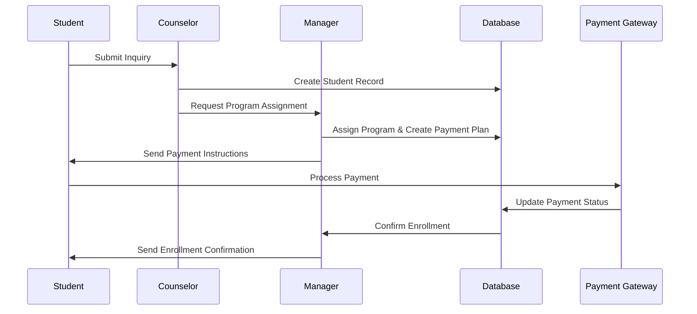
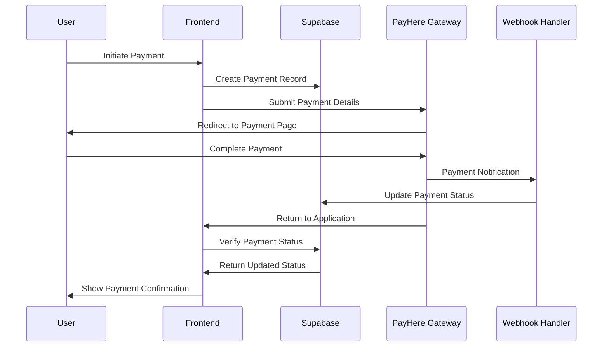
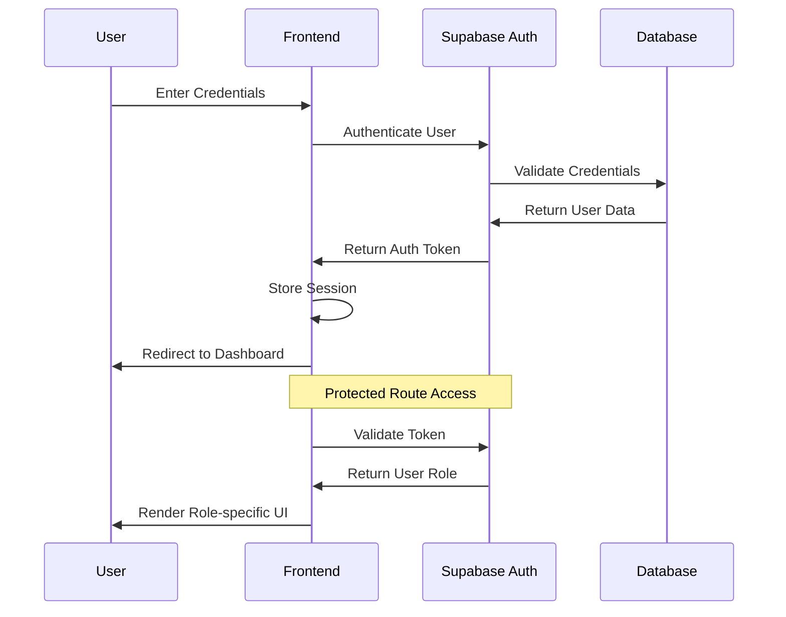
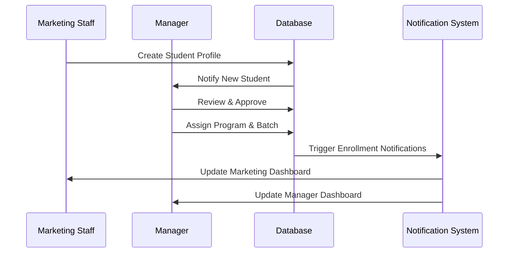

# SMIS - Student Management Information System

[](https://github.com/rasiboi/SMISFrontend)
[](https://reactjs.org/)
[](https://vitejs.dev/)
[](LICENSE)

## 🎯 Overview

SMIS (Student Management Information System) is a comprehensive web-based platform designed for educational institutions to manage student enrollment, payment processing, program administration, and academic analytics. Built with modern React architecture and integrated with Supabase backend services, SMIS provides a scalable solution for educational management.

## ✨ Key Features

### 🎓 **Student Management**
- Complete student lifecycle management
- Multi-role access control (Manager, Marketing, Counselor)
- Advanced student search and filtering
- Profile management with academic history

### 💰 **Payment Processing**
- Integrated PayHere payment gateway
- Flexible payment plans (full/installment)
- Automated receipt generation
- Real-time transaction tracking
- Multi-currency support

### 📚 **Program & Batch Management**
- Dynamic program creation and management
- Batch scheduling and capacity management
- Enrollment tracking and analytics
- Course prerequisite management

### 📊 **Analytics & Reporting**
- Real-time dashboard analytics
- Student performance metrics
- Payment analytics and trends
- Counselor performance tracking
- Custom report generation

### 🔐 **Security & Authentication**
- Role-based access control (RBAC)
- Secure authentication with Supabase Auth
- Protected routes and API endpoints
- Audit trail for critical operations

## 🏗️ System Architecture

### Frontend Architecture
```
src/
├── components/           # Reusable UI components
│   ├── analytics/       # Analytics and reporting
│   ├── auth/           # Authentication components
│   ├── batches/        # Batch management
│   ├── dashboard/      # Dashboard components
│   ├── enrollments/    # Enrollment management
│   ├── inquiry/        # Student inquiry handling
│   ├── payments/       # Payment processing
│   ├── programs/       # Program management
│   ├── students/       # Student management
│   └── ui/            # Common UI components
├── context/            # React context providers
├── db/                # Database utilities
├── lib/               # Utility libraries
├── pages/             # Page components
├── routes/            # Route configurations
└── utils/             # Helper functions
```

### Technology Stack

| Category | Technology | Version | Purpose |
|----------|------------|---------|---------|
| **Frontend** | React | 18.2.0 | UI Framework |
| **Build Tool** | Vite | 5.0.8 | Development & Build |
| **Styling** | Tailwind CSS | 3.4.17 | CSS Framework |
| **UI Components** | Ant Design | 5.26.0 | Component Library |
| **Animations** | Framer Motion | 12.16.0 | Animations |
| **Backend** | Supabase | 2.50.0 | Database & Auth |
| **Payment** | PayHere | - | Payment Gateway |
| **Charts** | Recharts | 2.15.3 | Data Visualization |

## 🔄 System Workflows

### Student Enrollment Workflow


### Payment Processing Workflow


### User Authentication Flow


### Student Management Workflow


## 🚀 Getting Started

### Prerequisites
- Node.js (v16 or higher)
- npm or yarn package manager
- Modern web browser
- Supabase account for backend services

### Installation

1. **Clone the repository:**
```bash
git clone https://github.com/rasiboi/SMISFrontend.git
cd SMISFrontend
```

2. **Install dependencies:**
```bash
npm install
```

3. **Environment Configuration:**
Create a `.env` file in the root directory:
```env
VITE_SUPABASE_URL=your_supabase_url
VITE_SUPABASE_ANON_KEY=your_supabase_anon_key
VITE_PAYHERE_MERCHANT_ID=your_payhere_merchant_id
VITE_PAYHERE_SANDBOX=true
```

4. **Start the development server:**
```bash
npm run dev
```

5. **Access the application:**
Open your browser and navigate to `http://localhost:5173`

### Build for Production

```bash
npm run build
npm run preview
```

### Deployment

The application is configured for GitHub Pages deployment:

```bash
npm run deploy
```

## 🎨 UI/UX Design Principles

### Design System
- **Color Palette:** Modern, accessible color scheme with high contrast
- **Typography:** Clean, readable fonts with proper hierarchy
- **Icons:** Consistent icon set using Ant Design and Heroicons
- **Animations:** Smooth, purposeful animations using Framer Motion
- **Responsive Design:** Mobile-first approach with breakpoint optimization

### User Experience
- **Intuitive Navigation:** Clear navigation patterns with breadcrumbs
- **Real-time Feedback:** Immediate user feedback for all actions
- **Progressive Disclosure:** Information revealed progressively to avoid overwhelm
- **Accessibility:** WCAG 2.1 AA compliance with keyboard navigation support

## 🔧 Configuration

### Payment Gateway Configuration
```javascript
// PayHere Configuration
const PAYHERE_CONFIG = {
  sandbox: process.env.VITE_PAYHERE_SANDBOX === 'true',
  merchant_id: process.env.VITE_PAYHERE_MERCHANT_ID,
  notify_url: `${window.location.origin}/api/payment-notify`,
  return_url: `${window.location.origin}/payment-success`,
  cancel_url: `${window.location.origin}/payment-cancel`
};
```

### Database Schema
Key tables and relationships:
- **Students:** Core student information
- **Programs:** Academic program definitions
- **Batches:** Class scheduling and capacity
- **Payment Plans:** Student payment structures
- **Transactions:** Payment transaction records
- **Users:** System user management

## 📊 Performance Metrics

### Key Performance Indicators
- **Load Time:** < 2 seconds initial page load
- **Bundle Size:** Optimized with code splitting
- **Lighthouse Score:** 90+ for Performance, SEO, and Accessibility
- **Database Queries:** Optimized with proper indexing
- **Real-time Updates:** < 100ms response time for live data

## 🔒 Security Features

### Authentication & Authorization
- JWT-based authentication through Supabase
- Role-based access control (Manager, Marketing, Counselor)
- Session management with automatic logout
- API endpoint protection

### Data Security
- Row-level security (RLS) policies in Supabase
- Input validation and sanitization
- HTTPS enforcement
- Sensitive data encryption

### Payment Security
- PCI DSS compliant payment processing
- Secure hash generation for transactions
- No sensitive payment data stored locally
- Payment gateway tokenization

## 🧪 Testing Strategy

### Testing Framework
- **Unit Tests:** Component-level testing with React Testing Library
- **Integration Tests:** End-to-end workflow testing
- **Performance Tests:** Load testing and optimization
- **Security Tests:** Vulnerability scanning and penetration testing

### Quality Assurance
- ESLint for code quality
- Prettier for code formatting
- Husky for pre-commit hooks
- Automated testing in CI/CD pipeline

## 📈 Monitoring & Analytics

### Application Monitoring
- Real-time error tracking
- Performance monitoring
- User interaction analytics
- Payment transaction monitoring

### Business Intelligence
- Student enrollment trends
- Payment success rates
- Program popularity metrics
- Counselor performance analytics

## 🤝 Contributing

We welcome contributions from the community! Please read our contributing guidelines before submitting pull requests.

### Development Workflow
1. Fork the repository
2. Create a feature branch
3. Make your changes
4. Write/update tests
5. Submit a pull request

### Code Standards
- Follow React best practices
- Use TypeScript for type safety
- Maintain 80%+ test coverage
- Follow conventional commit messages

## 📄 License

This project is licensed under the MIT License - see the [LICENSE](LICENSE) file for details.

## 📞 Support

For technical support or questions:
- **Email:** support@smis.edu
- **Documentation:** [Wiki](https://github.com/rasiboi/SMISFrontend/wiki)
- **Issues:** [GitHub Issues](https://github.com/rasiboi/SMISFrontend/issues)

## 🚀 Roadmap

### Version 2.0 Features
- [ ] Mobile application (React Native)
- [ ] Advanced reporting dashboard
- [ ] Multi-language support
- [ ] API integration with external systems
- [ ] Advanced analytics with AI insights
- [ ] Automated communication system

---

**Built with ❤️ by the SMIS Development Team**

*This documentation is automatically generated and maintained. Last updated: December 2024*
