# SMIS System Design Document

## Executive Summary

The Student Management Information System (SMIS) is designed as a modern, scalable web application that serves educational institutions in managing their complete student lifecycle. This document outlines the system's architecture, design decisions, and technical implementation strategy.

## System Overview

### Vision Statement
To provide a comprehensive, user-friendly platform that streamlines educational institution operations while maintaining data security, payment processing integrity, and role-based access control.

### Key Design Principles
1. **Scalability**: Horizontal scaling capabilities with microservices architecture
2. **Security**: Multi-layered security with RBAC and data encryption
3. **Usability**: Intuitive UI/UX with responsive design
4. **Maintainability**: Clean code architecture with comprehensive documentation
5. **Performance**: Optimized for fast load times and real-time updates

---

## Detailed System Architecture

### System Context Diagram

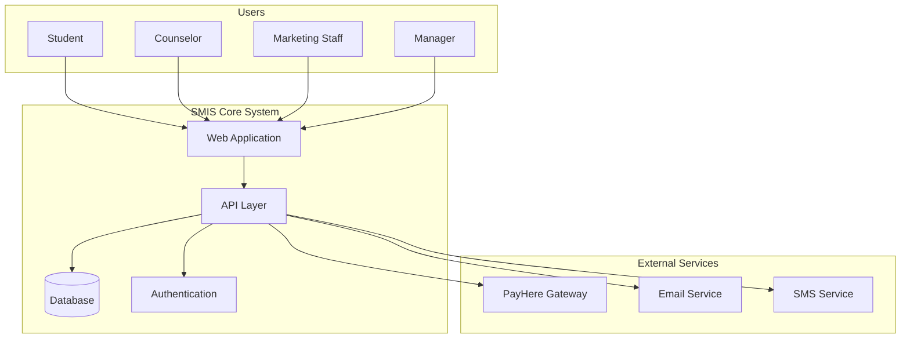

### Component Architecture

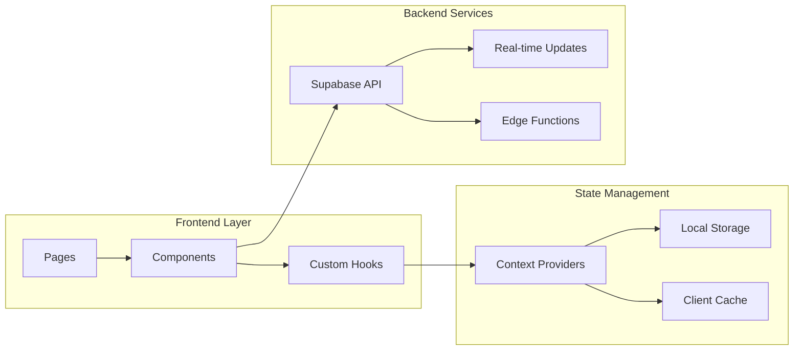

---

## Detailed Workflow Sequences

### Complete Student Enrollment Process

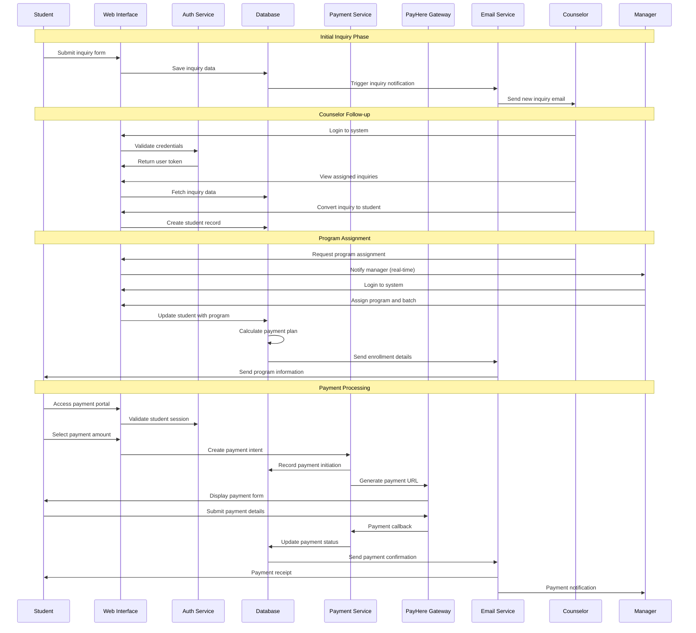

### Advanced Payment Reconciliation Workflow

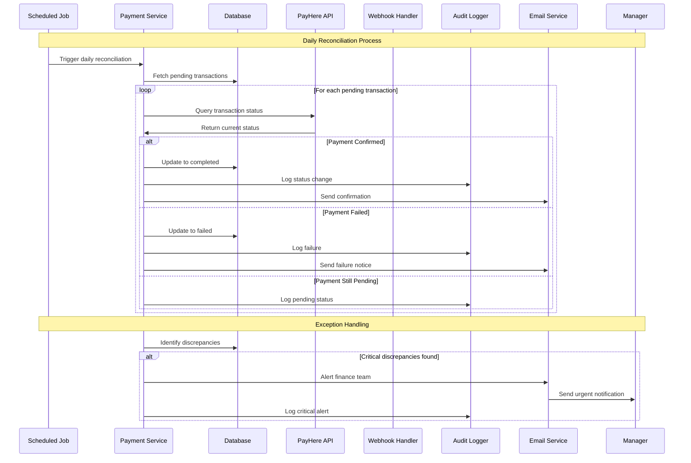

---

## Data Architecture

### Database Design

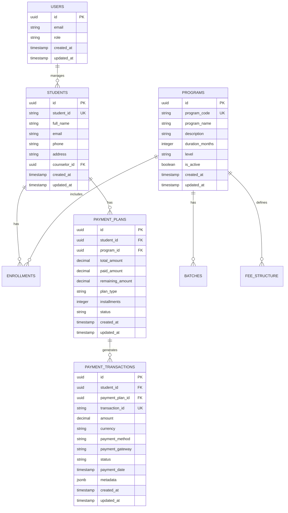

### Data Flow Architecture

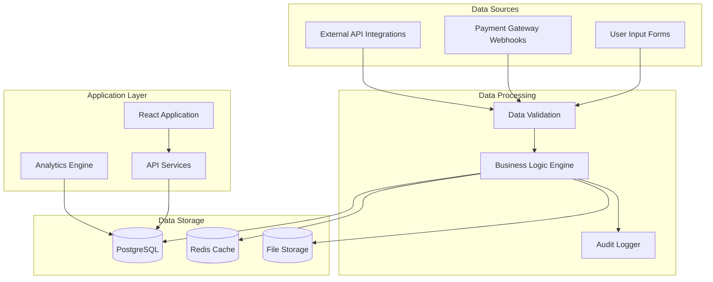

---

## Security Architecture

### Multi-Layer Security Model

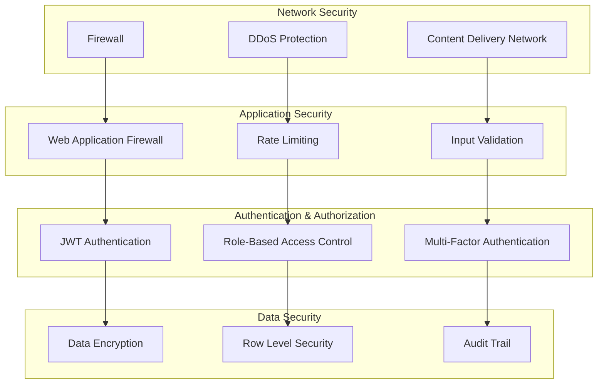

### Authentication Flow

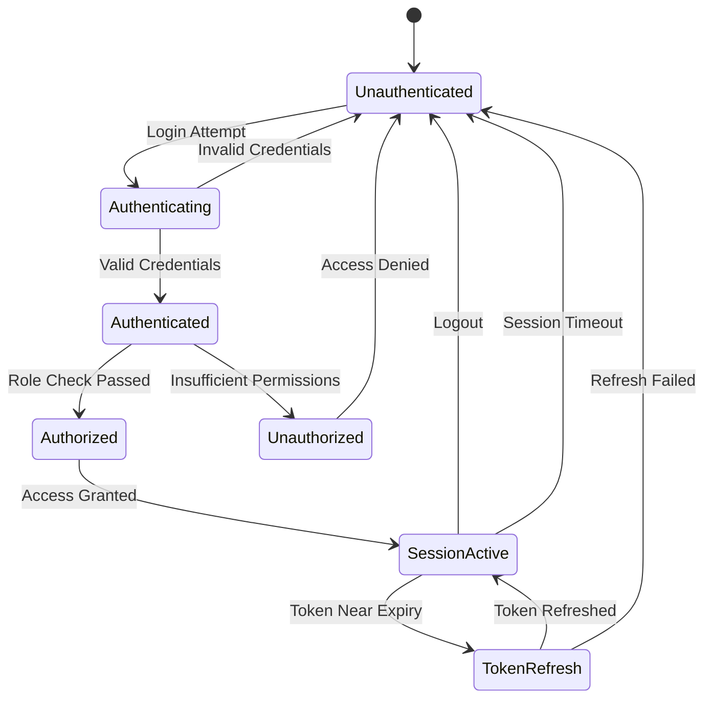

---

## Performance Architecture

### Caching Strategy

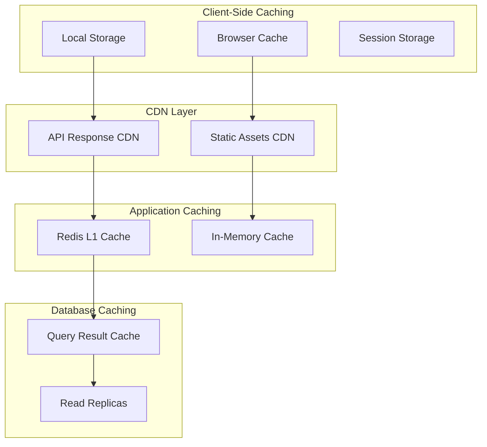

---

## Deployment Architecture

### CI/CD Pipeline

```mermaid
graph LR
    subgraph "Development"
        DEV[Developer]
        LOCAL[Local Testing]
    end
    
    subgraph "Source Control"
        GIT[Git Repository]
        PR[Pull Request]
    end
    
    subgraph "CI Pipeline"
        BUILD[Build Process]
        TEST[Automated Testing]
        SCAN[Security Scanning]
    end
    
    subgraph "CD Pipeline"
        STAGING[Staging Deploy]
        PROD_DEPLOY[Production Deploy]
        MONITORING[Post-Deploy Monitoring]
    end
    
    DEV --> LOCAL
    LOCAL --> GIT
    GIT --> PR
    PR --> BUILD
    BUILD --> TEST
    TEST --> SCAN
    SCAN --> STAGING
    STAGING --> PROD_DEPLOY
    PROD_DEPLOY --> MONITORING
```

---

## Scalability Considerations

### Horizontal Scaling Strategy

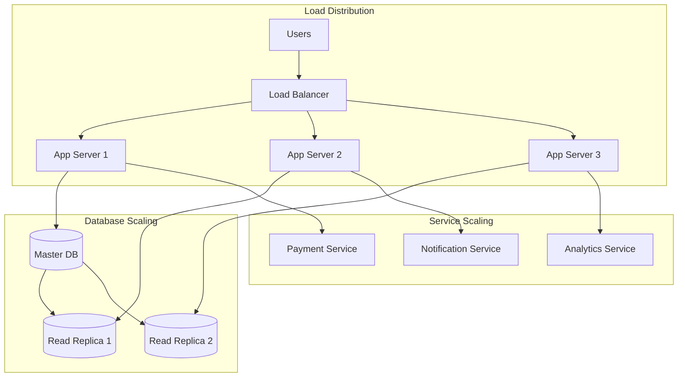

---

## Monitoring & Observability

### Monitoring Architecture

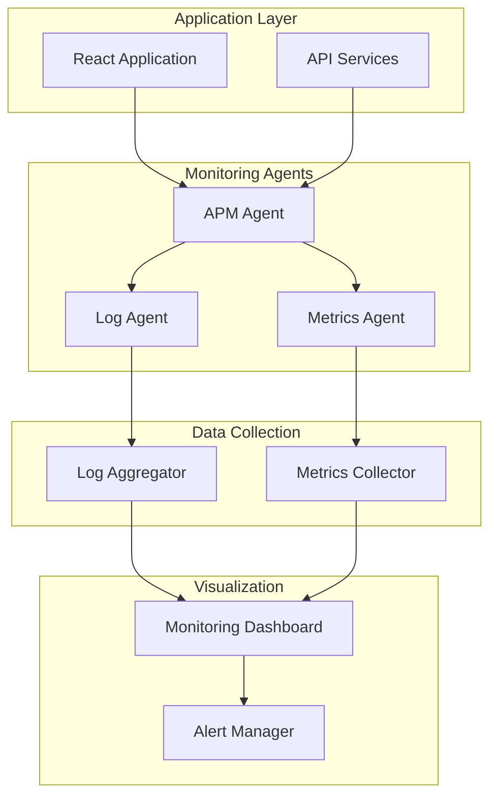

---

## Technology Stack Summary

| Layer | Technology | Purpose | Version |
|-------|------------|---------|---------|
| **Frontend** | React | UI Framework | 18.2.0 |
| **Build Tool** | Vite | Development Server | 5.0.8 |
| **Styling** | Tailwind CSS | CSS Framework | 3.4.17 |
| **UI Library** | Ant Design | Component Library | 5.26.0 |
| **State Management** | React Context | State Management | Built-in |
| **Backend** | Supabase | BaaS Platform | 2.50.0 |
| **Database** | PostgreSQL | Relational Database | 15+ |
| **Authentication** | Supabase Auth | Auth Service | Built-in |
| **Payment** | PayHere | Payment Gateway | API v2 |
| **Hosting** | GitHub Pages | Static Hosting | - |

---

## Risk Assessment

### Technical Risks

| Risk | Impact | Probability | Mitigation |
|------|--------|-------------|------------|
| **Database Performance** | High | Medium | Query optimization, indexing, read replicas |
| **Payment Gateway Failures** | High | Low | Fallback mechanisms, retry logic, monitoring |
| **Security Vulnerabilities** | Critical | Low | Regular security audits, dependency updates |
| **Scalability Issues** | Medium | Medium | Load testing, auto-scaling, performance monitoring |
| **Data Loss** | Critical | Very Low | Regular backups, point-in-time recovery |

### Business Risks

| Risk | Impact | Probability | Mitigation |
|------|--------|-------------|------------|
| **User Adoption** | High | Medium | User training, intuitive design, support |
| **Compliance Issues** | High | Low | Regular compliance audits, documentation |
| **Vendor Lock-in** | Medium | Medium | API abstraction layers, exit strategies |
| **Budget Overrun** | Medium | Medium | Regular cost monitoring, optimization |

---

## Future Roadmap

### Phase 1: Foundation (Current)
- Core student management functionality
- Basic payment processing
- Role-based access control
- Essential reporting

### Phase 2: Enhancement (Q2 2024)
- Advanced analytics dashboard
- Mobile application
- API for third-party integrations
- Enhanced notification system

### Phase 3: Scale (Q4 2024)
- Multi-tenancy support
- Advanced reporting engine
- AI-powered insights
- Workflow automation

### Phase 4: Innovation (2025)
- Machine learning integration
- Predictive analytics
- IoT device integration
- Advanced communication tools

---

*This system design document serves as the comprehensive technical blueprint for the SMIS platform. It is maintained by the Architecture Team and updated with each major release.* 