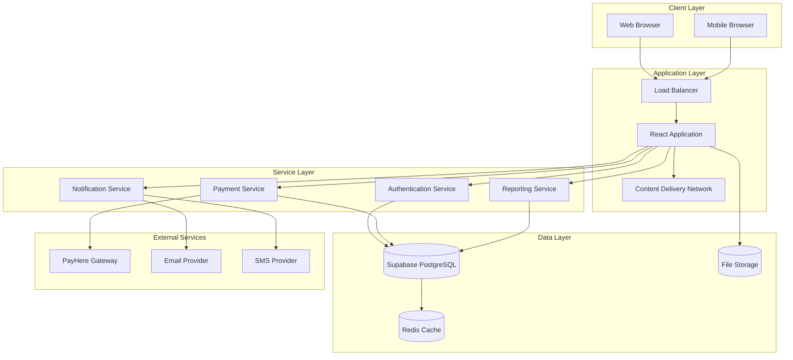
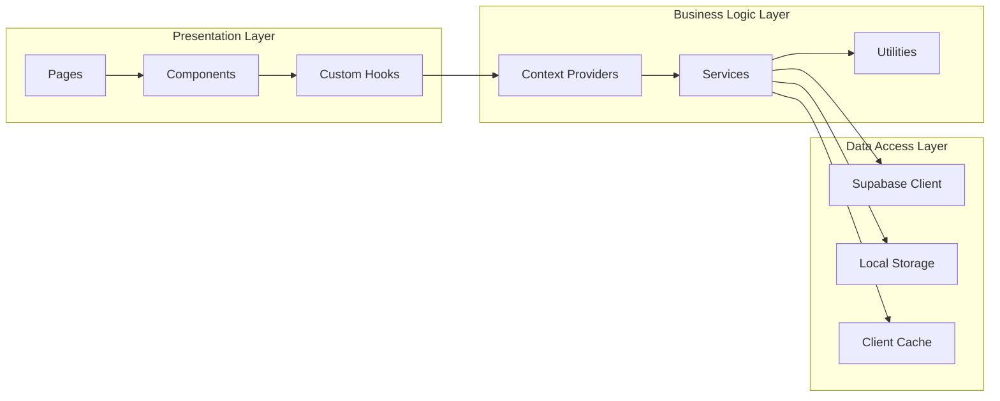
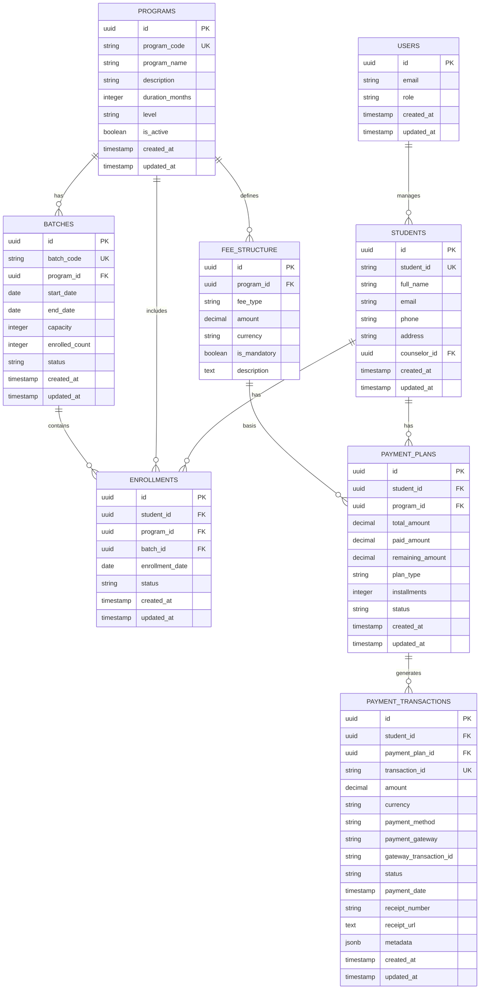
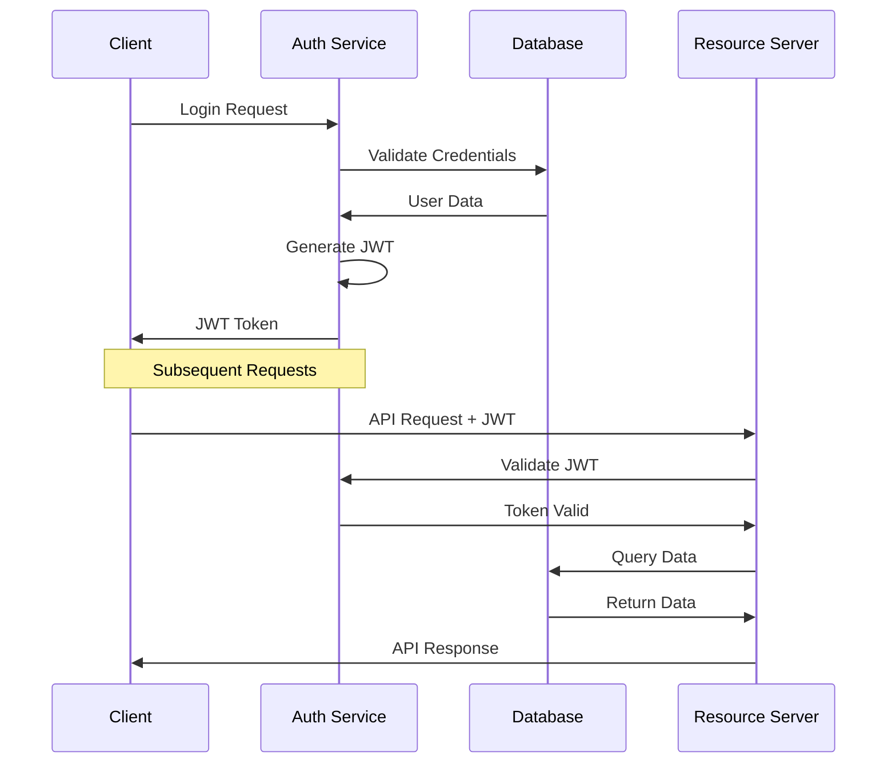
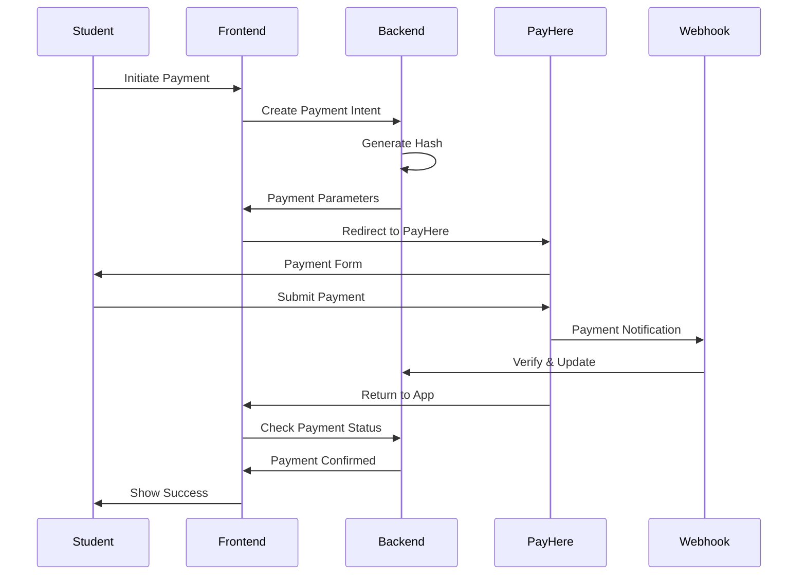

# SMIS Technical Documentation

## Table of Contents
1. [System Architecture](#system-architecture)
2. [Database Design](#database-design)
3. [API Specifications](#api-specifications)
4. [Security Implementation](#security-implementation)
5. [Payment Integration](#payment-integration)
6. [Deployment Guide](#deployment-guide)
7. [Performance Optimization](#performance-optimization)
8. [Monitoring & Logging](#monitoring--logging)

---

## System Architecture

### High-Level Architecture



### Component Architecture



---

## Database Design

### Entity Relationship Diagram



### Database Schema Specifications

#### Core Tables

**users**
- Primary authentication table
- Integrated with Supabase Auth
- Role-based access control

**students**
- Central student information
- Linked to user accounts
- Counselor assignment tracking

**programs**
- Academic program definitions
- Duration and level specifications
- Status management

**batches**
- Class scheduling and capacity
- Program association
- Enrollment tracking

#### Financial Tables

**fee_structure**
- Program-based fee definitions
- Multiple fee types support
- Currency flexibility

**payment_plans**
- Student payment arrangements
- Installment support
- Progress tracking

**payment_transactions**
- Complete transaction history
- Gateway integration data
- Receipt management

---

## API Specifications

### Authentication Endpoints

```javascript
// Login
POST /auth/v1/token
Content-Type: application/json
{
    "email": "user@example.com",
    "password": "password123"
}

// Response
{
    "access_token": "jwt_token",
    "token_type": "bearer",
    "expires_in": 3600,
    "user": {
        "id": "uuid",
        "email": "user@example.com",
        "role": "manager"
    }
}
```

### Student Management API

```javascript
// Create Student
POST /rest/v1/students
Authorization: Bearer jwt_token
Content-Type: application/json
{
    "student_id": "STU001",
    "full_name": "John Doe",
    "email": "john@example.com",
    "phone": "+94712345678",
    "address": "123 Main St, Colombo",
    "counselor_id": "uuid"
}

// Get Students
GET /rest/v1/students?select=*,programs(*),batches(*)
Authorization: Bearer jwt_token

// Update Student
PATCH /rest/v1/students?id=eq.uuid
Authorization: Bearer jwt_token
Content-Type: application/json
{
    "full_name": "John Smith",
    "phone": "+94712345679"
}
```

### Payment Processing API

```javascript
// Create Payment Plan
POST /rest/v1/payment_plans
Authorization: Bearer jwt_token
Content-Type: application/json
{
    "student_id": "uuid",
    "program_id": "uuid",
    "total_amount": 300000.00,
    "plan_type": "installment",
    "installments": 6
}

// Process Payment
POST /rest/v1/payment_transactions
Authorization: Bearer jwt_token
Content-Type: application/json
{
    "student_id": "uuid",
    "payment_plan_id": "uuid",
    "amount": 50000.00,
    "payment_method": "card",
    "payment_gateway": "payhere"
}
```

---

## Security Implementation

### Authentication Flow



### Role-Based Access Control

```javascript
// Role Definitions
const ROLES = {
  MANAGER: {
    permissions: [
      'students:read',
      'students:write',
      'programs:read',
      'programs:write',
      'payments:read',
      'payments:write',
      'analytics:read'
    ]
  },
  MARKETING: {
    permissions: [
      'students:read',
      'students:write',
      'inquiries:read',
      'inquiries:write',
      'basic_analytics:read'
    ]
  },
  COUNSELOR: {
    permissions: [
      'students:read',
      'assigned_students:write',
      'inquiries:read',
      'inquiries:write'
    ]
  }
};

// Permission Check
const hasPermission = (userRole, requiredPermission) => {
  return ROLES[userRole]?.permissions.includes(requiredPermission);
};
```

### Row Level Security (RLS) Policies

```sql
-- Students table RLS
CREATE POLICY "Managers can view all students" ON students
  FOR SELECT TO authenticated
  USING (auth.jwt() ->> 'role' = 'manager');

CREATE POLICY "Marketing can view their assigned students" ON students
  FOR SELECT TO authenticated
  USING (
    auth.jwt() ->> 'role' = 'marketing' AND
    counselor_id = auth.uid()
  );

-- Payment transactions RLS
CREATE POLICY "Users can only view authorized payments" ON payment_transactions
  FOR SELECT TO authenticated
  USING (
    auth.jwt() ->> 'role' = 'manager' OR
    (auth.jwt() ->> 'role' = 'marketing' AND 
     student_id IN (
       SELECT id FROM students WHERE counselor_id = auth.uid()
     ))
  );
```

---

## Payment Integration

### PayHere Integration Flow



### Payment Configuration

```javascript
// PayHere Configuration
const paymentConfig = {
  sandbox: process.env.NODE_ENV !== 'production',
  merchant_id: process.env.PAYHERE_MERCHANT_ID,
  merchant_secret: process.env.PAYHERE_MERCHANT_SECRET,
  currency: 'LKR',
  return_url: `${process.env.APP_URL}/payment/success`,
  cancel_url: `${process.env.APP_URL}/payment/cancel`,
  notify_url: `${process.env.API_URL}/webhooks/payhere`
};

// Hash Generation (Server-side)
const generateHash = (orderId, amount, currency) => {
  const hash = crypto
    .createHash('md5')
    .update(
      paymentConfig.merchant_id +
      orderId +
      amount.toFixed(2) +
      currency +
      crypto
        .createHash('md5')
        .update(paymentConfig.merchant_secret)
        .digest('hex')
        .toUpperCase()
    )
    .digest('hex')
    .toUpperCase();
  
  return hash;
};
```

### Payment Webhook Handler

```javascript
// Webhook verification
const verifyPayHereNotification = (req) => {
  const {
    merchant_id,
    order_id,
    payhere_amount,
    payhere_currency,
    status_code,
    md5sig
  } = req.body;

  // Generate expected hash
  const expectedHash = crypto
    .createHash('md5')
    .update(
      merchant_id +
      order_id +
      payhere_amount +
      payhere_currency +
      status_code +
      crypto
        .createHash('md5')
        .update(process.env.PAYHERE_MERCHANT_SECRET)
        .digest('hex')
        .toUpperCase()
    )
    .digest('hex')
    .toUpperCase();

  return expectedHash === md5sig;
};
```

---

## Deployment Guide

### Environment Setup

```bash
# Production Environment Variables
VITE_SUPABASE_URL=https://your-project.supabase.co
VITE_SUPABASE_ANON_KEY=your-anon-key
VITE_PAYHERE_MERCHANT_ID=your-merchant-id
VITE_PAYHERE_SANDBOX=false
VITE_APP_URL=https://your-domain.com
VITE_API_URL=https://api.your-domain.com
```

### Build Process

```bash
# Install dependencies
npm ci

# Run tests
npm run test

# Build for production
npm run build

# Preview build
npm run preview
```

### Docker Deployment

```dockerfile
# Dockerfile
FROM node:18-alpine as builder

WORKDIR /app
COPY package*.json ./
RUN npm ci --only=production

COPY . .
RUN npm run build

FROM nginx:alpine
COPY --from=builder /app/dist /usr/share/nginx/html
COPY nginx.conf /etc/nginx/nginx.conf

EXPOSE 80
CMD ["nginx", "-g", "daemon off;"]
```

### CI/CD Pipeline

```yaml
# .github/workflows/deploy.yml
name: Deploy to Production

on:
  push:
    branches: [main]

jobs:
  deploy:
    runs-on: ubuntu-latest
    steps:
      - uses: actions/checkout@v3
      
      - name: Setup Node.js
        uses: actions/setup-node@v3
        with:
          node-version: '18'
          cache: 'npm'
      
      - name: Install dependencies
        run: npm ci
      
      - name: Run tests
        run: npm run test
      
      - name: Build application
        run: npm run build
        env:
          VITE_SUPABASE_URL: ${{ secrets.SUPABASE_URL }}
          VITE_SUPABASE_ANON_KEY: ${{ secrets.SUPABASE_ANON_KEY }}
      
      - name: Deploy to GitHub Pages
        uses: peaceiris/actions-gh-pages@v3
        with:
          github_token: ${{ secrets.GITHUB_TOKEN }}
          publish_dir: ./dist
```

---

## Performance Optimization

### Bundle Optimization

```javascript
// vite.config.js
export default defineConfig({
  plugins: [react()],
  build: {
    rollupOptions: {
      output: {
        manualChunks: {
          vendor: ['react', 'react-dom'],
          antd: ['antd', '@ant-design/icons'],
          charts: ['recharts'],
          router: ['react-router-dom']
        }
      }
    },
    chunkSizeWarningLimit: 600
  }
});
```

### Code Splitting

```javascript
// Lazy loading components
const Dashboard = lazy(() => import('./components/dashboard/Dashboard'));
const StudentManagement = lazy(() => import('./components/students/StudentManagement'));
const PaymentManagement = lazy(() => import('./components/payments/PaymentManagement'));

// Route configuration with suspense
const router = createBrowserRouter([
  {
    path: '/',
    element: (
      <Suspense fallback={<LoadingSpinner />}>
        <Dashboard />
      </Suspense>
    )
  }
]);
```

### Database Optimization

```sql
-- Index creation for performance
CREATE INDEX idx_students_counselor_id ON students(counselor_id);
CREATE INDEX idx_payment_transactions_student_id ON payment_transactions(student_id);
CREATE INDEX idx_payment_transactions_status ON payment_transactions(status);
CREATE INDEX idx_enrollments_program_batch ON enrollments(program_id, batch_id);

-- Query optimization
-- Use select with specific columns
SELECT id, full_name, email, phone FROM students 
WHERE counselor_id = $1 
ORDER BY created_at DESC 
LIMIT 20;
```

---

## Monitoring & Logging

### Application Monitoring

```javascript
// Error boundary for React components
class ErrorBoundary extends React.Component {
  constructor(props) {
    super(props);
    this.state = { hasError: false };
  }

  static getDerivedStateFromError(error) {
    return { hasError: true };
  }

  componentDidCatch(error, errorInfo) {
    // Log error to monitoring service
    console.error('Application Error:', error, errorInfo);
    
    // Send to error tracking service
    if (process.env.NODE_ENV === 'production') {
      // Sentry, LogRocket, etc.
      this.logError(error, errorInfo);
    }
  }

  render() {
    if (this.state.hasError) {
      return <ErrorFallback />;
    }

    return this.props.children;
  }
}
```

### Performance Monitoring

```javascript
// Performance tracking
const trackPerformance = (name, fn) => {
  return async (...args) => {
    const start = performance.now();
    try {
      const result = await fn(...args);
      const duration = performance.now() - start;
      
      // Log performance metrics
      console.log(`${name} executed in ${duration}ms`);
      
      return result;
    } catch (error) {
      const duration = performance.now() - start;
      console.error(`${name} failed after ${duration}ms:`, error);
      throw error;
    }
  };
};

// Usage
const optimizedFetchStudents = trackPerformance(
  'fetchStudents',
  async (filters) => {
    return await supabase
      .from('students')
      .select('*')
      .match(filters);
  }
);
```

### Health Check Endpoints

```javascript
// Health check for application status
app.get('/health', (req, res) => {
  const healthCheck = {
    status: 'OK',
    timestamp: new Date().toISOString(),
    uptime: process.uptime(),
    environment: process.env.NODE_ENV,
    version: process.env.npm_package_version
  };
  
  res.status(200).json(healthCheck);
});

// Database connectivity check
app.get('/health/database', async (req, res) => {
  try {
    const { data, error } = await supabase
      .from('users')
      .select('count')
      .limit(1);
    
    if (error) throw error;
    
    res.status(200).json({ 
      status: 'OK', 
      database: 'Connected' 
    });
  } catch (error) {
    res.status(503).json({ 
      status: 'Error', 
      database: 'Disconnected',
      error: error.message 
    });
  }
});
```

---

## Troubleshooting Guide

### Common Issues

1. **Payment Gateway Integration**
   - Hash mismatch errors
   - Webhook verification failures
   - Currency conversion issues

2. **Authentication Problems**
   - JWT token expiration
   - Role permission errors
   - Session management issues

3. **Database Performance**
   - Slow query execution
   - Connection pool exhaustion
   - RLS policy conflicts

4. **Build and Deployment**
   - Environment variable issues
   - Asset loading problems
   - CORS configuration errors

### Debugging Tools

```javascript
// Debug configuration
const DEBUG_CONFIG = {
  enableLogging: process.env.NODE_ENV === 'development',
  logLevel: process.env.LOG_LEVEL || 'info',
  enablePerformanceTracking: true
};

// Custom logger
const logger = {
  debug: (message, data) => {
    if (DEBUG_CONFIG.enableLogging) {
      console.log(`[DEBUG] ${message}`, data);
    }
  },
  info: (message, data) => {
    console.log(`[INFO] ${message}`, data);
  },
  error: (message, error) => {
    console.error(`[ERROR] ${message}`, error);
  }
};
```

---

*This technical documentation is maintained by the SMIS Development Team and updated regularly to reflect the latest system changes and improvements.* 