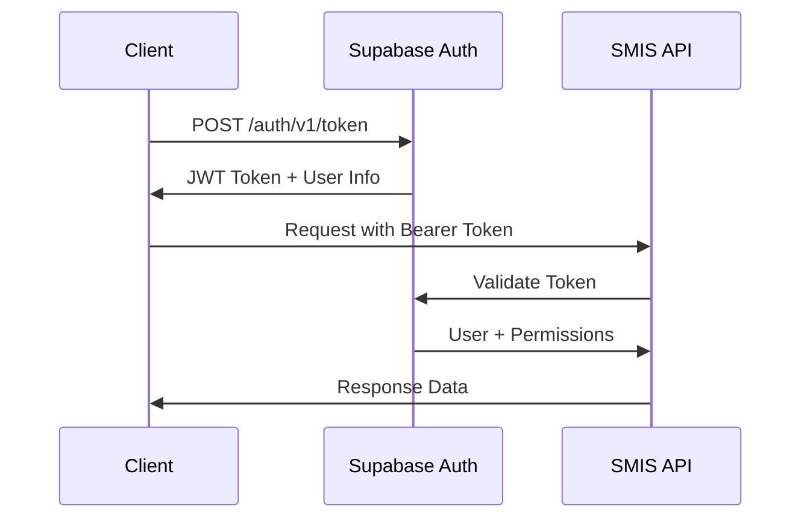

# SMIS API Documentation

## Overview

The SMIS API provides a comprehensive set of endpoints for managing students, programs, payments, and system administration. Built on Supabase, it offers REST-style endpoints with real-time capabilities.

**Base URL:** `https://your-project.supabase.co`
**API Version:** v1
**Authentication:** Bearer Token (JWT)

---

## Authentication

### Authentication Flow



### Login Endpoint

```http
POST /auth/v1/token
Content-Type: application/json

{
  "email": "user@example.com",
  "password": "password123"
}
```

**Response:**
```json
{
  "access_token": "eyJhbGciOiJIUzI1NiIsInR5cCI6IkpXVCJ9...",
  "token_type": "bearer",
  "expires_in": 3600,
  "refresh_token": "refresh_token_here",
  "user": {
    "id": "uuid-string",
    "email": "user@example.com",
    "role": "manager",
    "created_at": "2024-01-01T00:00:00Z"
  }
}
```

---

## Students API

### List Students

```http
GET /rest/v1/students?select=*,programs(*),batches(*)
Authorization: Bearer {token}
```

**Query Parameters:**
- `select`: Specify fields to return
- `limit`: Number of records to return (default: 100)
- `offset`: Number of records to skip
- `order`: Sort order (e.g., `created_at.desc`)

**Response:**
```json
[
  {
    "id": "uuid-string",
    "student_id": "STU001",
    "full_name": "John Doe",
    "email": "john@example.com",
    "phone": "+94712345678",
    "address": "123 Main St, Colombo",
    "counselor_id": "uuid-string",
    "created_at": "2024-01-01T00:00:00Z",
    "updated_at": "2024-01-01T00:00:00Z",
    "programs": [...],
    "batches": [...]
  }
]
```

### Create Student

```http
POST /rest/v1/students
Authorization: Bearer {token}
Content-Type: application/json

{
  "student_id": "STU002",
  "full_name": "Jane Smith",
  "email": "jane@example.com",
  "phone": "+94712345679",
  "address": "456 Oak Ave, Kandy",
  "counselor_id": "uuid-string"
}
```

**Response:**
```json
{
  "id": "new-uuid-string",
  "student_id": "STU002",
  "full_name": "Jane Smith",
  "email": "jane@example.com",
  "phone": "+94712345679",
  "address": "456 Oak Ave, Kandy",
  "counselor_id": "uuid-string",
  "created_at": "2024-01-01T00:00:00Z",
  "updated_at": "2024-01-01T00:00:00Z"
}
```

### Update Student

```http
PATCH /rest/v1/students?id=eq.{student_id}
Authorization: Bearer {token}
Content-Type: application/json

{
  "full_name": "Jane Smith Updated",
  "phone": "+94712345680"
}
```

### Delete Student

```http
DELETE /rest/v1/students?id=eq.{student_id}
Authorization: Bearer {token}
```

---

## Programs API

### List Programs

```http
GET /rest/v1/programs?select=*,fee_structure(*)
Authorization: Bearer {token}
```

**Response:**
```json
[
  {
    "id": "uuid-string",
    "program_code": "HD-IT",
    "program_name": "Higher Diploma in Information Technology",
    "description": "Comprehensive IT program covering...",
    "duration_months": 24,
    "level": "Higher Diploma",
    "is_active": true,
    "created_at": "2024-01-01T00:00:00Z",
    "fee_structure": [
      {
        "fee_type": "registration",
        "amount": 25000.00,
        "currency": "LKR",
        "is_mandatory": true
      }
    ]
  }
]
```

### Create Program

```http
POST /rest/v1/programs
Authorization: Bearer {token}
Content-Type: application/json

{
  "program_code": "HD-BM",
  "program_name": "Higher Diploma in Business Management",
  "description": "Business management fundamentals...",
  "duration_months": 24,
  "level": "Higher Diploma",
  "is_active": true
}
```

---

## Payment Plans API

### List Payment Plans

```http
GET /rest/v1/payment_plans?select=*,students(*),programs(*)
Authorization: Bearer {token}
```

**Response:**
```json
[
  {
    "id": "uuid-string",
    "student_id": "uuid-string",
    "program_id": "uuid-string",
    "total_amount": 300000.00,
    "paid_amount": 50000.00,
    "remaining_amount": 250000.00,
    "plan_type": "installment",
    "installments": 6,
    "status": "active",
    "created_at": "2024-01-01T00:00:00Z",
    "students": {...},
    "programs": {...}
  }
]
```

### Create Payment Plan

```http
POST /rest/v1/payment_plans
Authorization: Bearer {token}
Content-Type: application/json

{
  "student_id": "uuid-string",
  "program_id": "uuid-string",
  "total_amount": 300000.00,
  "plan_type": "installment",
  "installments": 6
}
```

---

## Payment Transactions API

### List Transactions

```http
GET /rest/v1/payment_transactions?select=*,students(*),payment_plans(*)
Authorization: Bearer {token}
```

**Response:**
```json
[
  {
    "id": "uuid-string",
    "student_id": "uuid-string",
    "payment_plan_id": "uuid-string",
    "transaction_id": "TXN001",
    "amount": 50000.00,
    "currency": "LKR",
    "payment_method": "card",
    "payment_gateway": "payhere",
    "gateway_transaction_id": "payhere_txn_123",
    "status": "completed",
    "payment_date": "2024-01-01T00:00:00Z",
    "receipt_number": "RCP001",
    "receipt_url": "https://...",
    "metadata": {
      "gateway_response": {...}
    },
    "created_at": "2024-01-01T00:00:00Z"
  }
]
```

### Create Transaction

```http
POST /rest/v1/payment_transactions
Authorization: Bearer {token}
Content-Type: application/json

{
  "student_id": "uuid-string",
  "payment_plan_id": "uuid-string",
  "amount": 50000.00,
  "currency": "LKR",
  "payment_method": "card",
  "payment_gateway": "payhere"
}
```

---

## Batches API

### List Batches

```http
GET /rest/v1/batches?select=*,programs(*)
Authorization: Bearer {token}
```

**Response:**
```json
[
  {
    "id": "uuid-string",
    "batch_code": "HD-IT-2024-01",
    "program_id": "uuid-string",
    "start_date": "2024-02-01",
    "end_date": "2026-02-01",
    "capacity": 30,
    "enrolled_count": 25,
    "status": "active",
    "created_at": "2024-01-01T00:00:00Z",
    "programs": {...}
  }
]
```

### Create Batch

```http
POST /rest/v1/batches
Authorization: Bearer {token}
Content-Type: application/json

{
  "batch_code": "HD-IT-2024-02",
  "program_id": "uuid-string",
  "start_date": "2024-03-01",
  "end_date": "2026-03-01",
  "capacity": 30,
  "status": "planning"
}
```

---

## Enrollments API

### List Enrollments

```http
GET /rest/v1/enrollments?select=*,students(*),programs(*),batches(*)
Authorization: Bearer {token}
```

### Create Enrollment

```http
POST /rest/v1/enrollments
Authorization: Bearer {token}
Content-Type: application/json

{
  "student_id": "uuid-string",
  "program_id": "uuid-string",
  "batch_id": "uuid-string",
  "enrollment_date": "2024-01-01",
  "status": "enrolled"
}
```

---

## Analytics API

### Dashboard Metrics

```http
GET /rest/v1/rpc/get_dashboard_metrics
Authorization: Bearer {token}
```

**Response:**
```json
{
  "total_students": 150,
  "active_students": 120,
  "total_programs": 8,
  "active_programs": 6,
  "total_revenue": 15000000.00,
  "pending_payments": 2500000.00,
  "enrollment_trend": [
    {"month": "2024-01", "count": 20},
    {"month": "2024-02", "count": 25}
  ],
  "payment_trend": [
    {"month": "2024-01", "amount": 1000000.00},
    {"month": "2024-02", "amount": 1250000.00}
  ]
}
```

### Student Statistics

```http
GET /rest/v1/rpc/get_student_statistics?counselor_id={uuid}
Authorization: Bearer {token}
```

---

## Real-time Subscriptions

### Subscribe to Student Changes

```javascript
const supabase = createClient(url, key);

const subscription = supabase
  .channel('students')
  .on('postgres_changes', 
    { event: '*', schema: 'public', table: 'students' },
    (payload) => {
      console.log('Student changed:', payload);
    }
  )
  .subscribe();
```

### Subscribe to Payment Updates

```javascript
const paymentSubscription = supabase
  .channel('payments')
  .on('postgres_changes',
    { event: 'INSERT', schema: 'public', table: 'payment_transactions' },
    (payload) => {
      console.log('New payment:', payload);
    }
  )
  .subscribe();
```

---

## Error Handling

### Error Response Format

```json
{
  "error": {
    "code": "VALIDATION_ERROR",
    "message": "The provided data is invalid",
    "details": {
      "field": "email",
      "issue": "Email format is invalid"
    },
    "timestamp": "2024-01-01T00:00:00Z"
  }
}
```

### Common Error Codes

| Code | HTTP Status | Description |
|------|-------------|-------------|
| `AUTHENTICATION_REQUIRED` | 401 | No valid authentication token provided |
| `INSUFFICIENT_PERMISSIONS` | 403 | User lacks required permissions |
| `RESOURCE_NOT_FOUND` | 404 | Requested resource doesn't exist |
| `VALIDATION_ERROR` | 400 | Request data validation failed |
| `DUPLICATE_RESOURCE` | 409 | Resource already exists |
| `RATE_LIMIT_EXCEEDED` | 429 | Too many requests |
| `INTERNAL_SERVER_ERROR` | 500 | Unexpected server error |

---

## Rate Limiting

### Limits by User Role

| Role | Requests/Minute | Burst Limit |
|------|-----------------|-------------|
| **Student** | 60 | 10 |
| **Counselor** | 120 | 20 |
| **Marketing** | 180 | 30 |
| **Manager** | 300 | 50 |

### Rate Limit Headers

```http
X-RateLimit-Limit: 120
X-RateLimit-Remaining: 85
X-RateLimit-Reset: 1704067200
```

---

## Pagination

### Standard Pagination

```http
GET /rest/v1/students?limit=20&offset=40
```

### Cursor-based Pagination

```http
GET /rest/v1/students?limit=20&cursor=eyJjcmVhdGVkX2F0IjoiMjAyNC0wMS0wMVQwMDowMDowMFoifQ
```

**Response Headers:**
```http
X-Total-Count: 150
X-Next-Cursor: eyJjcmVhdGVkX2F0IjoiMjAyNC0wMS0wMVQwMTowMDowMFoifQ
X-Has-More: true
```

---

## Filtering and Searching

### Basic Filtering

```http
GET /rest/v1/students?status=eq.active&program_id=eq.uuid-string
```

### Advanced Filtering

```http
GET /rest/v1/students?full_name=ilike.*john*&created_at=gte.2024-01-01
```

### Full-text Search

```http
GET /rest/v1/students?or=(full_name.ilike.*search*,email.ilike.*search*)
```

### Available Operators

| Operator | Description | Example |
|----------|-------------|---------|
| `eq` | Equals | `status=eq.active` |
| `neq` | Not equals | `status=neq.inactive` |
| `gt` | Greater than | `amount=gt.1000` |
| `gte` | Greater than or equal | `created_at=gte.2024-01-01` |
| `lt` | Less than | `amount=lt.5000` |
| `lte` | Less than or equal | `created_at=lte.2024-12-31` |
| `like` | Like (case sensitive) | `name=like.*John*` |
| `ilike` | Like (case insensitive) | `name=ilike.*john*` |
| `in` | In list | `status=in.(active,pending)` |
| `is` | Is null/not null | `deleted_at=is.null` |

---

## Bulk Operations

### Bulk Insert Students

```http
POST /rest/v1/students
Authorization: Bearer {token}
Content-Type: application/json

[
  {
    "student_id": "STU003",
    "full_name": "Alice Johnson",
    "email": "alice@example.com"
  },
  {
    "student_id": "STU004",
    "full_name": "Bob Wilson",
    "email": "bob@example.com"
  }
]
```

### Bulk Update

```http
PATCH /rest/v1/students?id=in.(uuid1,uuid2)
Authorization: Bearer {token}
Content-Type: application/json

{
  "status": "active"
}
```

---

## Webhook Integration

### Payment Webhook

PayHere sends webhooks to your configured endpoint:

```http
POST /api/webhooks/payhere
Content-Type: application/x-www-form-urlencoded

merchant_id=1234567&
order_id=TXN001&
payhere_amount=50000.00&
payhere_currency=LKR&
status_code=2&
md5sig=hash_value
```

### Webhook Verification

```javascript
const crypto = require('crypto');

function verifyPayHereWebhook(payload, secret) {
  const {
    merchant_id,
    order_id,
    payhere_amount,
    payhere_currency,
    status_code,
    md5sig
  } = payload;

  const hash = crypto
    .createHash('md5')
    .update(
      merchant_id +
      order_id +
      payhere_amount +
      payhere_currency +
      status_code +
      crypto
        .createHash('md5')
        .update(secret)
        .digest('hex')
        .toUpperCase()
    )
    .digest('hex')
    .toUpperCase();

  return hash === md5sig;
}
```

---

## SDK Examples

### JavaScript/Node.js

```javascript
import { createClient } from '@supabase/supabase-js';

const supabase = createClient(
  'https://your-project.supabase.co',
  'your-anon-key'
);

// Authenticate
const { data: authData, error: authError } = await supabase.auth.signInWithPassword({
  email: 'user@example.com',
  password: 'password123'
});

// Fetch students
const { data: students, error } = await supabase
  .from('students')
  .select('*, programs(*)')
  .eq('status', 'active')
  .limit(10);

// Create student
const { data: newStudent, error: createError } = await supabase
  .from('students')
  .insert({
    student_id: 'STU005',
    full_name: 'New Student',
    email: 'new@example.com'
  })
  .select();
```

### Python

```python
from supabase import create_client, Client

url = "https://your-project.supabase.co"
key = "your-anon-key"
supabase: Client = create_client(url, key)

# Authenticate
auth_response = supabase.auth.sign_in_with_password({
    "email": "user@example.com", 
    "password": "password123"
})

# Fetch students
students = supabase.table('students') \
    .select('*, programs(*)') \
    .eq('status', 'active') \
    .limit(10) \
    .execute()

# Create student
new_student = supabase.table('students') \
    .insert({
        'student_id': 'STU006',
        'full_name': 'Python Student',
        'email': 'python@example.com'
    }) \
    .execute()
```

---

## Testing

### Test Data Setup

```javascript
// Create test student
const testStudent = {
  student_id: 'TEST001',
  full_name: 'Test Student',
  email: 'test@example.com',
  phone: '+94712345678'
};

// Create test program
const testProgram = {
  program_code: 'TEST-PROG',
  program_name: 'Test Program',
  duration_months: 12,
  level: 'Test'
};
```

### API Testing with Jest

```javascript
describe('Students API', () => {
  test('should create student', async () => {
    const response = await request(app)
      .post('/rest/v1/students')
      .set('Authorization', `Bearer ${token}`)
      .send(testStudent)
      .expect(201);

    expect(response.body.student_id).toBe('TEST001');
  });

  test('should fetch students', async () => {
    const response = await request(app)
      .get('/rest/v1/students')
      .set('Authorization', `Bearer ${token}`)
      .expect(200);

    expect(Array.isArray(response.body)).toBe(true);
  });
});
```

---

## Best Practices

### API Usage Guidelines

1. **Authentication**: Always include valid JWT tokens
2. **Rate Limiting**: Respect rate limits and implement backoff
3. **Error Handling**: Handle all error responses gracefully
4. **Pagination**: Use pagination for large datasets
5. **Caching**: Implement client-side caching where appropriate
6. **Filtering**: Use filters to reduce payload size
7. **Real-time**: Use subscriptions for live data updates

### Security Considerations

1. **Token Management**: Store tokens securely, implement refresh logic
2. **HTTPS Only**: Always use HTTPS in production
3. **Input Validation**: Validate all input data
4. **SQL Injection**: Use parameterized queries
5. **Cross-Origin**: Configure CORS properly
6. **Audit Logging**: Log all API access for security monitoring

---

## Migration Guide

### Version History

| Version | Release Date | Changes |
|---------|--------------|---------|
| **v1.0** | 2024-01-01 | Initial API release |
| **v1.1** | 2024-02-01 | Added bulk operations |
| **v1.2** | 2024-03-01 | Enhanced filtering options |

### Breaking Changes

#### v1.1 → v1.2
- `student_status` field renamed to `status`
- Date format changed from `YYYY-MM-DD` to ISO 8601

---

*This API documentation is automatically generated from the SMIS codebase and updated with each release. For support, contact the development team.* 