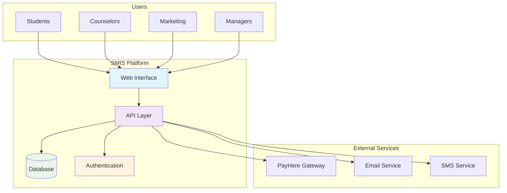
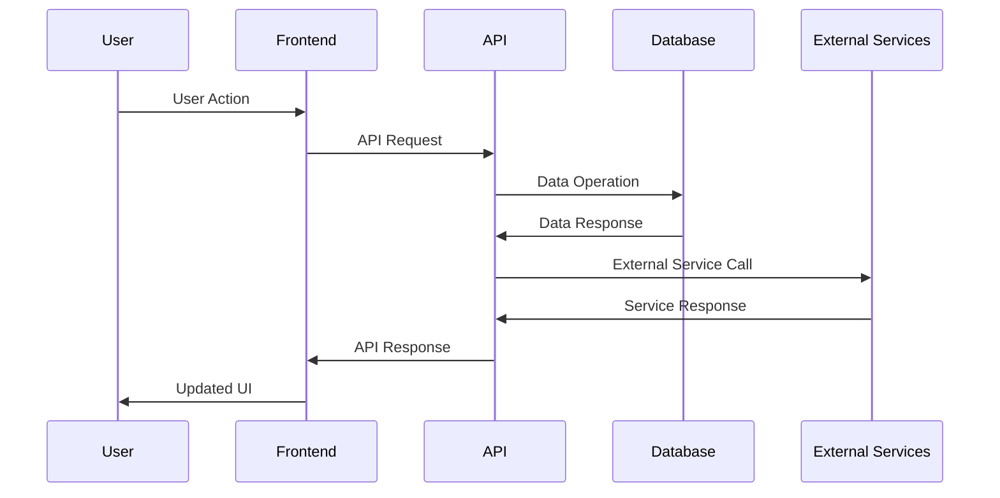

# SMIS Documentation Index

## 📚 Complete Documentation Suite

Welcome to the comprehensive documentation for the Student Management Information System (SMIS). This index provides quick access to all technical documents, guides, and specifications.

---

## 📋 Quick Navigation

### 🎯 [Main README](../README.md)
**The primary entry point** - Complete overview of the SMIS platform with features, installation guide, and getting started instructions.

**Contents:**
- System overview and key features
- Technology stack and architecture
- Installation and setup guide
- User roles and permissions
- Deployment instructions
- Contributing guidelines

---

### 🏗️ [System Design Document](./SYSTEM_DESIGN.md)
**Comprehensive architectural blueprint** - Detailed system design with workflows, security, and scalability considerations.

**Contents:**
- System architecture diagrams
- Detailed workflow sequences
- Database design and relationships
- Security implementation
- Performance optimization
- Deployment architecture
- Risk assessment and roadmap

---

### 🔧 [Technical Documentation](./TECHNICAL_DOCUMENTATION.md)
**In-depth technical reference** - Complete technical specifications, API details, and deployment guides.

**Contents:**
- High-level system architecture
- Database schema and design
- API specifications and endpoints
- Security implementation details
- Payment gateway integration
- Performance optimization strategies
- Monitoring and logging setup

---

### 🌐 [API Documentation](./API_DOCUMENTATION.md)
**Complete API reference** - Comprehensive guide to all SMIS API endpoints with examples and best practices.

**Contents:**
- Authentication and authorization
- All API endpoints with examples
- Real-time subscriptions
- Error handling and codes
- Rate limiting and pagination
- SDK examples and testing
- Best practices and security

---

## 📊 Documentation Matrix

| Document | Target Audience | Complexity | Use Case |
|----------|----------------|------------|----------|
| **README** | All Users | Beginner | Getting started, overview |
| **System Design** | Architects, Managers | Advanced | Architecture planning |
| **Technical Docs** | Developers, DevOps | Intermediate | Implementation guide |
| **API Docs** | Developers, Integrators | Intermediate | API integration |

---

## 🔄 System Overview Diagrams

### High-Level Architecture


### Core System Flow


---

## 📁 File Structure

```
docs/
├── INDEX.md                     # This file - Documentation index
├── API_DOCUMENTATION.md         # Complete API reference
├── SYSTEM_DESIGN.md             # System architecture and design
└── TECHNICAL_DOCUMENTATION.md   # Technical implementation guide

project-root/
├── README.md                    # Main project documentation
├── PAYMENT_SYSTEM_DOCUMENTATION.md  # Legacy payment docs
└── package.json                 # Project configuration
```

---

## 🎯 Documentation Features

### ✅ What's Included

- **Complete System Architecture** - High-level and detailed views
- **Sequence Diagrams** - All major workflows and processes
- **Database Design** - ERD and schema specifications
- **API Reference** - All endpoints with examples
- **Security Guidelines** - Authentication, authorization, and best practices
- **Performance Optimization** - Caching, scaling, and monitoring
- **Deployment Guides** - CI/CD, Docker, and production setup
- **Testing Strategies** - Unit, integration, and API testing
- **Troubleshooting** - Common issues and solutions

### 📈 Diagram Types Used

- **System Context Diagrams** - Overall system relationships
- **Sequence Diagrams** - Process flows and interactions
- **Entity Relationship Diagrams** - Database structure
- **Component Diagrams** - System components and dependencies
- **Flow Charts** - Decision trees and processes
- **Architecture Diagrams** - Technical system layout

---

## 👥 User Roles & Access

### 🎓 Student
- View programs and courses
- Make payments
- Track enrollment status
- Access receipts and documents

### 👨‍💼 Counselor
- Manage assigned students
- Handle inquiries and follow-ups
- Process enrollments
- Generate basic reports

### 📊 Marketing Staff
- Manage student inquiries
- Track conversion metrics
- Generate marketing reports
- Handle promotional activities

### 🏢 Manager
- Full system administration
- Advanced analytics and reporting
- User management
- System configuration
- Financial oversight

---

## 🔐 Security Overview

### Authentication & Authorization
- **JWT-based authentication** with Supabase Auth
- **Role-based access control** (RBAC)
- **Row-level security** (RLS) policies
- **Multi-factor authentication** support

### Data Protection
- **End-to-end encryption** for sensitive data
- **PCI DSS compliance** for payment processing
- **GDPR compliance** for data privacy
- **Regular security audits** and updates

### API Security
- **Rate limiting** by user role
- **Request validation** and sanitization
- **CORS configuration** for cross-origin requests
- **Audit logging** for all API access

---

## 🚀 Key Technologies

| Category | Technology | Version | Purpose |
|----------|------------|---------|---------|
| **Frontend** | React | 18.2.0 | User interface |
| **Backend** | Supabase | 2.50.0 | Database and auth |
| **Styling** | Tailwind CSS | 3.4.17 | Responsive design |
| **Payment** | PayHere | API v2 | Payment processing |
| **Build** | Vite | 5.0.8 | Development server |
| **Charts** | Recharts | 2.15.3 | Data visualization |

---

## 📞 Support & Contact

### Development Team
- **Architecture Team**: System design and technical decisions
- **Frontend Team**: UI/UX and React development  
- **Backend Team**: API and database management
- **DevOps Team**: Deployment and infrastructure

### Getting Help
1. **Documentation**: Start with this documentation suite
2. **GitHub Issues**: Report bugs and request features
3. **Code Reviews**: Submit pull requests for improvements
4. **Team Chat**: Direct communication with development team

---

## 📅 Documentation Maintenance

### Update Schedule
- **Weekly**: API documentation updates
- **Monthly**: Technical documentation review
- **Quarterly**: System design document updates
- **Annually**: Complete documentation audit

### Version Control
- All documentation is version controlled with the codebase
- Changes are tracked and reviewed through pull requests
- Release notes include documentation updates
- Deprecated features are clearly marked

---

## 🎨 Visual Design System

### Documentation Standards
- **Consistent formatting** across all documents
- **Professional diagrams** using Mermaid syntax
- **Clear code examples** with syntax highlighting
- **Structured navigation** with clear headings
- **Visual indicators** for different content types

### Diagram Color Coding
- **Blue (#e1f5fe)**: User interfaces and frontend
- **Purple (#f3e5f5)**: APIs and services
- **Green (#e8f5e8)**: Databases and storage
- **Orange (#fff3e0)**: Authentication and security
- **Red (#ffebee)**: External services and integrations

---

## 🔍 Quick Search Guide

### Finding Information Quickly

**For System Overview**: Start with `README.md`
**For Architecture Details**: Check `SYSTEM_DESIGN.md`
**For Implementation**: Reference `TECHNICAL_DOCUMENTATION.md`
**For API Integration**: Use `API_DOCUMENTATION.md`

### Common Search Terms
- **Authentication**: API_DOCUMENTATION.md → Authentication section
- **Database Schema**: TECHNICAL_DOCUMENTATION.md → Database Design
- **Payment Processing**: SYSTEM_DESIGN.md → Payment Integration
- **Security**: All documents have dedicated security sections
- **Deployment**: TECHNICAL_DOCUMENTATION.md → Deployment Guide

---

## 📋 Document Checklist

Before using SMIS documentation, ensure you have:

- [ ] Read the main README for system overview
- [ ] Understood your user role and permissions
- [ ] Reviewed relevant architecture diagrams
- [ ] Set up development environment (if applicable)
- [ ] Configured authentication and API access
- [ ] Reviewed security best practices
- [ ] Identified relevant API endpoints
- [ ] Understood error handling procedures

---

## 📈 Metrics & Analytics

### Documentation Usage
- **Page views**: Tracked for each document
- **Search queries**: Common information requests
- **Feedback**: User suggestions and improvements
- **Update frequency**: How often docs are modified

### Quality Metrics
- **Completeness**: Coverage of all system features
- **Accuracy**: Up-to-date with current implementation
- **Clarity**: User feedback on understanding
- **Accessibility**: Mobile and screen reader friendly

---

*This documentation index is maintained by the SMIS Development Team and updated with each major release. Last updated: December 2024*

---

## 📝 Quick Links

- 🏠 [Main README](../README.md)
- 🏗️ [System Design](./SYSTEM_DESIGN.md)
- 🔧 [Technical Docs](./TECHNICAL_DOCUMENTATION.md)
- 🌐 [API Reference](./API_DOCUMENTATION.md)
- 💳 [Payment Documentation](../PAYMENT_SYSTEM_DOCUMENTATION.md)
- 🚀 [Live Application](https://rasiboi.github.io/SMISFrontend)
- 📂 [GitHub Repository](https://github.com/rasiboi/SMISFrontend) 