# SMIS System Design Document

## Executive Summary

The Student Management Information System (SMIS) is designed as a modern, scalable web application that serves educational institutions in managing their complete student lifecycle - from inquiry to graduation. This document outlines the system's architecture, design decisions, and technical implementation strategy.

## System Overview

### Vision Statement
To provide a comprehensive, user-friendly platform that streamlines educational institution operations while maintaining data security, payment processing integrity, and role-based access control.

### Key Design Principles
1. **Scalability**: Horizontal scaling capabilities with microservices architecture
2. **Security**: Multi-layered security with RBAC and data encryption
3. **Usability**: Intuitive UI/UX with responsive design
4. **Maintainability**: Clean code architecture with comprehensive documentation
5. **Performance**: Optimized for fast load times and real-time updates

---

## Detailed System Architecture

### System Context Diagram

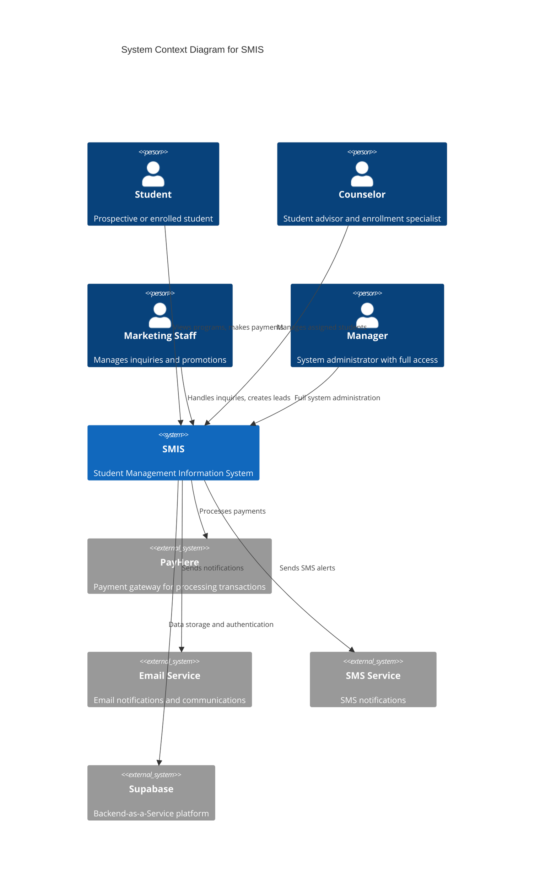
```mermaid
C4Context
    title System Context Diagram for SMIS

    Person(student, "Student", "Prospective or enrolled student")
    Person(counselor, "Counselor", "Student advisor and enrollment specialist")
    Person(marketing, "Marketing Staff", "Manages inquiries and promotions")
    Person(manager, "Manager", "System administrator with full access")
    
    System(smis, "SMIS", "Student Management Information System")
    
    System_Ext(payhere, "PayHere", "Payment gateway for processing transactions")
    System_Ext(email, "Email Service", "Email notifications and communications")
    System_Ext(sms, "SMS Service", "SMS notifications")
    System_Ext(supabase, "Supabase", "Backend-as-a-Service platform")
    
    Rel(student, smis, "Views programs, makes payments")
    Rel(counselor, smis, "Manages assigned students")
    Rel(marketing, smis, "Handles inquiries, creates leads")
    Rel(manager, smis, "Full system administration")
    
    Rel(smis, payhere, "Processes payments")
    Rel(smis, email, "Sends notifications")
    Rel(smis, sms, "Sends SMS alerts")
    Rel(smis, supabase, "Data storage and authentication")
```

### Container Diagram

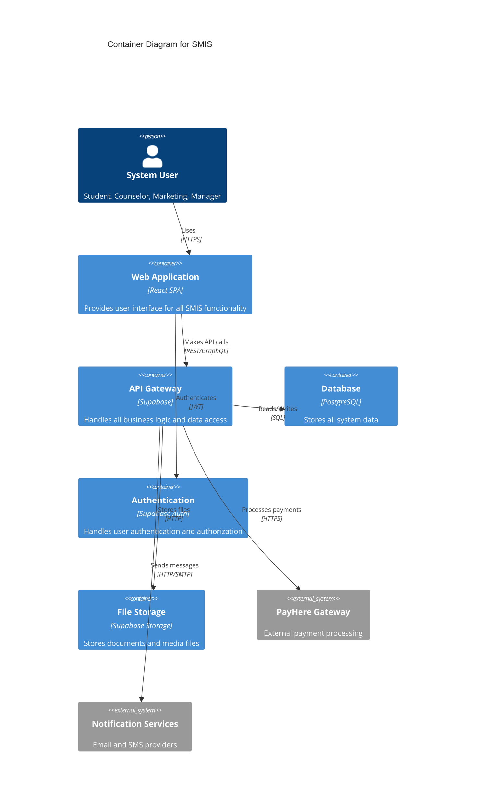
```mermaid
C4Container
    title Container Diagram for SMIS

    Person(user, "System User", "Student, Counselor, Marketing, Manager")
    
    Container(webapp, "Web Application", "React SPA", "Provides user interface for all SMIS functionality")
    Container(api, "API Gateway", "Supabase", "Handles all business logic and data access")
    Container(database, "Database", "PostgreSQL", "Stores all system data")
    Container(auth, "Authentication", "Supabase Auth", "Handles user authentication and authorization")
    Container(storage, "File Storage", "Supabase Storage", "Stores documents and media files")
    
    System_Ext(payhere, "PayHere Gateway", "External payment processing")
    System_Ext(notifications, "Notification Services", "Email and SMS providers")
    
    Rel(user, webapp, "Uses", "HTTPS")
    Rel(webapp, api, "Makes API calls", "REST/GraphQL")
    Rel(webapp, auth, "Authenticates", "JWT")
    Rel(api, database, "Reads/Writes", "SQL")
    Rel(api, storage, "Stores files", "HTTP")
    Rel(api, payhere, "Processes payments", "HTTPS")
    Rel(api, notifications, "Sends messages", "HTTP/SMTP")
```

---

## Detailed Workflow Sequences

### Complete Student Enrollment Process

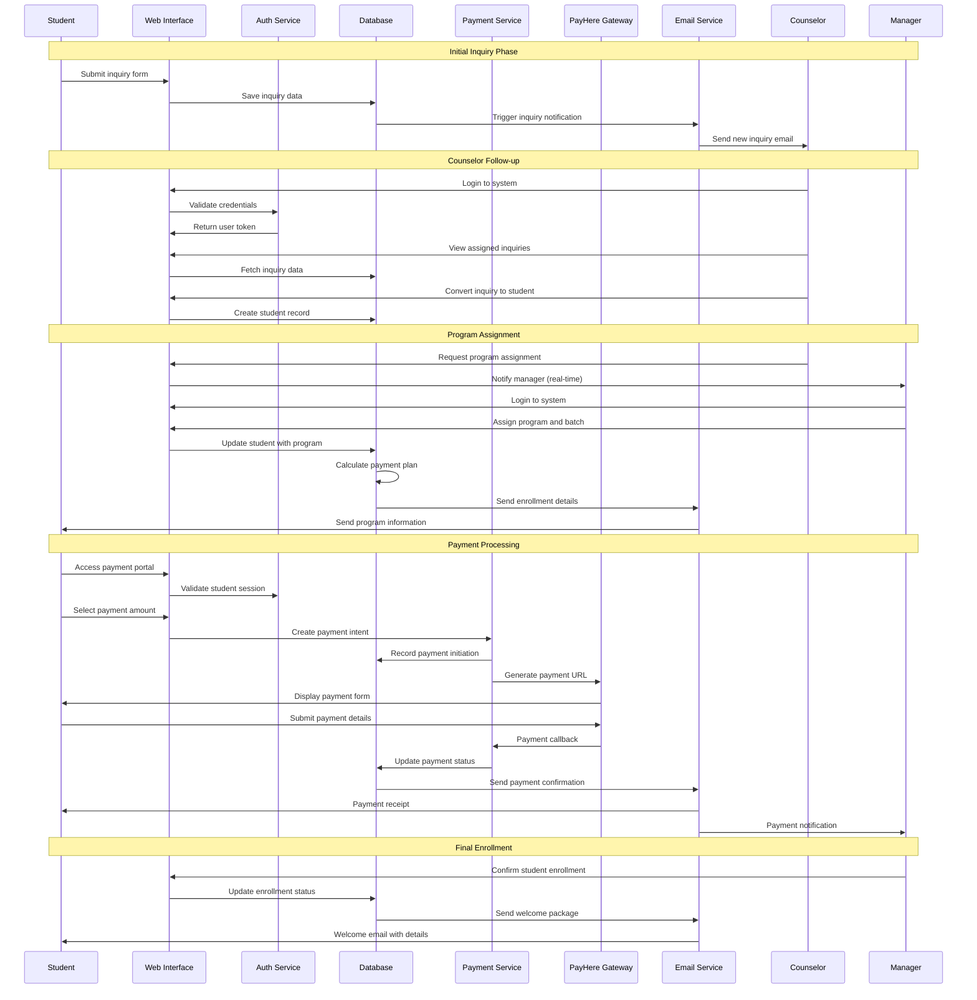
```mermaid
sequenceDiagram
    participant S as Student
    participant UI as Web Interface
    participant AUTH as Auth Service
    participant DB as Database
    participant PAYMENT as Payment Service
    participant PAYHERE as PayHere Gateway
    participant EMAIL as Email Service
    participant C as Counselor
    participant M as Manager

    Note over S,M: Initial Inquiry Phase
    S->>UI: Submit inquiry form
    UI->>DB: Save inquiry data
    DB->>EMAIL: Trigger inquiry notification
    EMAIL->>C: Send new inquiry email
    
    Note over S,M: Counselor Follow-up
    C->>UI: Login to system
    UI->>AUTH: Validate credentials
    AUTH->>UI: Return user token
    C->>UI: View assigned inquiries
    UI->>DB: Fetch inquiry data
    C->>UI: Convert inquiry to student
    UI->>DB: Create student record
    
    Note over S,M: Program Assignment
    C->>UI: Request program assignment
    UI->>M: Notify manager (real-time)
    M->>UI: Login to system
    M->>UI: Assign program and batch
    UI->>DB: Update student with program
    DB->>DB: Calculate payment plan
    DB->>EMAIL: Send enrollment details
    EMAIL->>S: Send program information
    
    Note over S,M: Payment Processing
    S->>UI: Access payment portal
    UI->>AUTH: Validate student session
    S->>UI: Select payment amount
    UI->>PAYMENT: Create payment intent
    PAYMENT->>DB: Record payment initiation
    PAYMENT->>PAYHERE: Generate payment URL
    PAYHERE->>S: Display payment form
    S->>PAYHERE: Submit payment details
    PAYHERE->>PAYMENT: Payment callback
    PAYMENT->>DB: Update payment status
    DB->>EMAIL: Send payment confirmation
    EMAIL->>S: Payment receipt
    EMAIL->>M: Payment notification
    
    Note over S,M: Final Enrollment
    M->>UI: Confirm student enrollment
    UI->>DB: Update enrollment status
    DB->>EMAIL: Send welcome package
    EMAIL->>S: Welcome email with details
```

### Advanced Payment Reconciliation Workflow

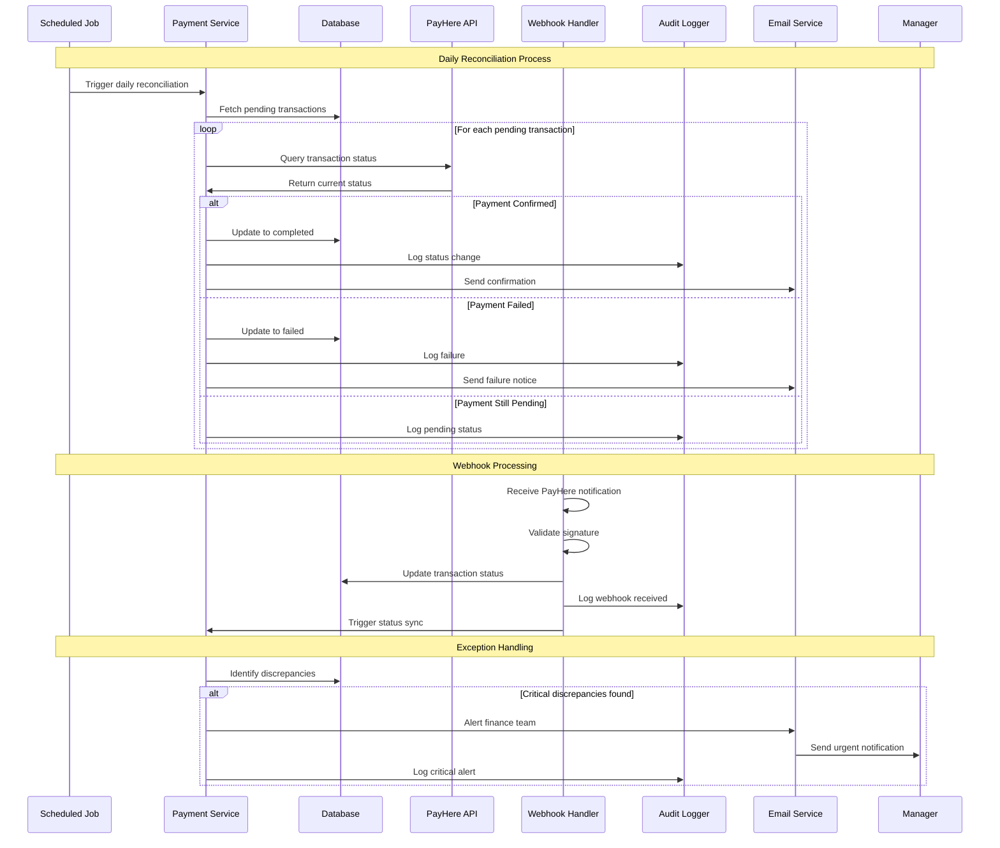
```mermaid
sequenceDiagram
    participant CRON as Scheduled Job
    participant PAYMENT as Payment Service
    participant DB as Database
    participant PAYHERE as PayHere API
    participant WEBHOOK as Webhook Handler
    participant AUDIT as Audit Logger
    participant EMAIL as Email Service
    participant MANAGER as Manager

    Note over CRON,MANAGER: Daily Reconciliation Process
    CRON->>PAYMENT: Trigger daily reconciliation
    PAYMENT->>DB: Fetch pending transactions
    
    loop For each pending transaction
        PAYMENT->>PAYHERE: Query transaction status
        PAYHERE->>PAYMENT: Return current status
        
        alt Payment Confirmed
            PAYMENT->>DB: Update to completed
            PAYMENT->>AUDIT: Log status change
            PAYMENT->>EMAIL: Send confirmation
        else Payment Failed
            PAYMENT->>DB: Update to failed
            PAYMENT->>AUDIT: Log failure
            PAYMENT->>EMAIL: Send failure notice
        else Payment Still Pending
            PAYMENT->>AUDIT: Log pending status
        end
    end
    
    Note over CRON,MANAGER: Webhook Processing
    WEBHOOK->>WEBHOOK: Receive PayHere notification
    WEBHOOK->>WEBHOOK: Validate signature
    WEBHOOK->>DB: Update transaction status
    WEBHOOK->>AUDIT: Log webhook received
    WEBHOOK->>PAYMENT: Trigger status sync
    
    Note over CRON,MANAGER: Exception Handling
    PAYMENT->>DB: Identify discrepancies
    alt Critical discrepancies found
        PAYMENT->>EMAIL: Alert finance team
        EMAIL->>MANAGER: Send urgent notification
        PAYMENT->>AUDIT: Log critical alert
    end
```

### Real-time Dashboard Updates

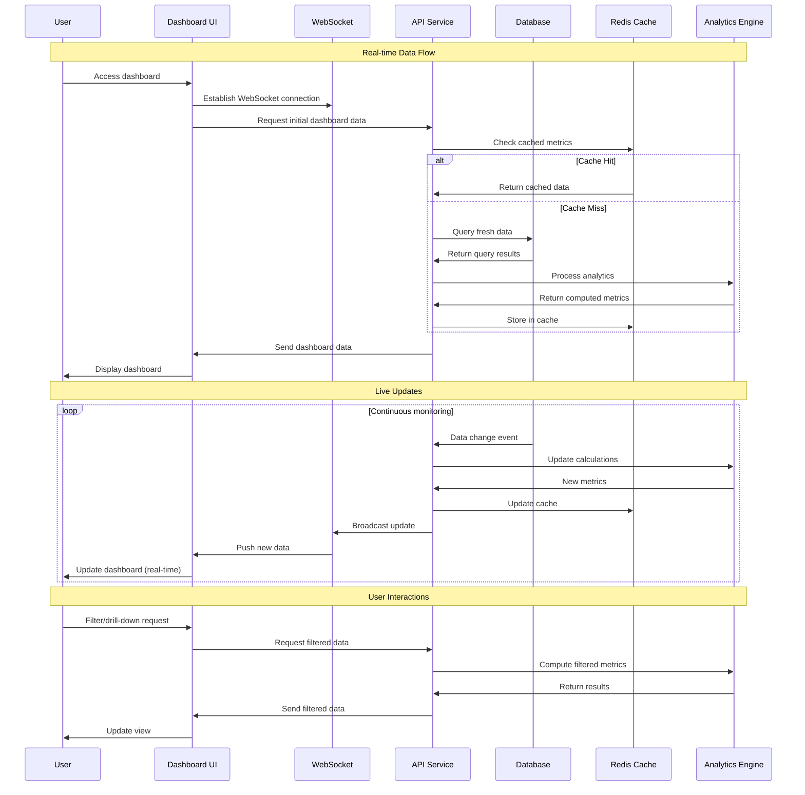
```mermaid
sequenceDiagram
    participant USER as User
    participant UI as Dashboard UI
    participant WS as WebSocket
    participant API as API Service
    participant DB as Database
    participant CACHE as Redis Cache
    participant ANALYTICS as Analytics Engine

    Note over USER,ANALYTICS: Real-time Data Flow
    USER->>UI: Access dashboard
    UI->>WS: Establish WebSocket connection
    UI->>API: Request initial dashboard data
    API->>CACHE: Check cached metrics
    
    alt Cache Hit
        CACHE->>API: Return cached data
    else Cache Miss
        API->>DB: Query fresh data
        DB->>API: Return query results
        API->>ANALYTICS: Process analytics
        ANALYTICS->>API: Return computed metrics
        API->>CACHE: Store in cache
    end
    
    API->>UI: Send dashboard data
    UI->>USER: Display dashboard
    
    Note over USER,ANALYTICS: Live Updates
    loop Continuous monitoring
        DB->>API: Data change event
        API->>ANALYTICS: Update calculations
        ANALYTICS->>API: New metrics
        API->>CACHE: Update cache
        API->>WS: Broadcast update
        WS->>UI: Push new data
        UI->>USER: Update dashboard (real-time)
    end
    
    Note over USER,ANALYTICS: User Interactions
    USER->>UI: Filter/drill-down request
    UI->>API: Request filtered data
    API->>ANALYTICS: Compute filtered metrics
    ANALYTICS->>API: Return results
    API->>UI: Send filtered data
    UI->>USER: Update view
```

---

## Data Architecture

### Data Flow Architecture

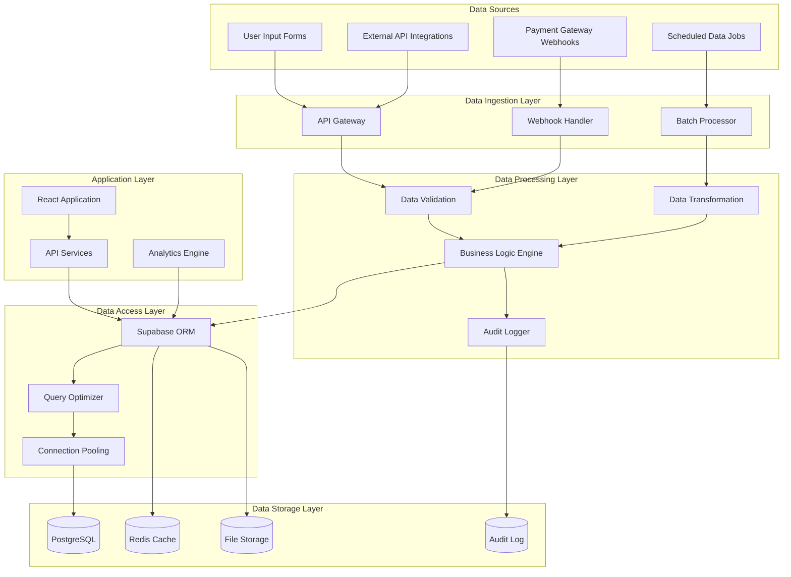
```mermaid
flowchart TD
    subgraph "Data Sources"
        USER_INPUT[User Input Forms]
        PAYMENT_GATEWAY[Payment Gateway Webhooks]
        EXTERNAL_APIs[External API Integrations]
        SCHEDULED_JOBS[Scheduled Data Jobs]
    end
    
    subgraph "Data Ingestion Layer"
        API_GATEWAY[API Gateway]
        WEBHOOK_HANDLER[Webhook Handler]
        BATCH_PROCESSOR[Batch Processor]
    end
    
    subgraph "Data Processing Layer"
        VALIDATION[Data Validation]
        TRANSFORMATION[Data Transformation]
        BUSINESS_LOGIC[Business Logic Engine]
        AUDIT_LOGGER[Audit Logger]
    end
    
    subgraph "Data Storage Layer"
        POSTGRES[(PostgreSQL)]
        REDIS_CACHE[(Redis Cache)]
        FILE_STORAGE[(File Storage)]
        AUDIT_LOG[(Audit Log)]
    end
    
    subgraph "Data Access Layer"
        ORM[Supabase ORM]
        QUERY_OPTIMIZER[Query Optimizer]
        CONNECTION_POOL[Connection Pooling]
    end
    
    subgraph "Application Layer"
        REACT_APP[React Application]
        API_SERVICES[API Services]
        ANALYTICS_ENGINE[Analytics Engine]
    end
    
    USER_INPUT --> API_GATEWAY
    PAYMENT_GATEWAY --> WEBHOOK_HANDLER
    EXTERNAL_APIs --> API_GATEWAY
    SCHEDULED_JOBS --> BATCH_PROCESSOR
    
    API_GATEWAY --> VALIDATION
    WEBHOOK_HANDLER --> VALIDATION
    BATCH_PROCESSOR --> TRANSFORMATION
    
    VALIDATION --> BUSINESS_LOGIC
    TRANSFORMATION --> BUSINESS_LOGIC
    BUSINESS_LOGIC --> AUDIT_LOGGER
    
    BUSINESS_LOGIC --> ORM
    AUDIT_LOGGER --> AUDIT_LOG
    
    ORM --> QUERY_OPTIMIZER
    QUERY_OPTIMIZER --> CONNECTION_POOL
    CONNECTION_POOL --> POSTGRES
    
    ORM --> REDIS_CACHE
    ORM --> FILE_STORAGE
    
    API_SERVICES --> ORM
    REACT_APP --> API_SERVICES
    ANALYTICS_ENGINE --> ORM
```

### Database Partitioning Strategy

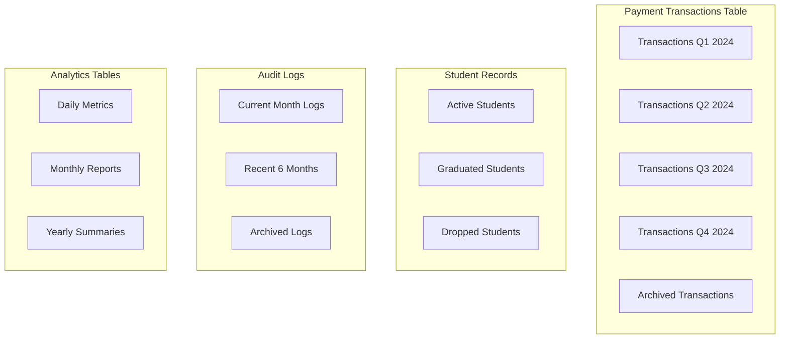
```mermaid
graph TB
    subgraph "Payment Transactions Table"
        PT_2024_Q1[Transactions Q1 2024]
        PT_2024_Q2[Transactions Q2 2024]
        PT_2024_Q3[Transactions Q3 2024]
        PT_2024_Q4[Transactions Q4 2024]
        PT_ARCHIVE[Archived Transactions]
    end
    
    subgraph "Student Records"
        ACTIVE_STUDENTS[Active Students]
        GRADUATED_STUDENTS[Graduated Students]
        DROPPED_STUDENTS[Dropped Students]
    end
    
    subgraph "Audit Logs"
        AUDIT_CURRENT[Current Month Logs]
        AUDIT_RECENT[Recent 6 Months]
        AUDIT_ARCHIVE[Archived Logs]
    end
    
    subgraph "Analytics Tables"
        DAILY_METRICS[Daily Metrics]
        MONTHLY_REPORTS[Monthly Reports]
        YEARLY_SUMMARIES[Yearly Summaries]
    end
```

---

## Security Architecture

### Multi-Layer Security Model

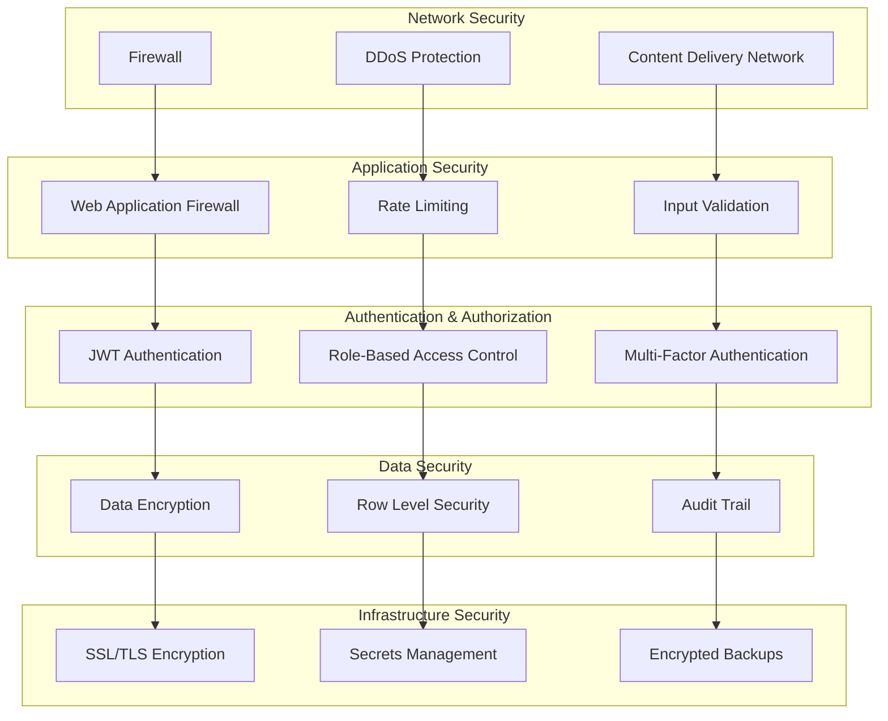
```mermaid
graph TB
    subgraph "Network Security"
        FIREWALL[Firewall]
        DDoS[DDoS Protection]
        CDN[Content Delivery Network]
    end
    
    subgraph "Application Security"
        WAF[Web Application Firewall]
        RATE_LIMITER[Rate Limiting]
        INPUT_VALIDATION[Input Validation]
    end
    
    subgraph "Authentication & Authorization"
        JWT_AUTH[JWT Authentication]
        RBAC[Role-Based Access Control]
        MFA[Multi-Factor Authentication]
    end
    
    subgraph "Data Security"
        ENCRYPTION[Data Encryption]
        RLS[Row Level Security]
        AUDIT_TRAIL[Audit Trail]
    end
    
    subgraph "Infrastructure Security"
        SSL_TLS[SSL/TLS Encryption]
        SECRETS_MGMT[Secrets Management]
        BACKUP_ENCRYPTION[Encrypted Backups]
    end
    
    FIREWALL --> WAF
    DDoS --> RATE_LIMITER
    CDN --> INPUT_VALIDATION
    
    WAF --> JWT_AUTH
    RATE_LIMITER --> RBAC
    INPUT_VALIDATION --> MFA
    
    JWT_AUTH --> ENCRYPTION
    RBAC --> RLS
    MFA --> AUDIT_TRAIL
    
    ENCRYPTION --> SSL_TLS
    RLS --> SECRETS_MGMT
    AUDIT_TRAIL --> BACKUP_ENCRYPTION
```

### Authentication & Authorization Flow

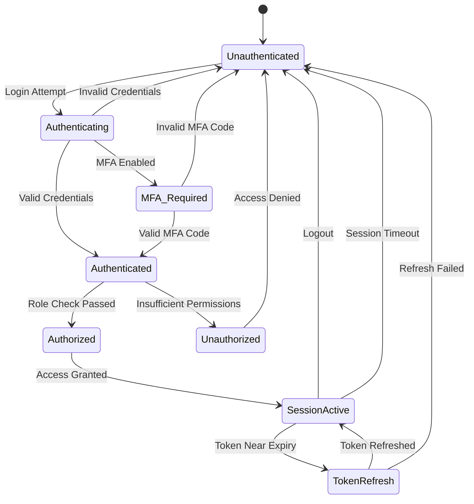
```mermaid
stateDiagram-v2
    [*] --> Unauthenticated
    
    Unauthenticated --> Authenticating: Login Attempt
    Authenticating --> Authenticated: Valid Credentials
    Authenticating --> Unauthenticated: Invalid Credentials
    Authenticating --> MFA_Required: MFA Enabled
    
    MFA_Required --> Authenticated: Valid MFA Code
    MFA_Required --> Unauthenticated: Invalid MFA Code
    
    Authenticated --> Authorized: Role Check Passed
    Authenticated --> Unauthorized: Insufficient Permissions
    
    Authorized --> SessionActive: Access Granted
    Unauthorized --> Unauthenticated: Access Denied
    
    SessionActive --> TokenRefresh: Token Near Expiry
    TokenRefresh --> SessionActive: Token Refreshed
    TokenRefresh --> Unauthenticated: Refresh Failed
    
    SessionActive --> Unauthenticated: Logout
    SessionActive --> Unauthenticated: Session Timeout
```

---

## Performance Architecture

### Caching Strategy

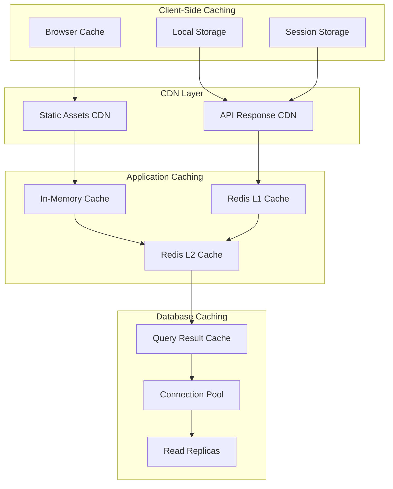
```mermaid
graph TB
    subgraph "Client-Side Caching"
        BROWSER_CACHE[Browser Cache]
        LOCAL_STORAGE[Local Storage]
        SESSION_STORAGE[Session Storage]
    end
    
    subgraph "CDN Layer"
        STATIC_ASSETS[Static Assets CDN]
        API_CACHE[API Response CDN]
    end
    
    subgraph "Application Caching"
        REDIS_L1[Redis L1 Cache]
        REDIS_L2[Redis L2 Cache]
        MEMORY_CACHE[In-Memory Cache]
    end
    
    subgraph "Database Caching"
        QUERY_CACHE[Query Result Cache]
        CONNECTION_POOL[Connection Pool]
        READ_REPLICAS[Read Replicas]
    end
    
    BROWSER_CACHE --> STATIC_ASSETS
    LOCAL_STORAGE --> API_CACHE
    SESSION_STORAGE --> API_CACHE
    
    STATIC_ASSETS --> MEMORY_CACHE
    API_CACHE --> REDIS_L1
    
    MEMORY_CACHE --> REDIS_L2
    REDIS_L1 --> REDIS_L2
    
    REDIS_L2 --> QUERY_CACHE
    QUERY_CACHE --> CONNECTION_POOL
    CONNECTION_POOL --> READ_REPLICAS
```

### Load Balancing Strategy

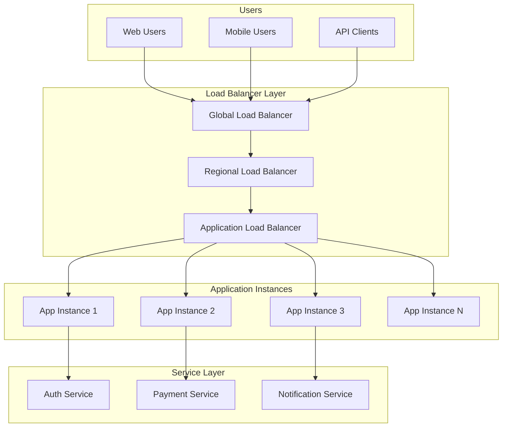
```mermaid
graph TB
    subgraph "Users"
        WEB_USERS[Web Users]
        MOBILE_USERS[Mobile Users]
        API_CLIENTS[API Clients]
    end
    
    subgraph "Load Balancer Layer"
        GLOBAL_LB[Global Load Balancer]
        REGIONAL_LB[Regional Load Balancer]
        APP_LB[Application Load Balancer]
    end
    
    subgraph "Application Instances"
        APP_1[App Instance 1]
        APP_2[App Instance 2]
        APP_3[App Instance 3]
        APP_N[App Instance N]
    end
    
    subgraph "Service Layer"
        AUTH_SERVICE[Auth Service]
        PAYMENT_SERVICE[Payment Service]
        NOTIFICATION_SERVICE[Notification Service]
    end
    
    WEB_USERS --> GLOBAL_LB
    MOBILE_USERS --> GLOBAL_LB
    API_CLIENTS --> GLOBAL_LB
    
    GLOBAL_LB --> REGIONAL_LB
    REGIONAL_LB --> APP_LB
    
    APP_LB --> APP_1
    APP_LB --> APP_2
    APP_LB --> APP_3
    APP_LB --> APP_N
    
    APP_1 --> AUTH_SERVICE
    APP_2 --> PAYMENT_SERVICE
    APP_3 --> NOTIFICATION_SERVICE
```

---

## Monitoring & Observability

### Comprehensive Monitoring Architecture

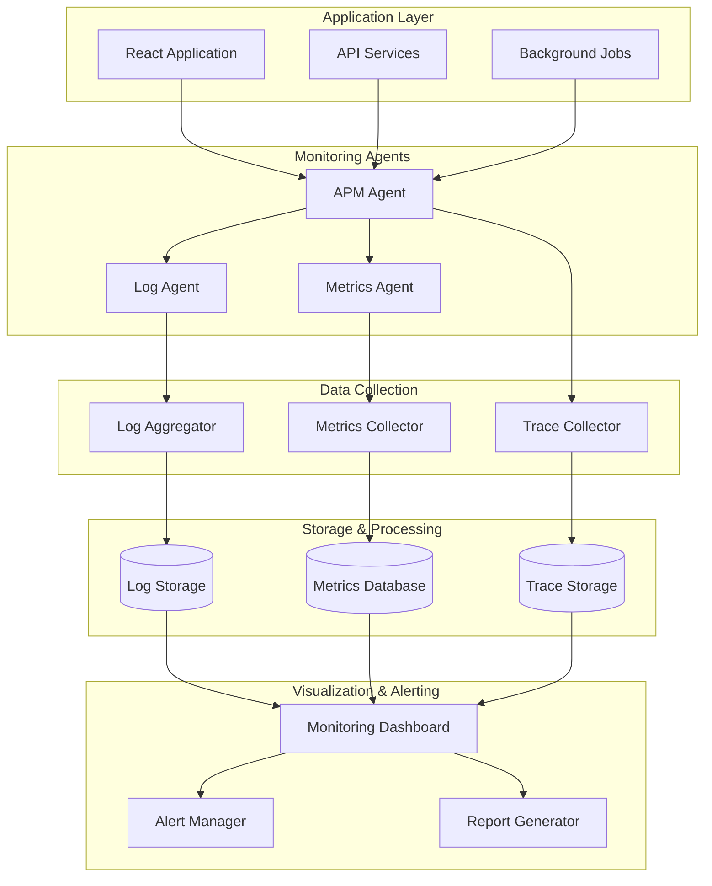
```mermaid
graph TB
    subgraph "Application Layer"
        REACT_APP[React Application]
        API_SERVICES[API Services]
        BACKGROUND_JOBS[Background Jobs]
    end
    
    subgraph "Monitoring Agents"
        APM_AGENT[APM Agent]
        LOG_AGENT[Log Agent]
        METRICS_AGENT[Metrics Agent]
    end
    
    subgraph "Data Collection"
        LOG_AGGREGATOR[Log Aggregator]
        METRICS_COLLECTOR[Metrics Collector]
        TRACE_COLLECTOR[Trace Collector]
    end
    
    subgraph "Storage & Processing"
        LOG_STORAGE[(Log Storage)]
        METRICS_DB[(Metrics Database)]
        TRACE_STORAGE[(Trace Storage)]
    end
    
    subgraph "Visualization & Alerting"
        DASHBOARD[Monitoring Dashboard]
        ALERTS[Alert Manager]
        REPORTS[Report Generator]
    end
    
    REACT_APP --> APM_AGENT
    API_SERVICES --> APM_AGENT
    BACKGROUND_JOBS --> APM_AGENT
    
    APM_AGENT --> LOG_AGENT
    APM_AGENT --> METRICS_AGENT
    
    LOG_AGENT --> LOG_AGGREGATOR
    METRICS_AGENT --> METRICS_COLLECTOR
    APM_AGENT --> TRACE_COLLECTOR
    
    LOG_AGGREGATOR --> LOG_STORAGE
    METRICS_COLLECTOR --> METRICS_DB
    TRACE_COLLECTOR --> TRACE_STORAGE
    
    LOG_STORAGE --> DASHBOARD
    METRICS_DB --> DASHBOARD
    TRACE_STORAGE --> DASHBOARD
    
    DASHBOARD --> ALERTS
    DASHBOARD --> REPORTS
```

---

## Deployment Architecture

### CI/CD Pipeline

```mermaid
graph LR
    subgraph "Development"
        DEV[Developer]
        IDE[IDE/Editor]
        LOCAL[Local Testing]
    end
    
    subgraph "Source Control"
        GIT[Git Repository]
        BRANCH[Feature Branch]
        PR[Pull Request]
    end
    
    subgraph "CI Pipeline"
        BUILD[Build Process]
        TEST[Automated Testing]
        SCAN[Security Scanning]
        QUALITY[Quality Gates]
    end
    
    subgraph "CD Pipeline"
        STAGING[Staging Deploy]
        UAT[UAT Testing]
        PROD_DEPLOY[Production Deploy]
        MONITORING[Post-Deploy Monitoring]
    end
    
    DEV --> IDE
    IDE --> LOCAL
    LOCAL --> GIT
    
    GIT --> BRANCH
    BRANCH --> PR
    PR --> BUILD
    
    BUILD --> TEST
    TEST --> SCAN
    SCAN --> QUALITY
    
    QUALITY --> STAGING
    STAGING --> UAT
    UAT --> PROD_DEPLOY
    PROD_DEPLOY --> MONITORING
```

### Infrastructure as Code

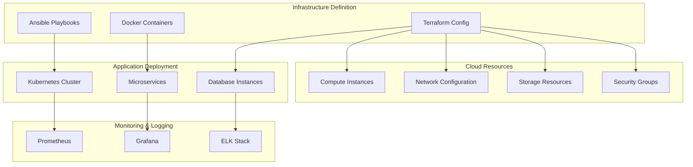
```mermaid
graph TB
    subgraph "Infrastructure Definition"
        TERRAFORM[Terraform Config]
        ANSIBLE[Ansible Playbooks]
        DOCKER[Docker Containers]
    end
    
    subgraph "Cloud Resources"
        COMPUTE[Compute Instances]
        NETWORK[Network Configuration]
        STORAGE[Storage Resources]
        SECURITY[Security Groups]
    end
    
    subgraph "Application Deployment"
        KUBERNETES[Kubernetes Cluster]
        SERVICES[Microservices]
        DATABASES[Database Instances]
    end
    
    subgraph "Monitoring & Logging"
        PROMETHEUS[Prometheus]
        GRAFANA[Grafana]
        ELK_STACK[ELK Stack]
    end
    
    TERRAFORM --> COMPUTE
    TERRAFORM --> NETWORK
    TERRAFORM --> STORAGE
    TERRAFORM --> SECURITY
    
    ANSIBLE --> KUBERNETES
    DOCKER --> SERVICES
    TERRAFORM --> DATABASES
    
    KUBERNETES --> PROMETHEUS
    SERVICES --> GRAFANA
    DATABASES --> ELK_STACK
```

---

## Scalability Considerations

### Horizontal Scaling Strategy

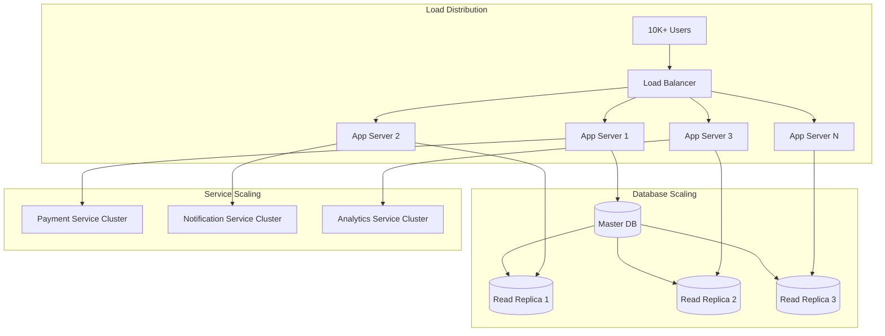
```mermaid
graph TB
    subgraph "Load Distribution"
        USERS[10K+ Users] --> LB[Load Balancer]
        LB --> APP1[App Server 1]
        LB --> APP2[App Server 2]
        LB --> APP3[App Server 3]
        LB --> APPN[App Server N]
    end
    
    subgraph "Database Scaling"
        APP1 --> MASTER[(Master DB)]
        APP2 --> REPLICA1[(Read Replica 1)]
        APP3 --> REPLICA2[(Read Replica 2)]
        APPN --> REPLICA3[(Read Replica 3)]
        
        MASTER --> REPLICA1
        MASTER --> REPLICA2
        MASTER --> REPLICA3
    end
    
    subgraph "Service Scaling"
        PAYMENT_SVC[Payment Service Cluster]
        NOTIFICATION_SVC[Notification Service Cluster]
        ANALYTICS_SVC[Analytics Service Cluster]
    end
    
    APP1 --> PAYMENT_SVC
    APP2 --> NOTIFICATION_SVC
    APP3 --> ANALYTICS_SVC
```

### Auto-Scaling Configuration

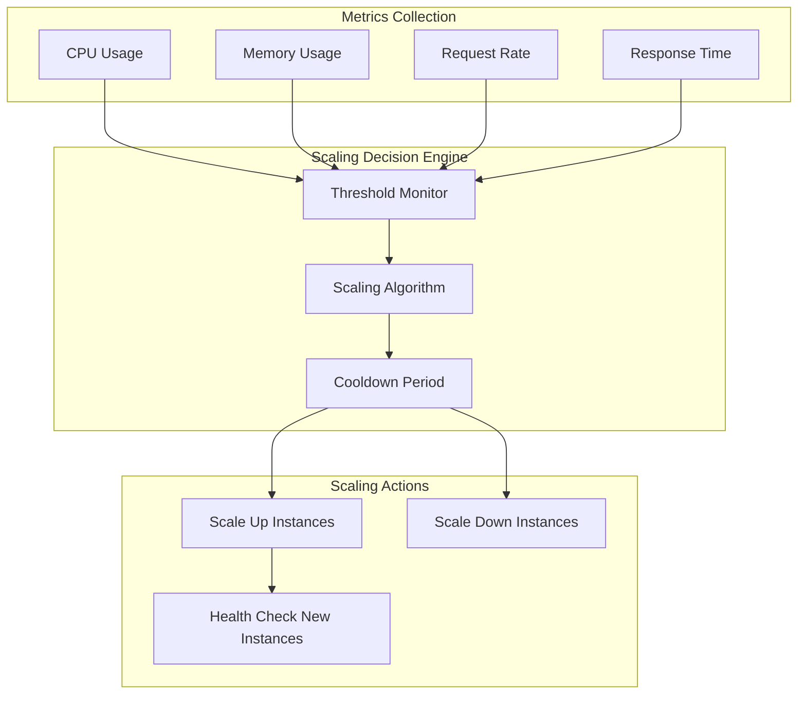
```mermaid
graph TB
    subgraph "Metrics Collection"
        CPU[CPU Usage]
        MEMORY[Memory Usage]
        REQUESTS[Request Rate]
        RESPONSE_TIME[Response Time]
    end
    
    subgraph "Scaling Decision Engine"
        THRESHOLD[Threshold Monitor]
        ALGORITHM[Scaling Algorithm]
        COOLDOWN[Cooldown Period]
    end
    
    subgraph "Scaling Actions"
        SCALE_UP[Scale Up Instances]
        SCALE_DOWN[Scale Down Instances]
        HEALTH_CHECK[Health Check New Instances]
    end
    
    CPU --> THRESHOLD
    MEMORY --> THRESHOLD
    REQUESTS --> THRESHOLD
    RESPONSE_TIME --> THRESHOLD
    
    THRESHOLD --> ALGORITHM
    ALGORITHM --> COOLDOWN
    
    COOLDOWN --> SCALE_UP
    COOLDOWN --> SCALE_DOWN
    SCALE_UP --> HEALTH_CHECK
```

---

## Technical Debt Management

### Code Quality Metrics

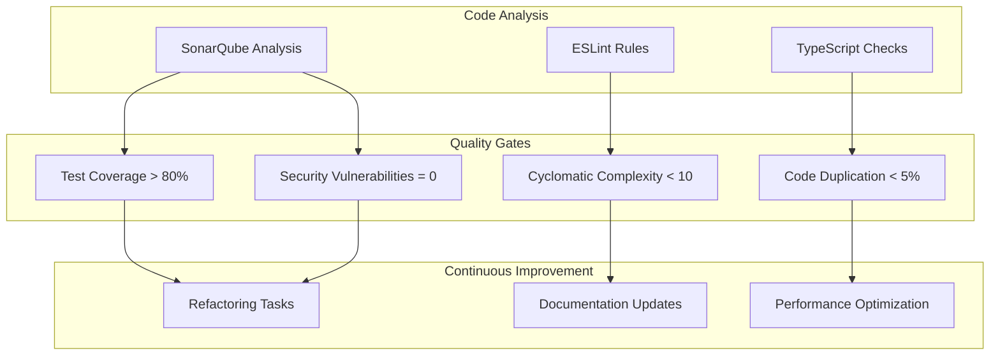
```mermaid
graph TB
    subgraph "Code Analysis"
        SONARQUBE[SonarQube Analysis]
        ESLINT[ESLint Rules]
        TYPESCRIPT[TypeScript Checks]
    end
    
    subgraph "Quality Gates"
        COVERAGE[Test Coverage > 80%]
        COMPLEXITY[Cyclomatic Complexity < 10]
        DUPLICATION[Code Duplication < 5%]
        SECURITY[Security Vulnerabilities = 0]
    end
    
    subgraph "Continuous Improvement"
        REFACTORING[Refactoring Tasks]
        DOCUMENTATION[Documentation Updates]
        PERFORMANCE[Performance Optimization]
    end
    
    SONARQUBE --> COVERAGE
    ESLINT --> COMPLEXITY
    TYPESCRIPT --> DUPLICATION
    SONARQUBE --> SECURITY
    
    COVERAGE --> REFACTORING
    COMPLEXITY --> DOCUMENTATION
    DUPLICATION --> PERFORMANCE
    SECURITY --> REFACTORING
```

---

## Disaster Recovery Plan

### Backup and Recovery Strategy

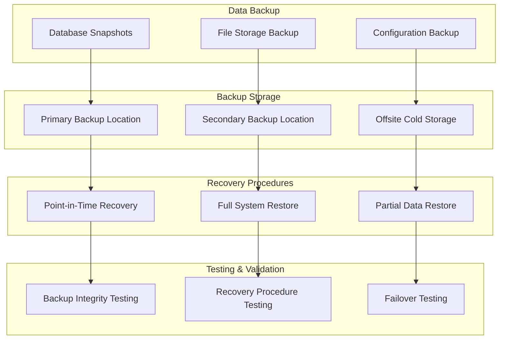
```mermaid
graph TB
    subgraph "Data Backup"
        DB_BACKUP[Database Snapshots]
        FILE_BACKUP[File Storage Backup]
        CONFIG_BACKUP[Configuration Backup]
    end
    
    subgraph "Backup Storage"
        PRIMARY[Primary Backup Location]
        SECONDARY[Secondary Backup Location]
        OFFSITE[Offsite Cold Storage]
    end
    
    subgraph "Recovery Procedures"
        POINT_IN_TIME[Point-in-Time Recovery]
        FULL_RESTORE[Full System Restore]
        PARTIAL_RESTORE[Partial Data Restore]
    end
    
    subgraph "Testing & Validation"
        BACKUP_TEST[Backup Integrity Testing]
        RECOVERY_TEST[Recovery Procedure Testing]
        FAILOVER_TEST[Failover Testing]
    end
    
    DB_BACKUP --> PRIMARY
    FILE_BACKUP --> SECONDARY
    CONFIG_BACKUP --> OFFSITE
    
    PRIMARY --> POINT_IN_TIME
    SECONDARY --> FULL_RESTORE
    OFFSITE --> PARTIAL_RESTORE
    
    POINT_IN_TIME --> BACKUP_TEST
    FULL_RESTORE --> RECOVERY_TEST
    PARTIAL_RESTORE --> FAILOVER_TEST
```

---

*This system design document serves as the comprehensive technical blueprint for the SMIS platform. It is maintained by the Architecture Team and updated with each major release.*

---

# Role-Based Function Workflows

## Marketing Staff Functions

### Marketing Login/Logout Workflow

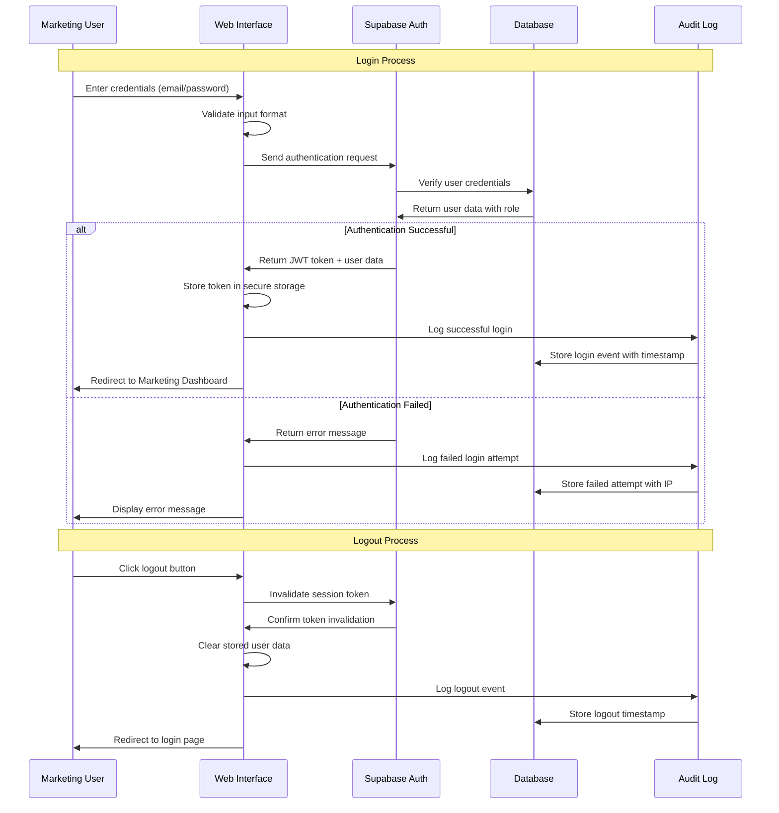
```mermaid
sequenceDiagram
    participant U as Marketing User
    participant UI as Web Interface
    participant AUTH as Supabase Auth
    participant DB as Database
    participant AUDIT as Audit Log

    Note over U,AUDIT: Login Process
    U->>UI: Enter credentials (email/password)
    UI->>UI: Validate input format
    UI->>AUTH: Send authentication request
    AUTH->>DB: Verify user credentials
    DB->>AUTH: Return user data with role
    
    alt Authentication Successful
        AUTH->>UI: Return JWT token + user data
        UI->>UI: Store token in secure storage
        UI->>AUDIT: Log successful login
        AUDIT->>DB: Store login event with timestamp
        UI->>U: Redirect to Marketing Dashboard
    else Authentication Failed
        AUTH->>UI: Return error message
        UI->>AUDIT: Log failed login attempt
        AUDIT->>DB: Store failed attempt with IP
        UI->>U: Display error message
    end

    Note over U,AUDIT: Logout Process
    U->>UI: Click logout button
    UI->>AUTH: Invalidate session token
    AUTH->>UI: Confirm token invalidation
    UI->>UI: Clear stored user data
    UI->>AUDIT: Log logout event
    AUDIT->>DB: Store logout timestamp
    UI->>U: Redirect to login page
```

### Marketing Dashboard Analytics Workflow

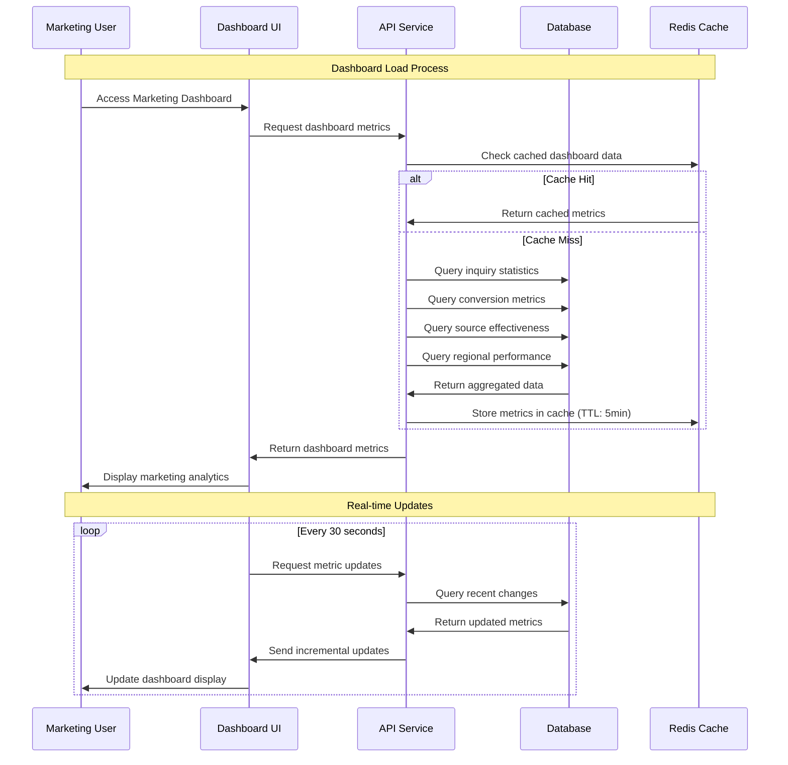
```mermaid
sequenceDiagram
    participant M as Marketing User
    participant UI as Dashboard UI
    participant API as API Service
    participant DB as Database
    participant CACHE as Redis Cache

    Note over M,CACHE: Dashboard Load Process
    M->>UI: Access Marketing Dashboard
    UI->>API: Request dashboard metrics
    
    API->>CACHE: Check cached dashboard data
    alt Cache Hit
        CACHE->>API: Return cached metrics
    else Cache Miss
        API->>DB: Query inquiry statistics
        API->>DB: Query conversion metrics
        API->>DB: Query source effectiveness
        API->>DB: Query regional performance
        DB->>API: Return aggregated data
        API->>CACHE: Store metrics in cache (TTL: 5min)
    end
    
    API->>UI: Return dashboard metrics
    UI->>M: Display marketing analytics
    
    Note over M,CACHE: Real-time Updates
    loop Every 30 seconds
        UI->>API: Request metric updates
        API->>DB: Query recent changes
        DB->>API: Return updated metrics
        API->>UI: Send incremental updates
        UI->>M: Update dashboard display
    end
```

### Marketing Student Management (Limited Access) Workflow

```mermaid
sequenceDiagram
    participant M as Marketing Staff
    participant UI as Student Interface
    participant API as Student API
    participant DB as Database
    participant RBAC as Role-Based Access Control

    Note over M,RBAC: Student Search & View
    M->>UI: Search for student
    UI->>API: Request student search (with marketing role)
    API->>RBAC: Validate marketing permissions
    RBAC->>API: Return allowed fields only
    
    API->>DB: Query students with field restrictions
    Note over DB: Marketing can only see: name, email, phone, program, enrollment status
    DB->>API: Return filtered student data
    API->>UI: Send limited student information
    UI->>M: Display restricted student profile
    
    Note over M,RBAC: Inquiry Conversion
    M->>UI: Convert inquiry to enrollment
    UI->>API: Request enrollment creation
    API->>RBAC: Check marketing conversion rights
    
    alt Permission Granted
        API->>DB: Create enrollment record
        API->>DB: Update inquiry status
        DB->>API: Return enrollment ID
        API->>UI: Send success confirmation
        UI->>M: Display enrollment confirmation
    else Permission Denied
        RBAC->>API: Return authorization error
        API->>UI: Send permission denied message
        UI->>M: Display access restriction notice
    end
```

### Marketing Inquiry Management & Follow-up Workflow

```mermaid
sequenceDiagram
    participant M as Marketing Staff
    participant UI as Inquiry Interface
    participant API as Inquiry API
    participant DB as Database
    participant EMAIL as Email Service
    participant SCHEDULER as Task Scheduler

    Note over M,SCHEDULER: Inquiry Creation & Assignment
    M->>UI: Create new inquiry
    UI->>API: Submit inquiry data
    API->>DB: Insert inquiry record
    DB->>API: Return inquiry ID
    
    API->>DB: Auto-assign to marketing staff
    API->>SCHEDULER: Schedule follow-up task
    SCHEDULER->>DB: Create follow-up reminder
    
    API->>EMAIL: Send inquiry confirmation
    EMAIL->>M: Email notification of new assignment
    API->>UI: Return success confirmation
    UI->>M: Display inquiry created message
    
    Note over M,SCHEDULER: Follow-up Management
    M->>UI: View assigned inquiries
    UI->>API: Request inquiry list (marketing filter)
    API->>DB: Query inquiries assigned to user
    DB->>API: Return inquiry list with follow-up dates
    API->>UI: Send inquiry data
    UI->>M: Display inquiry dashboard
    
    M->>UI: Update inquiry status
    UI->>API: Submit status update
    API->>DB: Update inquiry record
    API->>SCHEDULER: Update follow-up schedule
    
    Note over M,SCHEDULER: Automated Follow-up System
    SCHEDULER->>SCHEDULER: Check due follow-ups (every hour)
    SCHEDULER->>DB: Query overdue inquiries
    DB->>SCHEDULER: Return overdue list
    SCHEDULER->>EMAIL: Send follow-up reminders
    EMAIL->>M: Send overdue inquiry notifications
```

### Marketing Programs Information Management Workflow

```mermaid
sequenceDiagram
    participant M as Marketing Staff
    participant UI as Program Interface
    participant API as Program API
    participant DB as Database
    participant CONTENT as Content Management

    Note over M,CONTENT: Program Information Access
    M->>UI: Access program information
    UI->>API: Request program list
    API->>DB: Query active programs
    DB->>API: Return program data with marketing materials
    API->>UI: Send program information
    UI->>M: Display program catalog
    
    Note over M,CONTENT: Marketing Material Management
    M->>UI: Update program marketing description
    UI->>API: Submit marketing content update
    API->>DB: Update program marketing fields
    API->>CONTENT: Store marketing materials
    CONTENT->>DB: Save content versions
    DB->>API: Confirm update success
    API->>UI: Return success confirmation
    UI->>M: Display update confirmation
    
    Note over M,CONTENT: Program Promotion Tracking
    M->>UI: View program performance metrics
    UI->>API: Request program analytics
    API->>DB: Query enrollment statistics by program
    API->>DB: Query conversion rates by program
    API->>DB: Query marketing campaign performance
    DB->>API: Return aggregated analytics
    API->>UI: Send performance metrics
    UI->>M: Display program effectiveness dashboard
```

### Marketing Batches Information Workflow

```mermaid
sequenceDiagram
    participant M as Marketing Staff
    participant UI as Batch Interface
    participant API as Batch API
    participant DB as Database
    participant NOTIFY as Notification Service

    Note over M,NOTIFY: Batch Information Access
    M->>UI: View available batches
    UI->>API: Request batch information
    API->>DB: Query batches with availability
    DB->>API: Return batch data (capacity, enrolled, schedule)
    API->>UI: Send batch information
    UI->>M: Display batch availability matrix
    
    Note over M,NOTIFY: Batch Promotion Management
    M->>UI: Check batch enrollment status
    UI->>API: Request detailed batch metrics
    API->>DB: Query enrollment trends by batch
    API->>DB: Query batch conversion rates
    DB->>API: Return batch performance data
    API->>UI: Send batch analytics
    UI->>M: Display batch performance dashboard
    
    Note over M,NOTIFY: Batch Capacity Alerts
    API->>DB: Monitor batch capacity (automated)
    DB->>API: Return capacity warnings
    
    alt Batch Nearly Full (>80%)
        API->>NOTIFY: Trigger capacity alert
        NOTIFY->>M: Send batch capacity notification
    else Batch Full
        API->>NOTIFY: Trigger full capacity alert
        NOTIFY->>M: Send urgent capacity notification
        API->>DB: Update batch status to "Full"
    end
```

### Marketing Enrollment & Registration Management Workflow

```mermaid
sequenceDiagram
    participant M as Marketing Staff
    participant UI as Enrollment Interface
    participant API as Enrollment API
    participant DB as Database
    participant PAYMENT as Payment Service
    participant EMAIL as Email Service

    Note over M,EMAIL: Enrollment Processing
    M->>UI: Process new enrollment
    UI->>API: Submit enrollment data
    API->>DB: Create enrollment record
    API->>DB: Initialize enrollment steps
    DB->>API: Return enrollment ID
    
    API->>PAYMENT: Calculate payment plan
    PAYMENT->>DB: Store payment plan
    PAYMENT->>API: Return payment details
    
    API->>EMAIL: Send enrollment confirmation
    EMAIL->>M: Send process completion notice
    API->>UI: Return enrollment confirmation
    UI->>M: Display enrollment success
    
    Note over M,EMAIL: Registration Status Tracking
    M->>UI: Check registration progress
    UI->>API: Request enrollment status
    API->>DB: Query enrollment steps completion
    API->>DB: Query document submission status
    API->>DB: Query payment status
    DB->>API: Return comprehensive status
    API->>UI: Send registration progress
    UI->>M: Display registration pipeline
    
    Note over M,EMAIL: Registration Completion Assistance
    M->>UI: Assist with registration completion
    UI->>API: Request pending items list
    API->>DB: Query incomplete requirements
    DB->>API: Return missing items
    API->>UI: Send pending requirements
    UI->>M: Display completion checklist
    
    M->>UI: Send completion reminder
    UI->>API: Trigger reminder notification
    API->>EMAIL: Send completion reminder
    EMAIL->>M: Confirm reminder sent
```

### Marketing Payments (Limited Initial Processing) Workflow

```mermaid
sequenceDiagram
    participant M as Marketing Staff
    participant UI as Payment Interface
    participant API as Payment API
    participant DB as Database
    participant PAYHERE as PayHere Gateway
    participant MANAGER as Manager

    Note over M,MANAGER: Initial Payment Processing
    M->>UI: Process initial payment
    UI->>API: Submit payment request
    API->>DB: Validate marketing payment limits
    
    alt Within Marketing Limits (≤ Registration Fee)
        API->>DB: Create payment record
        API->>PAYHERE: Initialize payment gateway
        PAYHERE->>API: Return payment URL
        API->>UI: Send payment link
        UI->>M: Display payment confirmation
    else Exceeds Marketing Limits
        API->>UI: Send limit exceeded error
        UI->>MANAGER: Escalate to manager approval
        UI->>M: Display escalation notice
    end
    
    Note over M,MANAGER: Payment Status Monitoring
    M->>UI: Check payment status
    UI->>API: Request payment updates
    API->>DB: Query payment transactions
    API->>PAYHERE: Verify payment status
    PAYHERE->>API: Return current status
    DB->>API: Return payment history
    API->>UI: Send payment status
    UI->>M: Display payment dashboard
    
    Note over M,MANAGER: Payment Reconciliation Support
    M->>UI: View payment discrepancies
    UI->>API: Request reconciliation data
    API->>DB: Query pending reconciliations
    DB->>API: Return discrepancy list
    API->>UI: Send reconciliation items
    UI->>M: Display reconciliation tasks
```

### Marketing Currency Support Workflow

```mermaid
sequenceDiagram
    participant M as Marketing Staff
    participant UI as Currency Interface
    participant API as Currency API
    participant DB as Database
    participant EXCHANGE as Exchange Rate Service

    Note over M,EXCHANGE: Currency Rate Management
    M->>UI: View current exchange rates
    UI->>API: Request currency rates
    API->>DB: Query current exchange rates
    DB->>API: Return rate data with timestamps
    API->>UI: Send currency information
    UI->>M: Display exchange rate dashboard
    
    Note over M,EXCHANGE: Multi-Currency Quote Generation
    M->>UI: Generate program quote
    UI->>API: Request multi-currency pricing
    API->>DB: Query program fees (LKR base)
    API->>DB: Query current exchange rates
    DB->>API: Return base fees and rates
    
    API->>API: Calculate converted amounts
    API->>UI: Send multi-currency quotes
    UI->>M: Display pricing in multiple currencies
    
    Note over M,EXCHANGE: Currency Rate Updates
    EXCHANGE->>API: Push rate updates (scheduled)
    API->>DB: Update exchange rate table
    DB->>API: Confirm rate update
    API->>UI: Broadcast rate changes (WebSocket)
    UI->>M: Update displayed rates in real-time
```

### Marketing Student Discount Program Workflow

```mermaid
sequenceDiagram
    participant M as Marketing Staff
    participant UI as Discount Interface
    participant API as Discount API
    participant DB as Database
    participant VALIDATE as Validation Service

    Note over M,VALIDATE: Discount Eligibility Check
    M->>UI: Check student discount eligibility
    UI->>API: Submit student information
    API->>VALIDATE: Validate eligibility criteria
    VALIDATE->>DB: Check student history
    VALIDATE->>DB: Check program enrollment
    VALIDATE->>DB: Check previous discounts
    DB->>VALIDATE: Return eligibility data
    
    alt Eligible for Discount
        VALIDATE->>API: Return eligible discount types
        API->>UI: Send available discounts
        UI->>M: Display discount options
    else Not Eligible
        VALIDATE->>API: Return ineligibility reasons
        API->>UI: Send rejection reasons
        UI->>M: Display eligibility requirements
    end
    
    Note over M,VALIDATE: Discount Application
    M->>UI: Apply discount to enrollment
    UI->>API: Submit discount application
    API->>DB: Create discount record
    API->>DB: Update fee calculation
    API->>DB: Record discount usage
    DB->>API: Confirm discount applied
    API->>UI: Send application confirmation
    UI->>M: Display updated pricing
    
    Note over M,VALIDATE: Discount Performance Tracking
    M->>UI: View discount program performance
    UI->>API: Request discount analytics
    API->>DB: Query discount usage statistics
    API->>DB: Query conversion impact metrics
    DB->>API: Return discount effectiveness data
    API->>UI: Send performance metrics
    UI->>M: Display discount program dashboard
```

### Marketing Regional & School-Based Campaign Analytics Workflow

```mermaid
sequenceDiagram
    participant M as Marketing Staff
    participant UI as Analytics Interface
    participant API as Analytics API
    participant DB as Database
    participant GEO as Geographic Service

    Note over M,GEO: Regional Performance Analysis
    M->>UI: Access regional analytics
    UI->>API: Request regional performance data
    API->>DB: Query inquiries by region
    API->>DB: Query enrollments by region
    API->>DB: Query conversions by region
    DB->>API: Return regional statistics
    
    API->>GEO: Enrich with geographic data
    GEO->>API: Return geographic insights
    API->>UI: Send regional analytics
    UI->>M: Display regional performance map
    
    Note over M,GEO: School-Based Campaign Tracking
    M->>UI: View school campaign performance
    UI->>API: Request school-based metrics
    API->>DB: Query inquiries by source school
    API->>DB: Query conversion rates by school
    API->>DB: Query campaign ROI by school
    DB->>API: Return school performance data
    API->>UI: Send school analytics
    UI->>M: Display school campaign dashboard
    
    Note over M,GEO: Campaign Optimization Insights
    M->>UI: Generate campaign recommendations
    UI->>API: Request optimization insights
    API->>DB: Analyze campaign performance trends
    API->>DB: Identify top-performing regions/schools
    API->>DB: Calculate resource allocation recommendations
    DB->>API: Return optimization data
    API->>UI: Send campaign insights
    UI->>M: Display optimization recommendations
```

---

## Manager Functions

### Manager Login/Logout Workflow

```mermaid
sequenceDiagram
    participant M as Manager
    participant UI as Web Interface
    participant AUTH as Supabase Auth
    participant DB as Database
    participant AUDIT as Audit Log
    participant SECURITY as Security Monitor

    Note over M,SECURITY: Enhanced Manager Login
    M->>UI: Enter credentials + 2FA code
    UI->>UI: Validate input format
    UI->>AUTH: Send authentication with 2FA
    AUTH->>DB: Verify credentials and role
    AUTH->>SECURITY: Check security policies
    
    SECURITY->>DB: Validate IP whitelist
    SECURITY->>DB: Check login patterns
    SECURITY->>AUTH: Return security validation
    
    alt Authentication & Security Passed
        AUTH->>UI: Return JWT with manager privileges
        UI->>UI: Store secure token
        UI->>AUDIT: Log manager login with enhanced details
        AUDIT->>DB: Store login event with IP, device, location
        UI->>M: Redirect to Manager Dashboard
    else Authentication/Security Failed
        AUTH->>UI: Return enhanced error details
        UI->>AUDIT: Log failed manager login attempt
        UI->>SECURITY: Trigger security alert
        SECURITY->>DB: Record security incident
        UI->>M: Display security error message
    end

    Note over M,SECURITY: Secure Manager Logout
    M->>UI: Initiate logout
    UI->>AUTH: Invalidate all manager sessions
    AUTH->>SECURITY: Clear security tokens
    SECURITY->>UI: Confirm secure logout
    UI->>AUDIT: Log manager logout
    AUDIT->>DB: Store logout with session duration
    UI->>M: Redirect to secure login page
```

### Manager Comprehensive Dashboard Workflow

```mermaid
sequenceDiagram
    participant M as Manager
    participant UI as Dashboard UI
    participant API as Analytics API
    participant DB as Database
    participant CACHE as Redis Cache
    participant REALTIME as Real-time Updates

    Note over M,REALTIME: Advanced Dashboard Load
    M->>UI: Access Manager Dashboard
    UI->>API: Request comprehensive analytics
    
    API->>CACHE: Check cached manager metrics
    alt Cache Hit (Recent Data)
        CACHE->>API: Return cached comprehensive metrics
    else Cache Miss or Expired
        API->>DB: Query student statistics
        API->>DB: Query enrollment analytics
        API->>DB: Query revenue metrics
        API->>DB: Query counselor performance
        API->>DB: Query operational metrics
        API->>DB: Query security analytics
        DB->>API: Return comprehensive data
        API->>CACHE: Store in cache (TTL: 2min)
    end
    
    API->>UI: Return dashboard data
    UI->>M: Display comprehensive manager dashboard
    
    Note over M,REALTIME: Real-time System Monitoring
    REALTIME->>DB: Monitor system KPIs (continuous)
    DB->>REALTIME: Stream real-time updates
    REALTIME->>UI: Push critical updates
    UI->>M: Display real-time notifications
    
    Note over M,REALTIME: Drill-down Analytics
    M->>UI: Request detailed analytics
    UI->>API: Request specific metric deep-dive
    API->>DB: Execute complex analytical queries
    DB->>API: Return detailed analysis
    API->>UI: Send drill-down data
    UI->>M: Display detailed analytics views
```

### Manager Comprehensive Student Management Workflow

```mermaid
sequenceDiagram
    participant M as Manager
    participant UI as Student Interface
    participant API as Student API
    participant DB as Database
    participant ANALYTICS as Analytics Engine
    participant WORKFLOW as Workflow Engine

    Note over M,WORKFLOW: Full Student Lifecycle Management
    M->>UI: Access student management system
    UI->>API: Request comprehensive student data
    API->>DB: Query all student information
    API->>DB: Query academic records
    API->>DB: Query financial records
    API->>DB: Query interaction history
    DB->>API: Return complete student profiles
    API->>UI: Send comprehensive student data
    UI->>M: Display full student management interface
    
    Note over M,WORKFLOW: Advanced Student Operations
    M->>UI: Perform student status change
    UI->>API: Submit status change request
    API->>WORKFLOW: Trigger status change workflow
    WORKFLOW->>DB: Update student record
    WORKFLOW->>DB: Update related enrollments
    WORKFLOW->>DB: Trigger financial adjustments
    WORKFLOW->>DB: Create audit trail
    DB->>WORKFLOW: Confirm all updates
    WORKFLOW->>API: Return operation results
    API->>UI: Send success confirmation
    UI->>M: Display updated student status
    
    Note over M,WORKFLOW: Student Analytics & Insights
    M->>UI: Generate student analytics
    UI->>API: Request advanced student analytics
    API->>ANALYTICS: Process student performance data
    ANALYTICS->>DB: Analyze academic trends
    ANALYTICS->>DB: Analyze retention patterns
    ANALYTICS->>DB: Analyze financial patterns
    DB->>ANALYTICS: Return analytical results
    ANALYTICS->>API: Send insights and predictions
    API->>UI: Return student analytics
    UI->>M: Display student insights dashboard
```

### Manager Counselor Management & Performance Workflow

```mermaid
sequenceDiagram
    participant M as Manager
    participant UI as Counselor Interface
    participant API as Counselor API
    participant DB as Database
    participant PERFORMANCE as Performance Engine
    participant SCHEDULER as Task Scheduler

    Note over M,SCHEDULER: Counselor Performance Monitoring
    M->>UI: Access counselor management
    UI->>API: Request counselor performance data
    API->>PERFORMANCE: Calculate performance metrics
    PERFORMANCE->>DB: Query counselor interactions
    PERFORMANCE->>DB: Query inquiry assignments
    PERFORMANCE->>DB: Query conversion rates
    PERFORMANCE->>DB: Query response times
    PERFORMANCE->>DB: Query satisfaction ratings
    DB->>PERFORMANCE: Return performance data
    
    PERFORMANCE->>PERFORMANCE: Calculate KPI scores
    PERFORMANCE->>API: Return performance analytics
    API->>UI: Send counselor performance data
    UI->>M: Display counselor performance dashboard
    
    Note over M,SCHEDULER: Counselor Assignment Optimization
    M->>UI: Optimize counselor assignments
    UI->>API: Request assignment optimization
    API->>PERFORMANCE: Analyze workload distribution
    PERFORMANCE->>DB: Query current assignments
    PERFORMANCE->>DB: Query counselor capacity
    PERFORMANCE->>DB: Query performance history
    DB->>PERFORMANCE: Return assignment data
    
    PERFORMANCE->>PERFORMANCE: Calculate optimal assignments
    PERFORMANCE->>API: Return optimization recommendations
    API->>UI: Send assignment suggestions
    UI->>M: Display optimization recommendations
    
    M->>UI: Approve assignment changes
    UI->>API: Submit assignment updates
    API->>DB: Update counselor assignments
    API->>SCHEDULER: Schedule assignment notifications
    SCHEDULER->>DB: Create notification tasks
    DB->>API: Confirm assignment updates
    API->>UI: Send confirmation
    UI->>M: Display assignment confirmation
    
    Note over M,SCHEDULER: Performance Review Management
    SCHEDULER->>SCHEDULER: Trigger monthly reviews (automated)
    SCHEDULER->>PERFORMANCE: Generate performance reports
    PERFORMANCE->>DB: Compile performance data
    DB->>PERFORMANCE: Return comprehensive metrics
    PERFORMANCE->>SCHEDULER: Generate review reports
    SCHEDULER->>UI: Send review notifications
    UI->>M: Display performance review alerts
```

### Manager Advanced Inquiry Management & Analytics Workflow

```mermaid
sequenceDiagram
    participant M as Manager
    participant UI as Inquiry Interface
    participant API as Inquiry API
    participant DB as Database
    participant ANALYTICS as Advanced Analytics
    participant ML as Machine Learning Engine

    Note over M,ML: Advanced Inquiry Analytics
    M->>UI: Access advanced inquiry analytics
    UI->>API: Request comprehensive inquiry insights
    API->>ANALYTICS: Process inquiry data
    ANALYTICS->>DB: Query inquiry patterns
    ANALYTICS->>DB: Query conversion funnels
    ANALYTICS->>DB: Query source effectiveness
    ANALYTICS->>DB: Query geographic trends
    ANALYTICS->>DB: Query temporal patterns
    DB->>ANALYTICS: Return comprehensive data
    
    ANALYTICS->>ML: Process with ML models
    ML->>ANALYTICS: Return predictive insights
    ANALYTICS->>API: Send advanced analytics
    API->>UI: Return inquiry insights
    UI->>M: Display advanced analytics dashboard
    
    Note over M,ML: Inquiry Conversion Optimization
    M->>UI: Request conversion optimization
    UI->>API: Submit optimization request
    API->>ML: Analyze conversion patterns
    ML->>DB: Query successful conversion paths
    ML->>DB: Query failed conversion patterns
    DB->>ML: Return conversion data
    
    ML->>ML: Train optimization models
    ML->>API: Return optimization strategies
    API->>UI: Send optimization recommendations
    UI->>M: Display conversion optimization plan
    
    Note over M,ML: Predictive Inquiry Management
    ML->>DB: Continuous pattern analysis
    DB->>ML: Stream inquiry data
    ML->>ML: Update predictive models
    
    alt High Conversion Probability Detected
        ML->>API: Send priority alert
        API->>UI: Push priority notification
        UI->>M: Display high-value inquiry alert
    else Low Conversion Risk Detected
        ML->>API: Send intervention recommendation
        API->>UI: Push intervention suggestion
        UI->>M: Display retention strategy recommendation
    end
```

### Manager Programs Management Workflow

```mermaid
sequenceDiagram
    participant M as Manager
    participant UI as Program Interface
    participant API as Program API
    participant DB as Database
    participant WORKFLOW as Workflow Engine
    participant APPROVAL as Approval System

    Note over M,APPROVAL: Program Lifecycle Management
    M->>UI: Create new program
    UI->>API: Submit new program data
    API->>WORKFLOW: Initiate program creation workflow
    WORKFLOW->>DB: Create program record
    WORKFLOW->>DB: Create fee structure
    WORKFLOW->>DB: Create marketing materials
    WORKFLOW->>APPROVAL: Request approval chain
    
    APPROVAL->>APPROVAL: Route through approval hierarchy
    APPROVAL->>DB: Store approval status
    DB->>APPROVAL: Confirm approval recording
    APPROVAL->>WORKFLOW: Return approval result
    
    alt Program Approved
        WORKFLOW->>DB: Activate program
        WORKFLOW->>API: Send activation confirmation
        API->>UI: Return success response
        UI->>M: Display program activation success
    else Program Rejected
        WORKFLOW->>DB: Mark program as rejected
        WORKFLOW->>API: Send rejection details
        API->>UI: Return rejection response
        UI->>M: Display rejection reasons
    end
    
    Note over M,APPROVAL: Program Performance Management
    M->>UI: Monitor program performance
    UI->>API: Request program analytics
    API->>DB: Query enrollment statistics
    API->>DB: Query revenue metrics
    API->>DB: Query completion rates
    API->>DB: Query student satisfaction
    DB->>API: Return program performance data
    API->>UI: Send performance metrics
    UI->>M: Display program performance dashboard
    
    Note over M,APPROVAL: Program Optimization
    M->>UI: Request program optimization analysis
    UI->>API: Submit optimization request
    API->>DB: Analyze program performance trends
    API->>DB: Compare with benchmark programs
    API->>DB: Identify improvement opportunities
    DB->>API: Return optimization insights
    API->>UI: Send optimization recommendations
    UI->>M: Display program improvement suggestions
```

### Manager Enrollment & Registration Management Workflow

```mermaid
sequenceDiagram
    participant M as Manager
    participant UI as Enrollment Interface
    participant API as Enrollment API
    participant DB as Database
    participant WORKFLOW as Workflow Engine
    participant NOTIFICATION as Notification Service

    Note over M,NOTIFICATION: Comprehensive Enrollment Oversight
    M->>UI: Access enrollment management system
    UI->>API: Request enrollment pipeline overview
    API->>DB: Query all enrollment stages
    API->>DB: Query registration completions
    API->>DB: Query pending requirements
    API->>DB: Query bottlenecks and delays
    DB->>API: Return comprehensive enrollment data
    API->>UI: Send enrollment pipeline status
    UI->>M: Display enrollment management dashboard
    
    Note over M,NOTIFICATION: Enrollment Process Optimization
    M->>UI: Analyze enrollment bottlenecks
    UI->>API: Request bottleneck analysis
    API->>DB: Query stage completion times
    API->>DB: Query stage failure rates
    API->>DB: Query resource utilization
    DB->>API: Return bottleneck data
    
    API->>API: Calculate optimization opportunities
    API->>UI: Send bottleneck analysis
    UI->>M: Display process optimization recommendations
    
    M->>UI: Implement process improvements
    UI->>API: Submit process changes
    API->>WORKFLOW: Update enrollment workflows
    WORKFLOW->>DB: Modify process rules
    WORKFLOW->>NOTIFICATION: Update notification triggers
    NOTIFICATION->>DB: Store new notification rules
    DB->>WORKFLOW: Confirm workflow updates
    WORKFLOW->>API: Return update confirmation
    API->>UI: Send success response
    UI->>M: Display process update confirmation
    
    Note over M,NOTIFICATION: Registration Completion Management
    M->>UI: Monitor registration completions
    UI->>API: Request registration analytics
    API->>DB: Query completion rates by stage
    API->>DB: Query average completion times
    API->>DB: Query completion predictors
    DB->>API: Return registration analytics
    API->>UI: Send completion insights
    UI->>M: Display registration performance metrics
    
    Note over M,NOTIFICATION: Proactive Intervention System
    WORKFLOW->>DB: Monitor enrollment progress (automated)
    DB->>WORKFLOW: Return progress status
    
    alt Enrollment at Risk
        WORKFLOW->>NOTIFICATION: Trigger intervention alert
        NOTIFICATION->>M: Send risk notification
        NOTIFICATION->>UI: Push intervention recommendation
        UI->>M: Display intervention options
    else Enrollment on Track
        WORKFLOW->>DB: Log successful progress
    end
```

### Manager Regional & School-Based Campaign Analytics Workflow

```mermaid
sequenceDiagram
    participant M as Manager
    participant UI as Analytics Interface
    participant API as Campaign API
    participant DB as Database
    participant BI as Business Intelligence
    participant PREDICT as Predictive Analytics

    Note over M,PREDICT: Comprehensive Campaign Analytics
    M->>UI: Access regional campaign analytics
    UI->>API: Request comprehensive campaign data
    API->>BI: Process multi-dimensional analytics
    BI->>DB: Query regional performance data
    BI->>DB: Query school-based metrics
    BI->>DB: Query demographic analytics
    BI->>DB: Query ROI calculations
    BI->>DB: Query competitive analysis
    DB->>BI: Return comprehensive campaign data
    
    BI->>BI: Process advanced analytics
    BI->>API: Return comprehensive insights
    API->>UI: Send campaign analytics
    UI->>M: Display comprehensive campaign dashboard
    
    Note over M,PREDICT: Predictive Campaign Modeling
    M->>UI: Generate predictive campaign models
    UI->>API: Request predictive analysis
    API->>PREDICT: Process predictive modeling
    PREDICT->>DB: Query historical campaign data
    PREDICT->>DB: Query market trends
    PREDICT->>DB: Query seasonal patterns
    DB->>PREDICT: Return historical data
    
    PREDICT->>PREDICT: Build predictive models
    PREDICT->>API: Return campaign predictions
    API->>UI: Send predictive insights
    UI->>M: Display campaign forecasting dashboard
    
    Note over M,PREDICT: Campaign Optimization Engine
    M->>UI: Optimize campaign resource allocation
    UI->>API: Request optimization analysis
    API->>BI: Calculate optimal allocation
    BI->>DB: Query resource utilization data
    BI->>DB: Query performance correlations
    BI->>DB: Query budget constraints
    DB->>BI: Return optimization data
    
    BI->>PREDICT: Incorporate predictive insights
    PREDICT->>BI: Return optimized allocations
    BI->>API: Send optimization recommendations
    API->>UI: Return allocation strategies
    UI->>M: Display campaign optimization plan
    
    Note over M,PREDICT: Automated Performance Monitoring
    BI->>DB: Monitor campaign KPIs (real-time)
    DB->>BI: Stream performance data
    
    alt Performance Exceeds Targets
        BI->>API: Send success alert
        API->>UI: Push performance notification
        UI->>M: Display success metrics
    else Performance Below Targets
        BI->>PREDICT: Analyze performance gaps
        PREDICT->>BI: Return improvement recommendations
        BI->>API: Send intervention suggestions
        API->>UI: Push optimization recommendations
        UI->>M: Display performance improvement plan
    end
```

---

*This comprehensive workflow documentation covers all Marketing and Manager role functions with detailed sequence diagrams showing the complete interaction flows between users, systems, and services.* 