# SMIS System Design Document

## Executive Summary

The Student Management Information System (SMIS) is designed as a modern, scalable web application that serves educational institutions in managing their complete student lifecycle - from inquiry to graduation. This document outlines the system's architecture, design decisions, and technical implementation strategy.

## System Overview

### Vision Statement
To provide a comprehensive, user-friendly platform that streamlines educational institution operations while maintaining data security, payment processing integrity, and role-based access control.

### Key Design Principles
1. **Scalability**: Horizontal scaling capabilities with microservices architecture
2. **Security**: Multi-layered security with RBAC and data encryption
3. **Usability**: Intuitive UI/UX with responsive design
4. **Maintainability**: Clean code architecture with comprehensive documentation
5. **Performance**: Optimized for fast load times and real-time updates

---

## Detailed System Architecture

### System Context Diagram

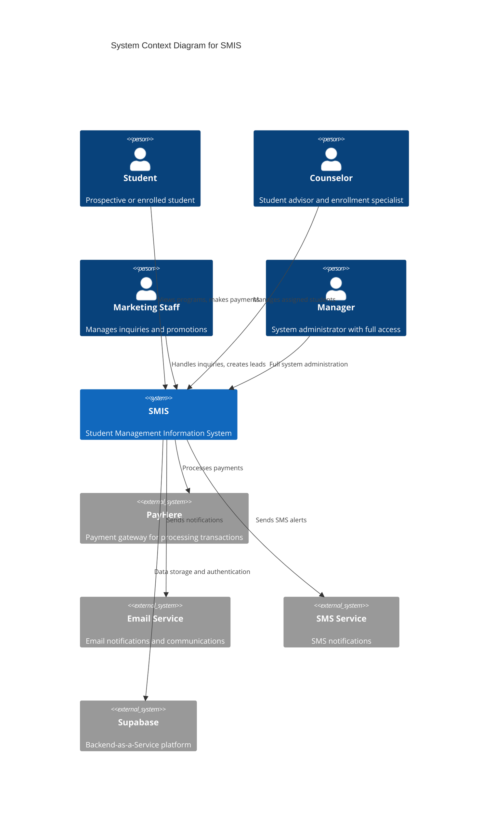
```mermaid
C4Context
    title System Context Diagram for SMIS

    Person(student, "Student", "Prospective or enrolled student")
    Person(counselor, "Counselor", "Student advisor and enrollment specialist")
    Person(marketing, "Marketing Staff", "Manages inquiries and promotions")
    Person(manager, "Manager", "System administrator with full access")
    
    System(smis, "SMIS", "Student Management Information System")
    
    System_Ext(payhere, "PayHere", "Payment gateway for processing transactions")
    System_Ext(email, "Email Service", "Email notifications and communications")
    System_Ext(sms, "SMS Service", "SMS notifications")
    System_Ext(supabase, "Supabase", "Backend-as-a-Service platform")
    
    Rel(student, smis, "Views programs, makes payments")
    Rel(counselor, smis, "Manages assigned students")
    Rel(marketing, smis, "Handles inquiries, creates leads")
    Rel(manager, smis, "Full system administration")
    
    Rel(smis, payhere, "Processes payments")
    Rel(smis, email, "Sends notifications")
    Rel(smis, sms, "Sends SMS alerts")
    Rel(smis, supabase, "Data storage and authentication")
```

### Container Diagram

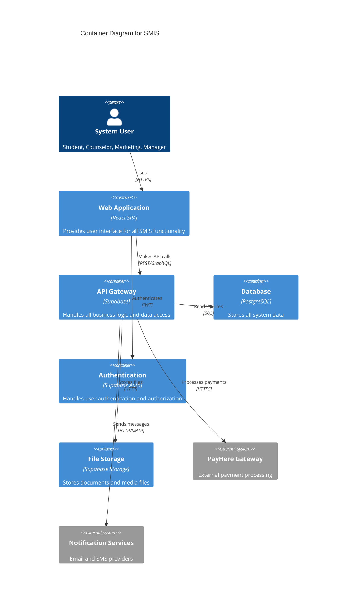
```mermaid
C4Container
    title Container Diagram for SMIS

    Person(user, "System User", "Student, Counselor, Marketing, Manager")
    
    Container(webapp, "Web Application", "React SPA", "Provides user interface for all SMIS functionality")
    Container(api, "API Gateway", "Supabase", "Handles all business logic and data access")
    Container(database, "Database", "PostgreSQL", "Stores all system data")
    Container(auth, "Authentication", "Supabase Auth", "Handles user authentication and authorization")
    Container(storage, "File Storage", "Supabase Storage", "Stores documents and media files")
    
    System_Ext(payhere, "PayHere Gateway", "External payment processing")
    System_Ext(notifications, "Notification Services", "Email and SMS providers")
    
    Rel(user, webapp, "Uses", "HTTPS")
    Rel(webapp, api, "Makes API calls", "REST/GraphQL")
    Rel(webapp, auth, "Authenticates", "JWT")
    Rel(api, database, "Reads/Writes", "SQL")
    Rel(api, storage, "Stores files", "HTTP")
    Rel(api, payhere, "Processes payments", "HTTPS")
    Rel(api, notifications, "Sends messages", "HTTP/SMTP")
```

---

## Detailed Workflow Sequences

### Complete Student Enrollment Process

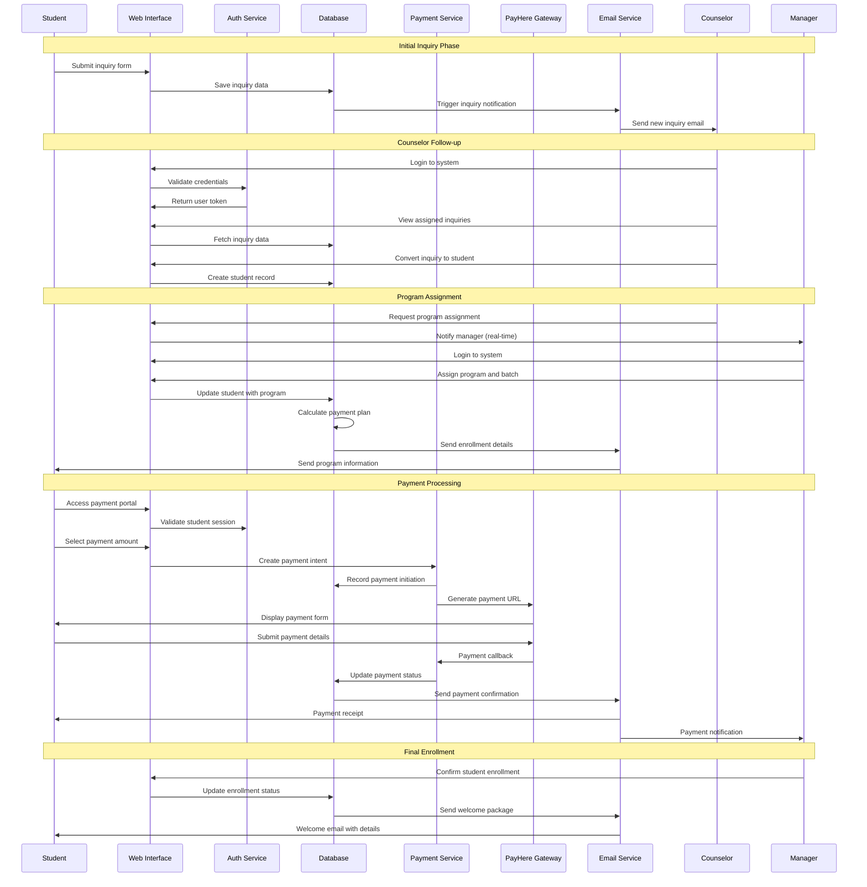
```mermaid
sequenceDiagram
    participant S as Student
    participant UI as Web Interface
    participant AUTH as Auth Service
    participant DB as Database
    participant PAYMENT as Payment Service
    participant PAYHERE as PayHere Gateway
    participant EMAIL as Email Service
    participant C as Counselor
    participant M as Manager

    Note over S,M: Initial Inquiry Phase
    S->>UI: Submit inquiry form
    UI->>DB: Save inquiry data
    DB->>EMAIL: Trigger inquiry notification
    EMAIL->>C: Send new inquiry email
    
    Note over S,M: Counselor Follow-up
    C->>UI: Login to system
    UI->>AUTH: Validate credentials
    AUTH->>UI: Return user token
    C->>UI: View assigned inquiries
    UI->>DB: Fetch inquiry data
    C->>UI: Convert inquiry to student
    UI->>DB: Create student record
    
    Note over S,M: Program Assignment
    C->>UI: Request program assignment
    UI->>M: Notify manager (real-time)
    M->>UI: Login to system
    M->>UI: Assign program and batch
    UI->>DB: Update student with program
    DB->>DB: Calculate payment plan
    DB->>EMAIL: Send enrollment details
    EMAIL->>S: Send program information
    
    Note over S,M: Payment Processing
    S->>UI: Access payment portal
    UI->>AUTH: Validate student session
    S->>UI: Select payment amount
    UI->>PAYMENT: Create payment intent
    PAYMENT->>DB: Record payment initiation
    PAYMENT->>PAYHERE: Generate payment URL
    PAYHERE->>S: Display payment form
    S->>PAYHERE: Submit payment details
    PAYHERE->>PAYMENT: Payment callback
    PAYMENT->>DB: Update payment status
    DB->>EMAIL: Send payment confirmation
    EMAIL->>S: Payment receipt
    EMAIL->>M: Payment notification
    
    Note over S,M: Final Enrollment
    M->>UI: Confirm student enrollment
    UI->>DB: Update enrollment status
    DB->>EMAIL: Send welcome package
    EMAIL->>S: Welcome email with details
```

### Advanced Payment Reconciliation Workflow

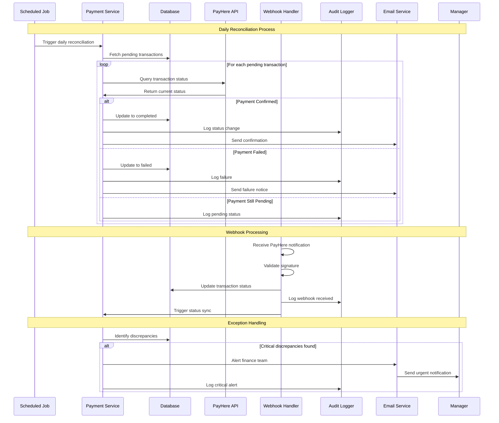
```mermaid
sequenceDiagram
    participant CRON as Scheduled Job
    participant PAYMENT as Payment Service
    participant DB as Database
    participant PAYHERE as PayHere API
    participant WEBHOOK as Webhook Handler
    participant AUDIT as Audit Logger
    participant EMAIL as Email Service
    participant MANAGER as Manager

    Note over CRON,MANAGER: Daily Reconciliation Process
    CRON->>PAYMENT: Trigger daily reconciliation
    PAYMENT->>DB: Fetch pending transactions
    
    loop For each pending transaction
        PAYMENT->>PAYHERE: Query transaction status
        PAYHERE->>PAYMENT: Return current status
        
        alt Payment Confirmed
            PAYMENT->>DB: Update to completed
            PAYMENT->>AUDIT: Log status change
            PAYMENT->>EMAIL: Send confirmation
        else Payment Failed
            PAYMENT->>DB: Update to failed
            PAYMENT->>AUDIT: Log failure
            PAYMENT->>EMAIL: Send failure notice
        else Payment Still Pending
            PAYMENT->>AUDIT: Log pending status
        end
    end
    
    Note over CRON,MANAGER: Webhook Processing
    WEBHOOK->>WEBHOOK: Receive PayHere notification
    WEBHOOK->>WEBHOOK: Validate signature
    WEBHOOK->>DB: Update transaction status
    WEBHOOK->>AUDIT: Log webhook received
    WEBHOOK->>PAYMENT: Trigger status sync
    
    Note over CRON,MANAGER: Exception Handling
    PAYMENT->>DB: Identify discrepancies
    alt Critical discrepancies found
        PAYMENT->>EMAIL: Alert finance team
        EMAIL->>MANAGER: Send urgent notification
        PAYMENT->>AUDIT: Log critical alert
    end
```

### Real-time Dashboard Updates

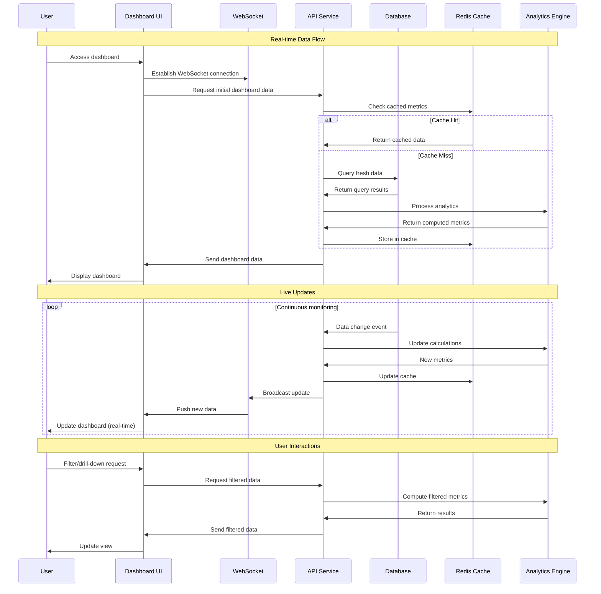
```mermaid
sequenceDiagram
    participant USER as User
    participant UI as Dashboard UI
    participant WS as WebSocket
    participant API as API Service
    participant DB as Database
    participant CACHE as Redis Cache
    participant ANALYTICS as Analytics Engine

    Note over USER,ANALYTICS: Real-time Data Flow
    USER->>UI: Access dashboard
    UI->>WS: Establish WebSocket connection
    UI->>API: Request initial dashboard data
    API->>CACHE: Check cached metrics
    
    alt Cache Hit
        CACHE->>API: Return cached data
    else Cache Miss
        API->>DB: Query fresh data
        DB->>API: Return query results
        API->>ANALYTICS: Process analytics
        ANALYTICS->>API: Return computed metrics
        API->>CACHE: Store in cache
    end
    
    API->>UI: Send dashboard data
    UI->>USER: Display dashboard
    
    Note over USER,ANALYTICS: Live Updates
    loop Continuous monitoring
        DB->>API: Data change event
        API->>ANALYTICS: Update calculations
        ANALYTICS->>API: New metrics
        API->>CACHE: Update cache
        API->>WS: Broadcast update
        WS->>UI: Push new data
        UI->>USER: Update dashboard (real-time)
    end
    
    Note over USER,ANALYTICS: User Interactions
    USER->>UI: Filter/drill-down request
    UI->>API: Request filtered data
    API->>ANALYTICS: Compute filtered metrics
    ANALYTICS->>API: Return results
    API->>UI: Send filtered data
    UI->>USER: Update view
```

---

## Data Architecture

### Data Flow Architecture

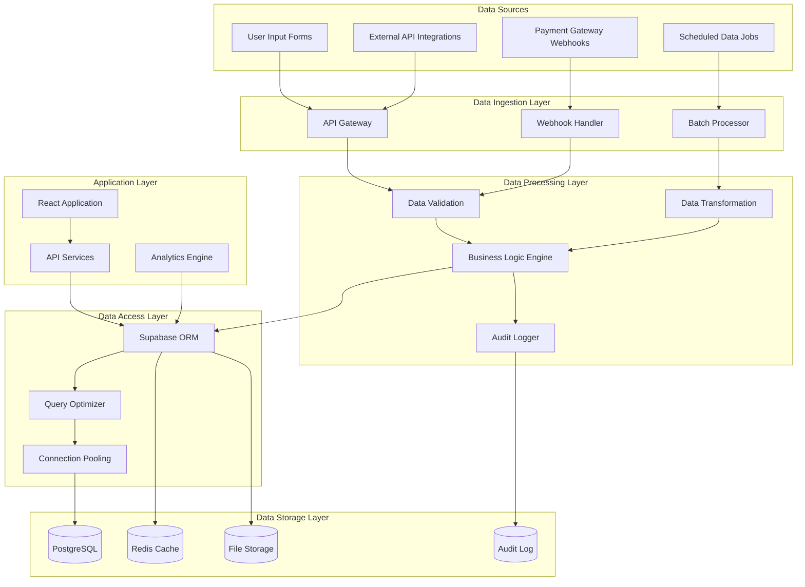
```mermaid
flowchart TD
    subgraph "Data Sources"
        USER_INPUT[User Input Forms]
        PAYMENT_GATEWAY[Payment Gateway Webhooks]
        EXTERNAL_APIs[External API Integrations]
        SCHEDULED_JOBS[Scheduled Data Jobs]
    end
    
    subgraph "Data Ingestion Layer"
        API_GATEWAY[API Gateway]
        WEBHOOK_HANDLER[Webhook Handler]
        BATCH_PROCESSOR[Batch Processor]
    end
    
    subgraph "Data Processing Layer"
        VALIDATION[Data Validation]
        TRANSFORMATION[Data Transformation]
        BUSINESS_LOGIC[Business Logic Engine]
        AUDIT_LOGGER[Audit Logger]
    end
    
    subgraph "Data Storage Layer"
        POSTGRES[(PostgreSQL)]
        REDIS_CACHE[(Redis Cache)]
        FILE_STORAGE[(File Storage)]
        AUDIT_LOG[(Audit Log)]
    end
    
    subgraph "Data Access Layer"
        ORM[Supabase ORM]
        QUERY_OPTIMIZER[Query Optimizer]
        CONNECTION_POOL[Connection Pooling]
    end
    
    subgraph "Application Layer"
        REACT_APP[React Application]
        API_SERVICES[API Services]
        ANALYTICS_ENGINE[Analytics Engine]
    end
    
    USER_INPUT --> API_GATEWAY
    PAYMENT_GATEWAY --> WEBHOOK_HANDLER
    EXTERNAL_APIs --> API_GATEWAY
    SCHEDULED_JOBS --> BATCH_PROCESSOR
    
    API_GATEWAY --> VALIDATION
    WEBHOOK_HANDLER --> VALIDATION
    BATCH_PROCESSOR --> TRANSFORMATION
    
    VALIDATION --> BUSINESS_LOGIC
    TRANSFORMATION --> BUSINESS_LOGIC
    BUSINESS_LOGIC --> AUDIT_LOGGER
    
    BUSINESS_LOGIC --> ORM
    AUDIT_LOGGER --> AUDIT_LOG
    
    ORM --> QUERY_OPTIMIZER
    QUERY_OPTIMIZER --> CONNECTION_POOL
    CONNECTION_POOL --> POSTGRES
    
    ORM --> REDIS_CACHE
    ORM --> FILE_STORAGE
    
    API_SERVICES --> ORM
    REACT_APP --> API_SERVICES
    ANALYTICS_ENGINE --> ORM
```

### Database Partitioning Strategy

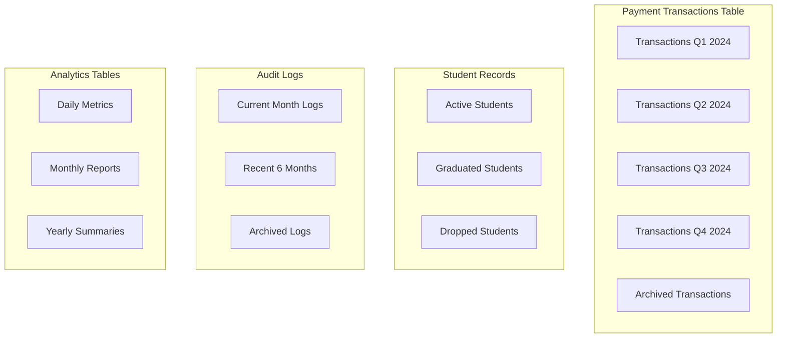
```mermaid
graph TB
    subgraph "Payment Transactions Table"
        PT_2024_Q1[Transactions Q1 2024]
        PT_2024_Q2[Transactions Q2 2024]
        PT_2024_Q3[Transactions Q3 2024]
        PT_2024_Q4[Transactions Q4 2024]
        PT_ARCHIVE[Archived Transactions]
    end
    
    subgraph "Student Records"
        ACTIVE_STUDENTS[Active Students]
        GRADUATED_STUDENTS[Graduated Students]
        DROPPED_STUDENTS[Dropped Students]
    end
    
    subgraph "Audit Logs"
        AUDIT_CURRENT[Current Month Logs]
        AUDIT_RECENT[Recent 6 Months]
        AUDIT_ARCHIVE[Archived Logs]
    end
    
    subgraph "Analytics Tables"
        DAILY_METRICS[Daily Metrics]
        MONTHLY_REPORTS[Monthly Reports]
        YEARLY_SUMMARIES[Yearly Summaries]
    end
```

---

## Security Architecture

### Multi-Layer Security Model

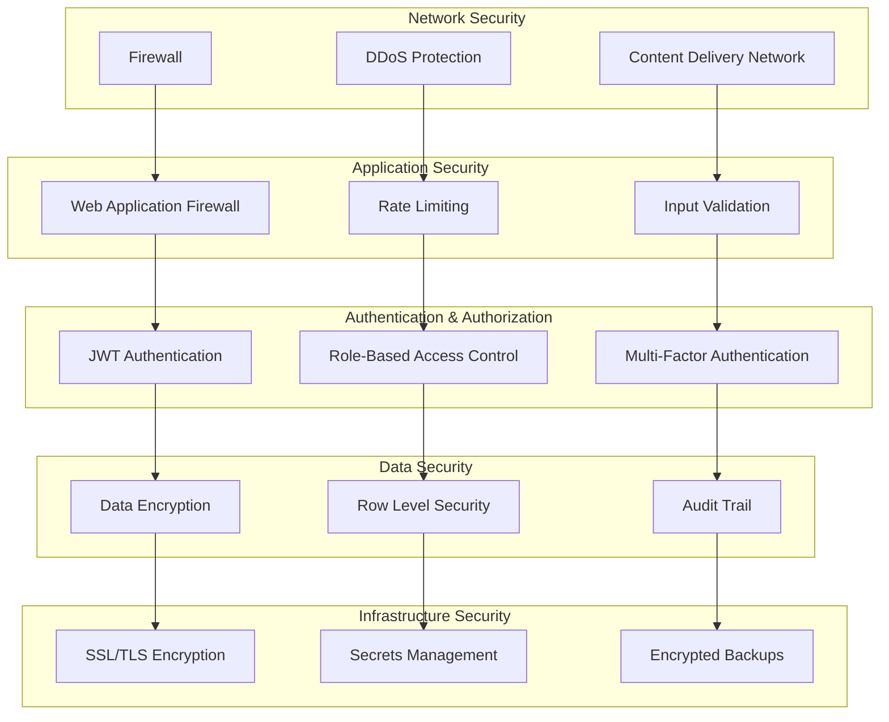
```mermaid
graph TB
    subgraph "Network Security"
        FIREWALL[Firewall]
        DDoS[DDoS Protection]
        CDN[Content Delivery Network]
    end
    
    subgraph "Application Security"
        WAF[Web Application Firewall]
        RATE_LIMITER[Rate Limiting]
        INPUT_VALIDATION[Input Validation]
    end
    
    subgraph "Authentication & Authorization"
        JWT_AUTH[JWT Authentication]
        RBAC[Role-Based Access Control]
        MFA[Multi-Factor Authentication]
    end
    
    subgraph "Data Security"
        ENCRYPTION[Data Encryption]
        RLS[Row Level Security]
        AUDIT_TRAIL[Audit Trail]
    end
    
    subgraph "Infrastructure Security"
        SSL_TLS[SSL/TLS Encryption]
        SECRETS_MGMT[Secrets Management]
        BACKUP_ENCRYPTION[Encrypted Backups]
    end
    
    FIREWALL --> WAF
    DDoS --> RATE_LIMITER
    CDN --> INPUT_VALIDATION
    
    WAF --> JWT_AUTH
    RATE_LIMITER --> RBAC
    INPUT_VALIDATION --> MFA
    
    JWT_AUTH --> ENCRYPTION
    RBAC --> RLS
    MFA --> AUDIT_TRAIL
    
    ENCRYPTION --> SSL_TLS
    RLS --> SECRETS_MGMT
    AUDIT_TRAIL --> BACKUP_ENCRYPTION
```

### Authentication & Authorization Flow

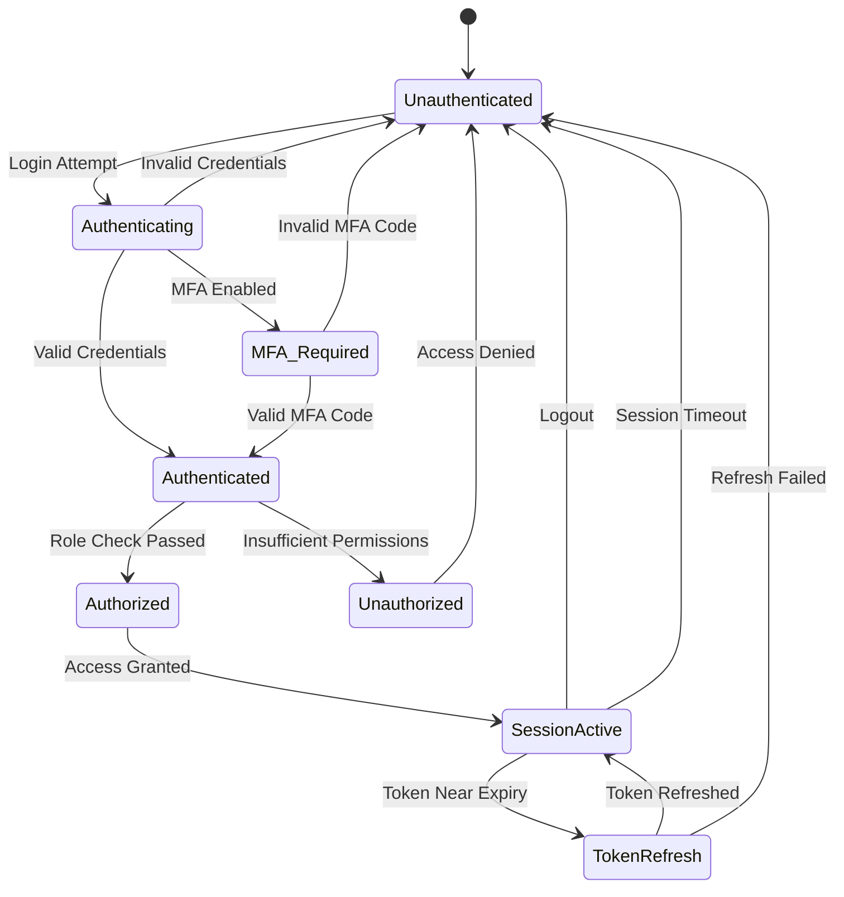
```mermaid
stateDiagram-v2
    [*] --> Unauthenticated
    
    Unauthenticated --> Authenticating: Login Attempt
    Authenticating --> Authenticated: Valid Credentials
    Authenticating --> Unauthenticated: Invalid Credentials
    Authenticating --> MFA_Required: MFA Enabled
    
    MFA_Required --> Authenticated: Valid MFA Code
    MFA_Required --> Unauthenticated: Invalid MFA Code
    
    Authenticated --> Authorized: Role Check Passed
    Authenticated --> Unauthorized: Insufficient Permissions
    
    Authorized --> SessionActive: Access Granted
    Unauthorized --> Unauthenticated: Access Denied
    
    SessionActive --> TokenRefresh: Token Near Expiry
    TokenRefresh --> SessionActive: Token Refreshed
    TokenRefresh --> Unauthenticated: Refresh Failed
    
    SessionActive --> Unauthenticated: Logout
    SessionActive --> Unauthenticated: Session Timeout
```

---

## Performance Architecture

### Caching Strategy

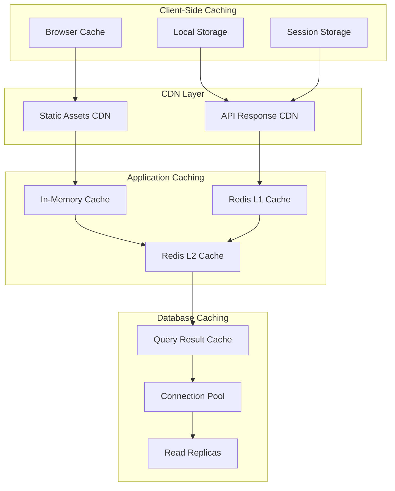
```mermaid
graph TB
    subgraph "Client-Side Caching"
        BROWSER_CACHE[Browser Cache]
        LOCAL_STORAGE[Local Storage]
        SESSION_STORAGE[Session Storage]
    end
    
    subgraph "CDN Layer"
        STATIC_ASSETS[Static Assets CDN]
        API_CACHE[API Response CDN]
    end
    
    subgraph "Application Caching"
        REDIS_L1[Redis L1 Cache]
        REDIS_L2[Redis L2 Cache]
        MEMORY_CACHE[In-Memory Cache]
    end
    
    subgraph "Database Caching"
        QUERY_CACHE[Query Result Cache]
        CONNECTION_POOL[Connection Pool]
        READ_REPLICAS[Read Replicas]
    end
    
    BROWSER_CACHE --> STATIC_ASSETS
    LOCAL_STORAGE --> API_CACHE
    SESSION_STORAGE --> API_CACHE
    
    STATIC_ASSETS --> MEMORY_CACHE
    API_CACHE --> REDIS_L1
    
    MEMORY_CACHE --> REDIS_L2
    REDIS_L1 --> REDIS_L2
    
    REDIS_L2 --> QUERY_CACHE
    QUERY_CACHE --> CONNECTION_POOL
    CONNECTION_POOL --> READ_REPLICAS
```

### Load Balancing Strategy

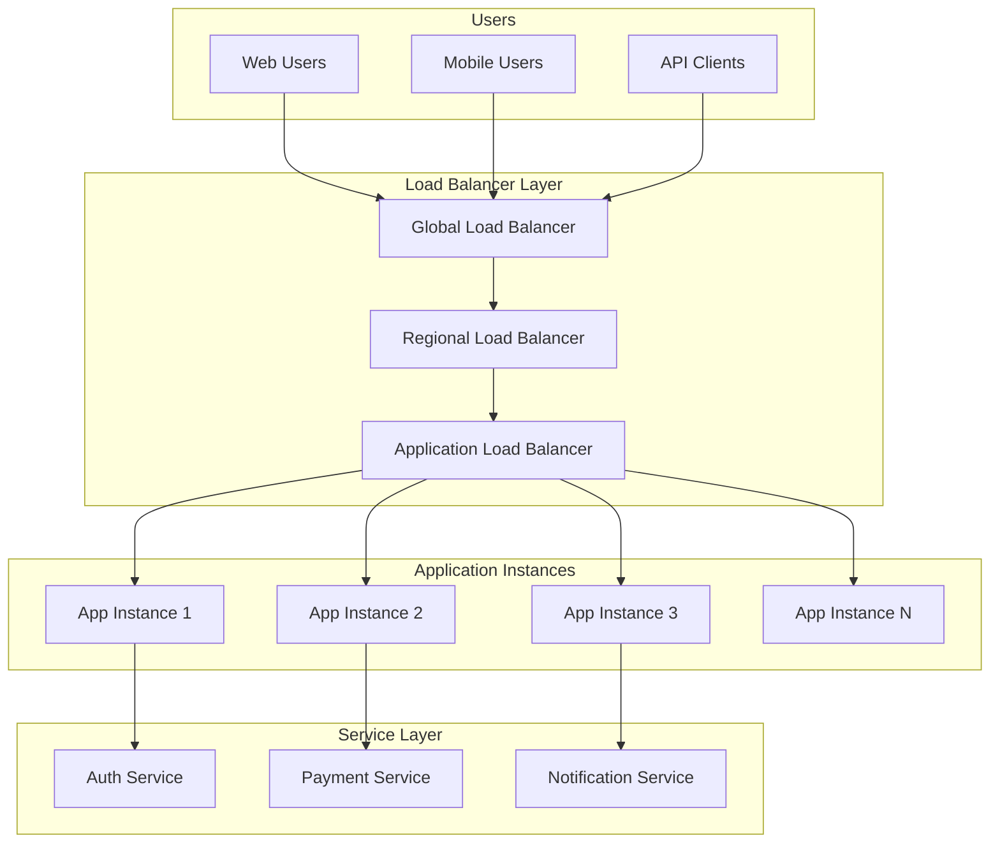
```mermaid
graph TB
    subgraph "Users"
        WEB_USERS[Web Users]
        MOBILE_USERS[Mobile Users]
        API_CLIENTS[API Clients]
    end
    
    subgraph "Load Balancer Layer"
        GLOBAL_LB[Global Load Balancer]
        REGIONAL_LB[Regional Load Balancer]
        APP_LB[Application Load Balancer]
    end
    
    subgraph "Application Instances"
        APP_1[App Instance 1]
        APP_2[App Instance 2]
        APP_3[App Instance 3]
        APP_N[App Instance N]
    end
    
    subgraph "Service Layer"
        AUTH_SERVICE[Auth Service]
        PAYMENT_SERVICE[Payment Service]
        NOTIFICATION_SERVICE[Notification Service]
    end
    
    WEB_USERS --> GLOBAL_LB
    MOBILE_USERS --> GLOBAL_LB
    API_CLIENTS --> GLOBAL_LB
    
    GLOBAL_LB --> REGIONAL_LB
    REGIONAL_LB --> APP_LB
    
    APP_LB --> APP_1
    APP_LB --> APP_2
    APP_LB --> APP_3
    APP_LB --> APP_N
    
    APP_1 --> AUTH_SERVICE
    APP_2 --> PAYMENT_SERVICE
    APP_3 --> NOTIFICATION_SERVICE
```

---

## Monitoring & Observability

### Comprehensive Monitoring Architecture

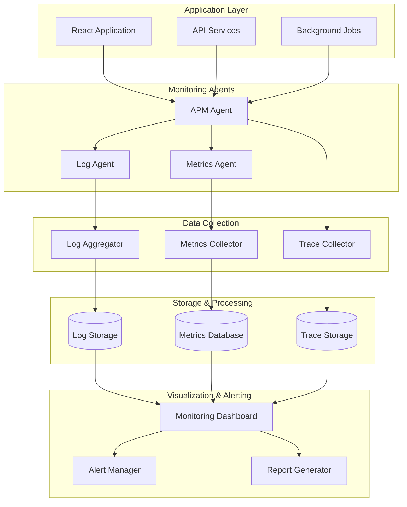
```mermaid
graph TB
    subgraph "Application Layer"
        REACT_APP[React Application]
        API_SERVICES[API Services]
        BACKGROUND_JOBS[Background Jobs]
    end
    
    subgraph "Monitoring Agents"
        APM_AGENT[APM Agent]
        LOG_AGENT[Log Agent]
        METRICS_AGENT[Metrics Agent]
    end
    
    subgraph "Data Collection"
        LOG_AGGREGATOR[Log Aggregator]
        METRICS_COLLECTOR[Metrics Collector]
        TRACE_COLLECTOR[Trace Collector]
    end
    
    subgraph "Storage & Processing"
        LOG_STORAGE[(Log Storage)]
        METRICS_DB[(Metrics Database)]
        TRACE_STORAGE[(Trace Storage)]
    end
    
    subgraph "Visualization & Alerting"
        DASHBOARD[Monitoring Dashboard]
        ALERTS[Alert Manager]
        REPORTS[Report Generator]
    end
    
    REACT_APP --> APM_AGENT
    API_SERVICES --> APM_AGENT
    BACKGROUND_JOBS --> APM_AGENT
    
    APM_AGENT --> LOG_AGENT
    APM_AGENT --> METRICS_AGENT
    
    LOG_AGENT --> LOG_AGGREGATOR
    METRICS_AGENT --> METRICS_COLLECTOR
    APM_AGENT --> TRACE_COLLECTOR
    
    LOG_AGGREGATOR --> LOG_STORAGE
    METRICS_COLLECTOR --> METRICS_DB
    TRACE_COLLECTOR --> TRACE_STORAGE
    
    LOG_STORAGE --> DASHBOARD
    METRICS_DB --> DASHBOARD
    TRACE_STORAGE --> DASHBOARD
    
    DASHBOARD --> ALERTS
    DASHBOARD --> REPORTS
```

---

## Deployment Architecture

### CI/CD Pipeline

```mermaid
graph LR
    subgraph "Development"
        DEV[Developer]
        IDE[IDE/Editor]
        LOCAL[Local Testing]
    end
    
    subgraph "Source Control"
        GIT[Git Repository]
        BRANCH[Feature Branch]
        PR[Pull Request]
    end
    
    subgraph "CI Pipeline"
        BUILD[Build Process]
        TEST[Automated Testing]
        SCAN[Security Scanning]
        QUALITY[Quality Gates]
    end
    
    subgraph "CD Pipeline"
        STAGING[Staging Deploy]
        UAT[UAT Testing]
        PROD_DEPLOY[Production Deploy]
        MONITORING[Post-Deploy Monitoring]
    end
    
    DEV --> IDE
    IDE --> LOCAL
    LOCAL --> GIT
    
    GIT --> BRANCH
    BRANCH --> PR
    PR --> BUILD
    
    BUILD --> TEST
    TEST --> SCAN
    SCAN --> QUALITY
    
    QUALITY --> STAGING
    STAGING --> UAT
    UAT --> PROD_DEPLOY
    PROD_DEPLOY --> MONITORING
```

### Infrastructure as Code

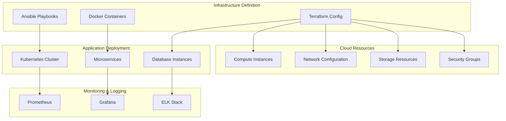
```mermaid
graph TB
    subgraph "Infrastructure Definition"
        TERRAFORM[Terraform Config]
        ANSIBLE[Ansible Playbooks]
        DOCKER[Docker Containers]
    end
    
    subgraph "Cloud Resources"
        COMPUTE[Compute Instances]
        NETWORK[Network Configuration]
        STORAGE[Storage Resources]
        SECURITY[Security Groups]
    end
    
    subgraph "Application Deployment"
        KUBERNETES[Kubernetes Cluster]
        SERVICES[Microservices]
        DATABASES[Database Instances]
    end
    
    subgraph "Monitoring & Logging"
        PROMETHEUS[Prometheus]
        GRAFANA[Grafana]
        ELK_STACK[ELK Stack]
    end
    
    TERRAFORM --> COMPUTE
    TERRAFORM --> NETWORK
    TERRAFORM --> STORAGE
    TERRAFORM --> SECURITY
    
    ANSIBLE --> KUBERNETES
    DOCKER --> SERVICES
    TERRAFORM --> DATABASES
    
    KUBERNETES --> PROMETHEUS
    SERVICES --> GRAFANA
    DATABASES --> ELK_STACK
```

---

## Scalability Considerations

### Horizontal Scaling Strategy

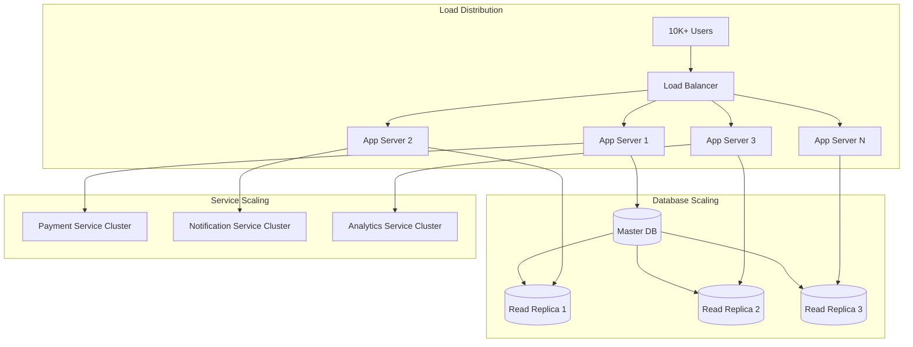
```mermaid
graph TB
    subgraph "Load Distribution"
        USERS[10K+ Users] --> LB[Load Balancer]
        LB --> APP1[App Server 1]
        LB --> APP2[App Server 2]
        LB --> APP3[App Server 3]
        LB --> APPN[App Server N]
    end
    
    subgraph "Database Scaling"
        APP1 --> MASTER[(Master DB)]
        APP2 --> REPLICA1[(Read Replica 1)]
        APP3 --> REPLICA2[(Read Replica 2)]
        APPN --> REPLICA3[(Read Replica 3)]
        
        MASTER --> REPLICA1
        MASTER --> REPLICA2
        MASTER --> REPLICA3
    end
    
    subgraph "Service Scaling"
        PAYMENT_SVC[Payment Service Cluster]
        NOTIFICATION_SVC[Notification Service Cluster]
        ANALYTICS_SVC[Analytics Service Cluster]
    end
    
    APP1 --> PAYMENT_SVC
    APP2 --> NOTIFICATION_SVC
    APP3 --> ANALYTICS_SVC
```

### Auto-Scaling Configuration

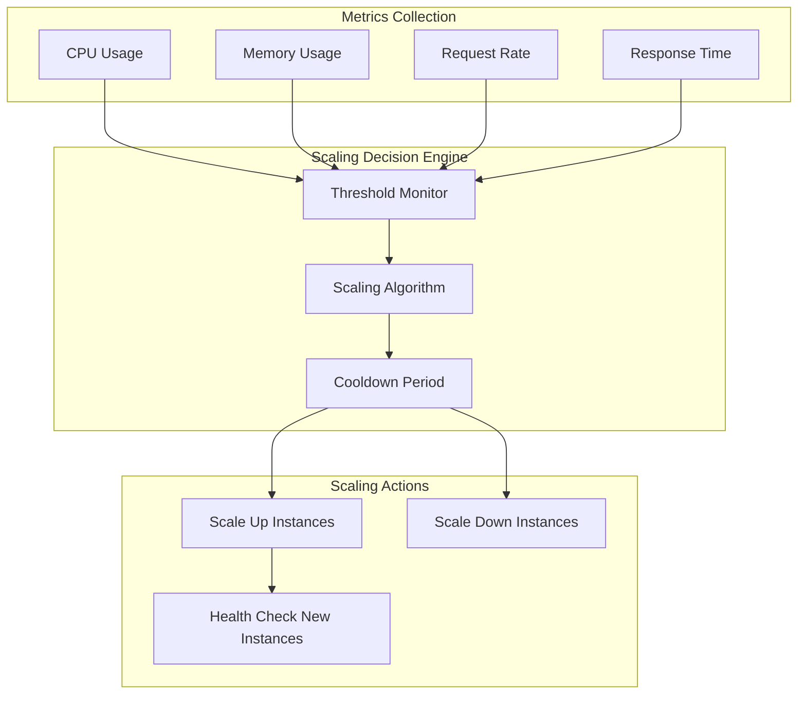
```mermaid
graph TB
    subgraph "Metrics Collection"
        CPU[CPU Usage]
        MEMORY[Memory Usage]
        REQUESTS[Request Rate]
        RESPONSE_TIME[Response Time]
    end
    
    subgraph "Scaling Decision Engine"
        THRESHOLD[Threshold Monitor]
        ALGORITHM[Scaling Algorithm]
        COOLDOWN[Cooldown Period]
    end
    
    subgraph "Scaling Actions"
        SCALE_UP[Scale Up Instances]
        SCALE_DOWN[Scale Down Instances]
        HEALTH_CHECK[Health Check New Instances]
    end
    
    CPU --> THRESHOLD
    MEMORY --> THRESHOLD
    REQUESTS --> THRESHOLD
    RESPONSE_TIME --> THRESHOLD
    
    THRESHOLD --> ALGORITHM
    ALGORITHM --> COOLDOWN
    
    COOLDOWN --> SCALE_UP
    COOLDOWN --> SCALE_DOWN
    SCALE_UP --> HEALTH_CHECK
```

---

## Technical Debt Management

### Code Quality Metrics

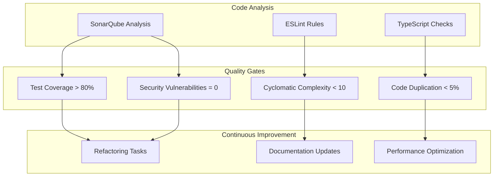
```mermaid
graph TB
    subgraph "Code Analysis"
        SONARQUBE[SonarQube Analysis]
        ESLINT[ESLint Rules]
        TYPESCRIPT[TypeScript Checks]
    end
    
    subgraph "Quality Gates"
        COVERAGE[Test Coverage > 80%]
        COMPLEXITY[Cyclomatic Complexity < 10]
        DUPLICATION[Code Duplication < 5%]
        SECURITY[Security Vulnerabilities = 0]
    end
    
    subgraph "Continuous Improvement"
        REFACTORING[Refactoring Tasks]
        DOCUMENTATION[Documentation Updates]
        PERFORMANCE[Performance Optimization]
    end
    
    SONARQUBE --> COVERAGE
    ESLINT --> COMPLEXITY
    TYPESCRIPT --> DUPLICATION
    SONARQUBE --> SECURITY
    
    COVERAGE --> REFACTORING
    COMPLEXITY --> DOCUMENTATION
    DUPLICATION --> PERFORMANCE
    SECURITY --> REFACTORING
```

---

## Disaster Recovery Plan

### Backup and Recovery Strategy

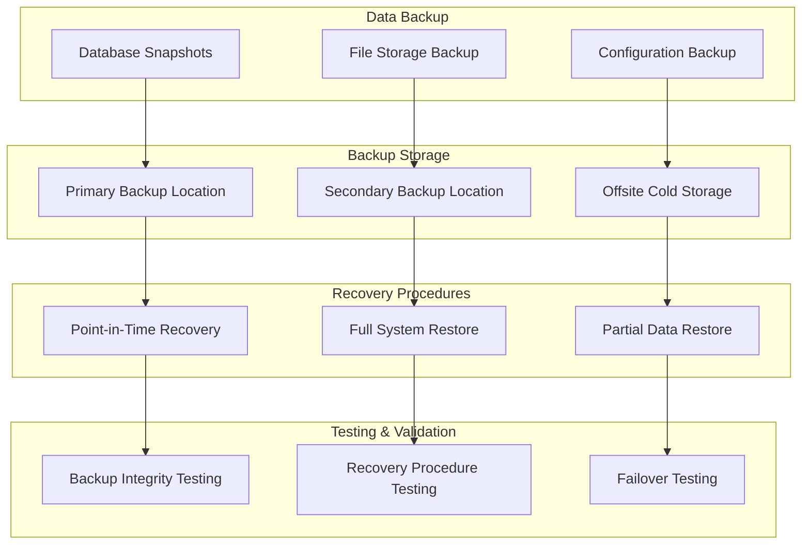
```mermaid
graph TB
    subgraph "Data Backup"
        DB_BACKUP[Database Snapshots]
        FILE_BACKUP[File Storage Backup]
        CONFIG_BACKUP[Configuration Backup]
    end
    
    subgraph "Backup Storage"
        PRIMARY[Primary Backup Location]
        SECONDARY[Secondary Backup Location]
        OFFSITE[Offsite Cold Storage]
    end
    
    subgraph "Recovery Procedures"
        POINT_IN_TIME[Point-in-Time Recovery]
        FULL_RESTORE[Full System Restore]
        PARTIAL_RESTORE[Partial Data Restore]
    end
    
    subgraph "Testing & Validation"
        BACKUP_TEST[Backup Integrity Testing]
        RECOVERY_TEST[Recovery Procedure Testing]
        FAILOVER_TEST[Failover Testing]
    end
    
    DB_BACKUP --> PRIMARY
    FILE_BACKUP --> SECONDARY
    CONFIG_BACKUP --> OFFSITE
    
    PRIMARY --> POINT_IN_TIME
    SECONDARY --> FULL_RESTORE
    OFFSITE --> PARTIAL_RESTORE
    
    POINT_IN_TIME --> BACKUP_TEST
    FULL_RESTORE --> RECOVERY_TEST
    PARTIAL_RESTORE --> FAILOVER_TEST
```

---

*This system design document serves as the comprehensive technical blueprint for the SMIS platform. It is maintained by the Architecture Team and updated with each major release.* 