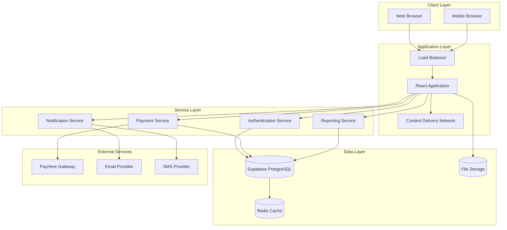
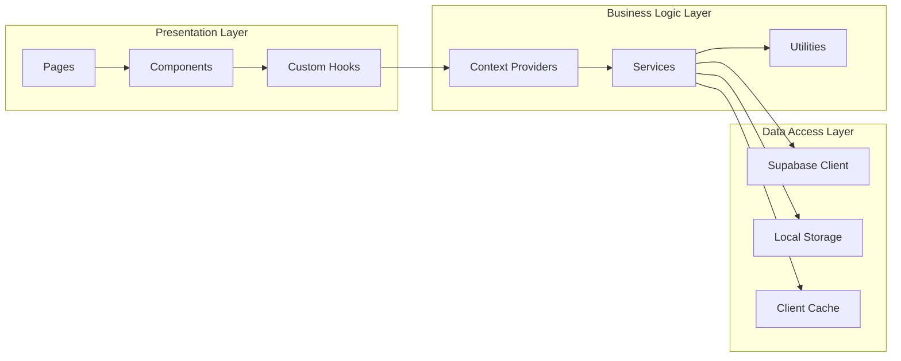
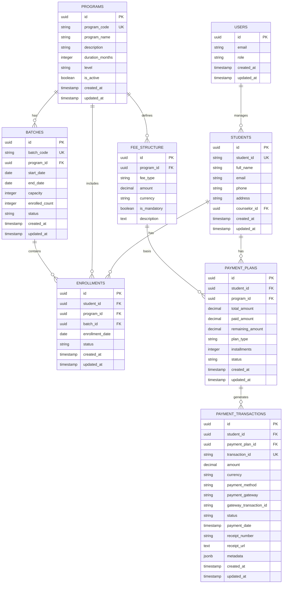
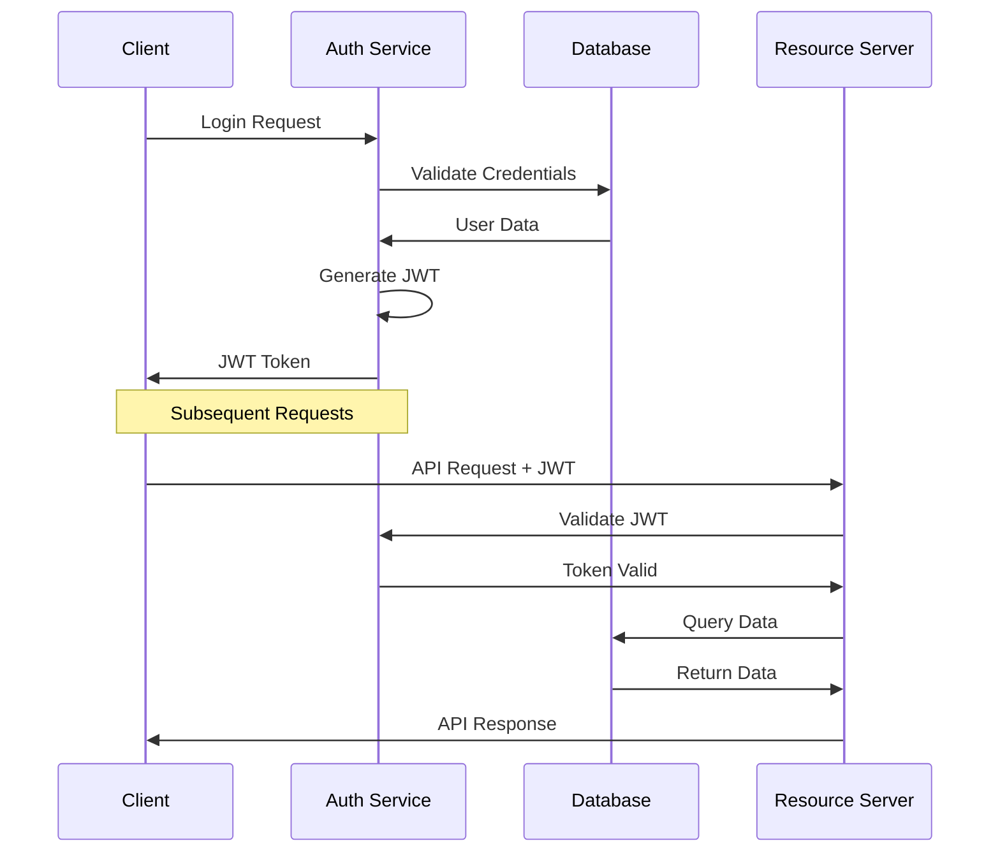
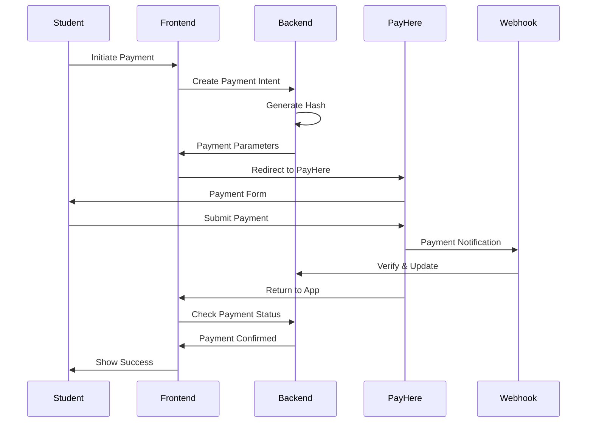

# SMIS Technical Documentation

## Table of Contents
1. [System Architecture](#system-architecture)
2. [Database Design](#database-design)
3. [API Specifications](#api-specifications)
4. [Security Implementation](#security-implementation)
5. [Payment Integration](#payment-integration)
6. [Deployment Guide](#deployment-guide)
7. [Performance Optimization](#performance-optimization)
8. [Monitoring & Logging](#monitoring--logging)

---

## System Architecture

### High-Level Architecture



### Component Architecture



---

## Database Design

### Entity Relationship Diagram



---

## API Specifications

### Authentication Endpoints

```javascript
// Login
POST /auth/v1/token
Content-Type: application/json
{
    "email": "user@example.com",
    "password": "password123"
}

// Response
{
    "access_token": "jwt_token",
    "token_type": "bearer",
    "expires_in": 3600,
    "user": {
        "id": "uuid",
        "email": "user@example.com",
        "role": "manager"
    }
}
```

### Student Management API

```javascript
// Create Student
POST /rest/v1/students
Authorization: Bearer jwt_token
Content-Type: application/json
{
    "student_id": "STU001",
    "full_name": "John Doe",
    "email": "john@example.com",
    "phone": "+94712345678",
    "address": "123 Main St, Colombo",
    "counselor_id": "uuid"
}

// Get Students
GET /rest/v1/students?select=*,programs(*),batches(*)
Authorization: Bearer jwt_token

// Update Student
PATCH /rest/v1/students?id=eq.uuid
Authorization: Bearer jwt_token
Content-Type: application/json
{
    "full_name": "John Smith",
    "phone": "+94712345679"
}
```

---

## Security Implementation

### Authentication Flow



### Role-Based Access Control

```javascript
// Role Definitions
const ROLES = {
  MANAGER: {
    permissions: [
      'students:read',
      'students:write',
      'programs:read',
      'programs:write',
      'payments:read',
      'payments:write',
      'analytics:read'
    ]
  },
  MARKETING: {
    permissions: [
      'students:read',
      'students:write',
      'inquiries:read',
      'inquiries:write',
      'basic_analytics:read'
    ]
  },
  COUNSELOR: {
    permissions: [
      'students:read',
      'assigned_students:write',
      'inquiries:read',
      'inquiries:write'
    ]
  }
};
```

---

## Payment Integration

### PayHere Integration Flow



### Payment Configuration

```javascript
// PayHere Configuration
const paymentConfig = {
  sandbox: process.env.NODE_ENV !== 'production',
  merchant_id: process.env.PAYHERE_MERCHANT_ID,
  merchant_secret: process.env.PAYHERE_MERCHANT_SECRET,
  currency: 'LKR',
  return_url: `${process.env.APP_URL}/payment/success`,
  cancel_url: `${process.env.APP_URL}/payment/cancel`,
  notify_url: `${process.env.API_URL}/webhooks/payhere`
};
```

---

## Deployment Guide

### Environment Setup

```bash
# Production Environment Variables
VITE_SUPABASE_URL=https://your-project.supabase.co
VITE_SUPABASE_ANON_KEY=your-anon-key
VITE_PAYHERE_MERCHANT_ID=your-merchant-id
VITE_PAYHERE_SANDBOX=false
VITE_APP_URL=https://your-domain.com
VITE_API_URL=https://api.your-domain.com
```

### Build Process

```bash
# Install dependencies
npm ci

# Run tests
npm run test

# Build for production
npm run build

# Preview build
npm run preview
```

### Docker Deployment

```dockerfile
# Dockerfile
FROM node:18-alpine as builder

WORKDIR /app
COPY package*.json ./
RUN npm ci --only=production

COPY . .
RUN npm run build

FROM nginx:alpine
COPY --from=builder /app/dist /usr/share/nginx/html
COPY nginx.conf /etc/nginx/nginx.conf

EXPOSE 80
CMD ["nginx", "-g", "daemon off;"]
```

---

## Performance Optimization

### Bundle Optimization

```javascript
// vite.config.js
export default defineConfig({
  plugins: [react()],
  build: {
    rollupOptions: {
      output: {
        manualChunks: {
          vendor: ['react', 'react-dom'],
          antd: ['antd', '@ant-design/icons'],
          charts: ['recharts'],
          router: ['react-router-dom']
        }
      }
    },
    chunkSizeWarningLimit: 600
  }
});
```

### Database Optimization

```sql
-- Index creation for performance
CREATE INDEX idx_students_counselor_id ON students(counselor_id);
CREATE INDEX idx_payment_transactions_student_id ON payment_transactions(student_id);
CREATE INDEX idx_payment_transactions_status ON payment_transactions(status);
CREATE INDEX idx_enrollments_program_batch ON enrollments(program_id, batch_id);
```

---

## Monitoring & Logging

### Application Monitoring

```javascript
// Error boundary for React components
class ErrorBoundary extends React.Component {
  constructor(props) {
    super(props);
    this.state = { hasError: false };
  }

  static getDerivedStateFromError(error) {
    return { hasError: true };
  }

  componentDidCatch(error, errorInfo) {
    console.error('Application Error:', error, errorInfo);
    
    if (process.env.NODE_ENV === 'production') {
      this.logError(error, errorInfo);
    }
  }

  render() {
    if (this.state.hasError) {
      return <ErrorFallback />;
    }

    return this.props.children;
  }
}
```

### Performance Monitoring

```javascript
// Performance tracking
const trackPerformance = (name, fn) => {
  return async (...args) => {
    const start = performance.now();
    try {
      const result = await fn(...args);
      const duration = performance.now() - start;
      console.log(`${name} executed in ${duration}ms`);
      return result;
    } catch (error) {
      const duration = performance.now() - start;
      console.error(`${name} failed after ${duration}ms:`, error);
      throw error;
    }
  };
};
```

---

*This technical documentation is maintained by the SMIS Development Team and updated regularly to reflect the latest system changes and improvements.*

---

# Role-Based Function Pseudo Codes

## Marketing Staff Functions

### Marketing Authentication Functions

```javascript
// Marketing Login Function
async function marketingLogin(email, password) {
  try {
    // Input validation
    validateInput({
      email: { required: true, format: 'email' },
      password: { required: true, minLength: 8 }
    });
    
    // Supabase authentication
    const { data, error } = await supabase.auth.signInWithPassword({
      email: email,
      password: password
    });
    
    if (error) {
      await auditLog.logFailedLogin(email, getClientIP());
      throw new Error('Invalid credentials');
    }
    
    // Verify marketing role
    const userRole = await getUserRole(data.user.id);
    if (!['marketing', 'manager'].includes(userRole)) {
      throw new Error('Unauthorized access');
    }
    
    // Create session
    const sessionToken = generateJWT(data.user.id, userRole);
    setSecureStorage('auth_token', sessionToken);
    
    // Log successful login
    await auditLog.logSuccessfulLogin(data.user.id, getClientIP());
    
    return {
      success: true,
      user: data.user,
      role: userRole,
      token: sessionToken
    };
    
  } catch (error) {
    logError('Marketing Login Failed', error);
    return { success: false, error: error.message };
  }
}

// Marketing Logout Function
async function marketingLogout() {
  try {
    const userId = getCurrentUserId();
    
    // Invalidate Supabase session
    await supabase.auth.signOut();
    
    // Clear local storage
    clearSecureStorage('auth_token');
    clearSecureStorage('user_data');
    
    // Log logout event
    await auditLog.logLogout(userId);
    
    // Redirect to login
    window.location.href = '/login';
    
    return { success: true };
    
  } catch (error) {
    logError('Marketing Logout Failed', error);
    return { success: false, error: error.message };
  }
}
```

### Marketing Dashboard Functions

```javascript
// Marketing Dashboard Data Fetcher
async function getMarketingDashboardData() {
  try {
    const userId = getCurrentUserId();
    const cacheKey = `marketing_dashboard_${userId}`;
    
    // Check cache first
    const cachedData = await cache.get(cacheKey);
    if (cachedData && !cache.isExpired(cacheKey, 300)) { // 5 min TTL
      return cachedData;
    }
    
    // Fetch fresh data
    const dashboardData = await Promise.all([
      getInquiryStatistics(),
      getConversionMetrics(),
      getSourceEffectiveness(),
      getRegionalPerformance(),
      getRecentActivities()
    ]);
    
    const result = {
      inquiries: dashboardData[0],
      conversions: dashboardData[1],
      sources: dashboardData[2],
      regions: dashboardData[3],
      activities: dashboardData[4],
      timestamp: new Date().toISOString()
    };
    
    // Cache the result
    await cache.set(cacheKey, result, 300);
    
    return { success: true, data: result };
    
  } catch (error) {
    logError('Marketing Dashboard Data Failed', error);
    return { success: false, error: error.message };
  }
}

// Inquiry Statistics Function
async function getInquiryStatistics() {
  try {
    const { data, error } = await supabase
      .from('inquiries')
      .select(`
        id,
        status,
        source,
        created_at,
        assigned_counselor_id
      `)
      .gte('created_at', getDateDaysAgo(30));
    
    if (error) throw error;
    
    const stats = {
      total: data.length,
      pending: data.filter(i => i.status === 'pending').length,
      in_progress: data.filter(i => i.status === 'in_progress').length,
      converted: data.filter(i => i.status === 'converted').length,
      by_source: groupBy(data, 'source'),
      trend: calculateTrend(data, 'created_at')
    };
    
    return stats;
    
  } catch (error) {
    logError('Inquiry Statistics Failed', error);
    throw error;
  }
}

// Real-time Dashboard Updates
function setupDashboardRealTime() {
  const subscription = supabase
    .channel('marketing_dashboard')
    .on('postgres_changes', 
      { event: '*', schema: 'public', table: 'inquiries' },
      (payload) => {
        updateDashboardMetrics('inquiries', payload);
      }
    )
    .on('postgres_changes',
      { event: '*', schema: 'public', table: 'enrollments' },
      (payload) => {
        updateDashboardMetrics('enrollments', payload);
      }
    )
    .subscribe();
    
  return subscription;
}
```

### Marketing Student Management Functions

```javascript
// Marketing Student Search (Limited Access)
async function searchStudentsMarketing(searchParams) {
  try {
    const userRole = getCurrentUserRole();
    
    // Define marketing-allowed fields
    const allowedFields = [
      'id', 'full_name', 'email', 'phone',
      'program_id', 'enrollment_status', 'created_at'
    ];
    
    // Build query with role restrictions
    let query = supabase
      .from('students')
      .select(allowedFields.join(', '));
    
    // Apply search filters
    if (searchParams.name) {
      query = query.ilike('full_name', `%${searchParams.name}%`);
    }
    
    if (searchParams.email) {
      query = query.ilike('email', `%${searchParams.email}%`);
    }
    
    if (searchParams.program_id) {
      query = query.eq('program_id', searchParams.program_id);
    }
    
    // Role-based access control
    if (userRole === 'marketing') {
      // Marketing can only see students they're involved with
      const marketingInquiries = await getMarketingAssignedInquiries();
      const allowedStudentIds = marketingInquiries.map(i => i.student_id);
      query = query.in('id', allowedStudentIds);
    }
    
    const { data, error } = await query
      .order('created_at', { ascending: false })
      .limit(50);
    
    if (error) throw error;
    
    return {
      success: true,
      students: data,
      restricted_access: userRole === 'marketing'
    };
    
  } catch (error) {
    logError('Marketing Student Search Failed', error);
    return { success: false, error: error.message };
  }
}

// Convert Inquiry to Enrollment (Marketing)
async function convertInquiryToEnrollment(inquiryId, enrollmentData) {
  try {
    const userRole = getCurrentUserRole();
    const userId = getCurrentUserId();
    
    // Verify marketing permissions
    if (userRole !== 'marketing' && userRole !== 'manager') {
      throw new Error('Insufficient permissions');
    }
    
    // Validate inquiry ownership/assignment
    const inquiry = await getInquiryById(inquiryId);
    if (!inquiry || inquiry.assigned_counselor_id !== userId) {
      throw new Error('Inquiry not assigned to current user');
    }
    
    // Start transaction
    const { data, error } = await supabase.rpc('convert_inquiry_to_enrollment', {
      p_inquiry_id: inquiryId,
      p_program_id: enrollmentData.program_id,
      p_batch_id: enrollmentData.batch_id,
      p_counselor_id: userId,
      p_initial_payment: enrollmentData.initial_payment || 0
    });
    
    if (error) throw error;
    
    // Log conversion activity
    await activityLog.logInquiryConversion(inquiryId, data.enrollment_id, userId);
    
    // Send notification emails
    await sendEnrollmentConfirmationEmail(data.enrollment_id);
    
    return {
      success: true,
      enrollment_id: data.enrollment_id,
      message: 'Inquiry successfully converted to enrollment'
    };
    
  } catch (error) {
    logError('Inquiry Conversion Failed', error);
    return { success: false, error: error.message };
  }
}
```

### Marketing Inquiry Management Functions

```javascript
// Create New Inquiry Function
async function createMarketingInquiry(inquiryData) {
  try {
    const userId = getCurrentUserId();
    
    // Validate inquiry data
    validateInquiryData(inquiryData);
    
    // Auto-assign to current marketing user
    const enrichedData = {
      ...inquiryData,
      assigned_counselor_id: userId,
      status: 'pending',
      source: inquiryData.source || 'marketing_direct',
      priority: calculateInquiryPriority(inquiryData),
      created_at: new Date().toISOString()
    };
    
    // Insert inquiry record
    const { data, error } = await supabase
      .from('inquiries')
      .insert(enrichedData)
      .select()
      .single();
    
    if (error) throw error;
    
    // Schedule follow-up task
    await scheduleFollowUpTask(data.id, calculateFollowUpDate(data.priority));
    
    // Send confirmation email
    await sendInquiryConfirmationEmail(data.id);
    
    // Log activity
    await activityLog.logInquiryCreation(data.id, userId);
    
    return {
      success: true,
      inquiry: data,
      message: 'Inquiry created successfully'
    };
    
  } catch (error) {
    logError('Inquiry Creation Failed', error);
    return { success: false, error: error.message };
  }
}

// Get Assigned Inquiries with Follow-up Management
async function getAssignedInquiries(filters = {}) {
  try {
    const userId = getCurrentUserId();
    
    let query = supabase
      .from('inquiries')
      .select(`
        *,
        students(full_name, email, phone),
        programs(name, fee_structure),
        follow_up_tasks(due_date, completed)
      `)
      .eq('assigned_counselor_id', userId);
    
    // Apply filters
    if (filters.status) {
      query = query.eq('status', filters.status);
    }
    
    if (filters.priority) {
      query = query.eq('priority', filters.priority);
    }
    
    if (filters.overdue_only) {
      query = query.lt('follow_up_tasks.due_date', new Date().toISOString());
    }
    
    const { data, error } = await query
      .order('created_at', { ascending: false });
    
    if (error) throw error;
    
    // Enrich with follow-up status
    const enrichedInquiries = data.map(inquiry => ({
      ...inquiry,
      follow_up_status: calculateFollowUpStatus(inquiry.follow_up_tasks),
      next_action: determineNextAction(inquiry)
    }));
    
    return {
      success: true,
      inquiries: enrichedInquiries,
      summary: {
        total: enrichedInquiries.length,
        overdue: enrichedInquiries.filter(i => i.follow_up_status === 'overdue').length,
        due_today: enrichedInquiries.filter(i => i.follow_up_status === 'due_today').length
      }
    };
    
  } catch (error) {
    logError('Get Assigned Inquiries Failed', error);
    return { success: false, error: error.message };
  }
}

// Update Inquiry Status with Follow-up Management
async function updateInquiryStatus(inquiryId, statusUpdate) {
  try {
    const userId = getCurrentUserId();
    
    // Verify inquiry ownership
    const inquiry = await getInquiryById(inquiryId);
    if (!inquiry || inquiry.assigned_counselor_id !== userId) {
      throw new Error('Inquiry not assigned to current user');
    }
    
    // Prepare update data
    const updateData = {
      status: statusUpdate.status,
      notes: statusUpdate.notes,
      last_contacted: new Date().toISOString(),
      updated_by: userId
    };
    
    // Update inquiry
    const { data, error } = await supabase
      .from('inquiries')
      .update(updateData)
      .eq('id', inquiryId)
      .select()
      .single();
    
    if (error) throw error;
    
    // Update follow-up schedule
    if (statusUpdate.schedule_follow_up) {
      await scheduleFollowUpTask(
        inquiryId,
        statusUpdate.follow_up_date,
        statusUpdate.follow_up_type
      );
    }
    
    // Log activity
    await activityLog.logInquiryUpdate(inquiryId, statusUpdate, userId);
    
    return {
      success: true,
      inquiry: data,
      message: 'Inquiry updated successfully'
    };
    
  } catch (error) {
    logError('Inquiry Update Failed', error);
    return { success: false, error: error.message };
  }
}

// Automated Follow-up System
async function processAutomatedFollowUps() {
  try {
    // Get overdue follow-ups
    const { data: overdueTasks } = await supabase
      .from('follow_up_tasks')
      .select(`
        *,
        inquiries(*, assigned_counselor_id)
      `)
      .eq('completed', false)
      .lt('due_date', new Date().toISOString());
    
    // Send notifications to marketing staff
    for (const task of overdueTasks) {
      await sendFollowUpReminder(
        task.inquiries.assigned_counselor_id,
        task.inquiry_id,
        task.due_date
      );
      
      // Mark as notified
      await supabase
        .from('follow_up_tasks')
        .update({ reminder_sent: true })
        .eq('id', task.id);
    }
    
    return {
      success: true,
      processed: overdueTasks.length
    };
    
  } catch (error) {
    logError('Automated Follow-up Processing Failed', error);
    return { success: false, error: error.message };
  }
}
``` 

### Marketing Programs & Batches Management Functions

```javascript
// Get Program Information with Marketing Materials
async function getMarketingProgramData() {
  try {
    const { data, error } = await supabase
      .from('programs')
      .select(`
        *,
        batches(id, name, start_date, capacity, enrolled_count, status),
        marketing_materials(content, images, brochures),
        program_analytics(enrollment_count, conversion_rate)
      `)
      .eq('status', 'active');
    
    if (error) throw error;
    
    // Enrich with marketing insights
    const enrichedPrograms = data.map(program => ({
      ...program,
      marketing_score: calculateMarketingScore(program),
      availability_status: calculateAvailabilityStatus(program.batches),
      recommended_pricing: calculateRecommendedPricing(program)
    }));
    
    return {
      success: true,
      programs: enrichedPrograms
    };
    
  } catch (error) {
    logError('Marketing Program Data Failed', error);
    return { success: false, error: error.message };
  }
}

// Update Program Marketing Content
async function updateProgramMarketingContent(programId, marketingData) {
  try {
    const userId = getCurrentUserId();
    
    // Validate marketing permissions
    if (!hasMarketingPermission('programs:update_marketing')) {
      throw new Error('Insufficient permissions');
    }
    
    // Update marketing materials
    const { data, error } = await supabase
      .from('marketing_materials')
      .upsert({
        program_id: programId,
        content: marketingData.content,
        images: marketingData.images,
        brochures: marketingData.brochures,
        updated_by: userId,
        updated_at: new Date().toISOString()
      })
      .select();
    
    if (error) throw error;
    
    // Version control for marketing content
    await createContentVersion(programId, marketingData, userId);
    
    return {
      success: true,
      marketing_materials: data
    };
    
  } catch (error) {
    logError('Marketing Content Update Failed', error);
    return { success: false, error: error.message };
  }
}

// Batch Availability Monitoring
async function monitorBatchCapacity() {
  try {
    const { data: batches, error } = await supabase
      .from('batches')
      .select(`
        *,
        programs(name),
        enrollments(count)
      `)
      .eq('status', 'open');
    
    if (error) throw error;
    
    const capacityAlerts = [];
    
    for (const batch of batches) {
      const enrolledCount = batch.enrollments.length;
      const capacityPercentage = (enrolledCount / batch.capacity) * 100;
      
      if (capacityPercentage >= 90) {
        capacityAlerts.push({
          batch_id: batch.id,
          program_name: batch.programs.name,
          status: 'critical',
          enrolled: enrolledCount,
          capacity: batch.capacity,
          percentage: capacityPercentage
        });
        
        // Send urgent notification
        await sendBatchCapacityAlert(batch.id, 'critical');
        
      } else if (capacityPercentage >= 80) {
        capacityAlerts.push({
          batch_id: batch.id,
          program_name: batch.programs.name,
          status: 'warning',
          enrolled: enrolledCount,
          capacity: batch.capacity,
          percentage: capacityPercentage
        });
        
        // Send warning notification
        await sendBatchCapacityAlert(batch.id, 'warning');
      }
    }
    
    return {
      success: true,
      alerts: capacityAlerts
    };
    
  } catch (error) {
    logError('Batch Capacity Monitoring Failed', error);
    return { success: false, error: error.message };
  }
}
```

### Marketing Payment & Currency Functions

```javascript
// Process Initial Payment (Marketing Limited)
async function processMarketingPayment(paymentData) {
  try {
    const userId = getCurrentUserId();
    const userRole = getCurrentUserRole();
    
    // Marketing payment limits validation
    const MARKETING_PAYMENT_LIMIT = 50000; // LKR
    
    if (paymentData.amount > MARKETING_PAYMENT_LIMIT && userRole === 'marketing') {
      // Escalate to manager
      await escalatePaymentToManager(paymentData, userId);
      return {
        success: false,
        requires_approval: true,
        message: 'Payment amount exceeds marketing limit. Manager approval required.'
      };
    }
    
    // Create payment record
    const paymentRecord = {
      student_id: paymentData.student_id,
      amount: paymentData.amount,
      currency: paymentData.currency || 'LKR',
      payment_type: 'registration_fee',
      processed_by: userId,
      status: 'pending',
      gateway_data: null
    };
    
    const { data, error } = await supabase
      .from('payment_transactions')
      .insert(paymentRecord)
      .select()
      .single();
    
    if (error) throw error;
    
    // Initialize PayHere payment
    const paymentUrl = await initializePayHerePayment(data.id, paymentData);
    
    return {
      success: true,
      payment_id: data.id,
      payment_url: paymentUrl,
      message: 'Payment initialized successfully'
    };
    
  } catch (error) {
    logError('Marketing Payment Processing Failed', error);
    return { success: false, error: error.message };
  }
}

// Multi-Currency Quote Generation
async function generateMultiCurrencyQuote(programId, baseAmount) {
  try {
    // Get current exchange rates
    const { data: rates, error } = await supabase
      .from('exchange_rates')
      .select('*')
      .eq('active', true);
    
    if (error) throw error;
    
    const baseCurrency = 'LKR';
    const supportedCurrencies = ['USD', 'EUR', 'GBP', 'AUD', 'CAD'];
    
    const quote = {
      program_id: programId,
      base_amount: baseAmount,
      base_currency: baseCurrency,
      generated_at: new Date().toISOString(),
      exchange_rates: {},
      converted_amounts: {}
    };
    
    // Calculate converted amounts
    for (const currency of supportedCurrencies) {
      const rate = rates.find(r => r.currency_code === currency);
      if (rate) {
        quote.exchange_rates[currency] = rate.rate;
        quote.converted_amounts[currency] = {
          amount: Math.round((baseAmount / rate.rate) * 100) / 100,
          display: formatCurrency(baseAmount / rate.rate, currency)
        };
      }
    }
    
    return {
      success: true,
      quote: quote
    };
    
  } catch (error) {
    logError('Multi-Currency Quote Failed', error);
    return { success: false, error: error.message };
  }
}

// Real-time Exchange Rate Updates
function setupExchangeRateUpdates() {
  const subscription = supabase
    .channel('exchange_rates')
    .on('postgres_changes',
      { event: 'UPDATE', schema: 'public', table: 'exchange_rates' },
      (payload) => {
        // Broadcast rate changes to all marketing interfaces
        broadcastExchangeRateUpdate(payload.new);
        
        // Update cached rates
        updateCachedExchangeRates(payload.new);
        
        // Recalculate any active quotes
        recalculateActiveQuotes(payload.new.currency_code);
      }
    )
    .subscribe();
    
  return subscription;
}
```

### Marketing Analytics & Campaign Functions

```javascript
// Student Discount Program Management
async function processStudentDiscount(studentId, discountData) {
  try {
    const userId = getCurrentUserId();
    
    // Validate discount eligibility
    const eligibility = await validateDiscountEligibility(studentId, discountData.discount_type);
    
    if (!eligibility.eligible) {
      return {
        success: false,
        error: 'Student not eligible for discount',
        reasons: eligibility.reasons
      };
    }
    
    // Calculate discount amount
    const discountAmount = calculateDiscountAmount(
      eligibility.base_fee,
      discountData.discount_type,
      discountData.discount_percentage
    );
    
    // Create discount record
    const { data, error } = await supabase
      .from('student_discounts')
      .insert({
        student_id: studentId,
        discount_type: discountData.discount_type,
        discount_percentage: discountData.discount_percentage,
        discount_amount: discountAmount,
        reason: discountData.reason,
        approved_by: userId,
        status: 'active',
        expires_at: discountData.expires_at
      })
      .select()
      .single();
    
    if (error) throw error;
    
    // Update fee calculation
    await updateStudentFeeCalculation(studentId);
    
    // Log discount activity
    await activityLog.logDiscountApplication(studentId, data.id, userId);
    
    return {
      success: true,
      discount: data,
      new_total_fee: eligibility.base_fee - discountAmount
    };
    
  } catch (error) {
    logError('Student Discount Processing Failed', error);
    return { success: false, error: error.message };
  }
}

// Regional Campaign Analytics
async function getRegionalCampaignAnalytics(filters = {}) {
  try {
    const dateRange = filters.date_range || getDefaultDateRange();
    
    // Regional performance query
    const { data: regionalData, error } = await supabase
      .from('inquiries')
      .select(`
        source_region,
        source_school,
        status,
        created_at,
        students(enrollment_status),
        campaign_source
      `)
      .gte('created_at', dateRange.start)
      .lte('created_at', dateRange.end);
    
    if (error) throw error;
    
    // Process analytics
    const analytics = {
      by_region: {},
      by_school: {},
      conversion_funnel: {},
      roi_analysis: {}
    };
    
    // Group by region
    const regionGroups = groupBy(regionalData, 'source_region');
    for (const [region, inquiries] of Object.entries(regionGroups)) {
      analytics.by_region[region] = {
        total_inquiries: inquiries.length,
        conversions: inquiries.filter(i => i.status === 'converted').length,
        conversion_rate: calculateConversionRate(inquiries),
        enrollment_rate: calculateEnrollmentRate(inquiries),
        top_schools: getTopSchools(inquiries)
      };
    }
    
    // Group by school
    const schoolGroups = groupBy(regionalData, 'source_school');
    for (const [school, inquiries] of Object.entries(schoolGroups)) {
      analytics.by_school[school] = {
        total_inquiries: inquiries.length,
        conversions: inquiries.filter(i => i.status === 'converted').length,
        conversion_rate: calculateConversionRate(inquiries),
        region: inquiries[0]?.source_region,
        performance_score: calculateSchoolPerformance(inquiries)
      };
    }
    
    // Campaign optimization recommendations
    analytics.recommendations = generateCampaignRecommendations(analytics);
    
    return {
      success: true,
      analytics: analytics,
      summary: {
        total_regions: Object.keys(analytics.by_region).length,
        total_schools: Object.keys(analytics.by_school).length,
        best_performing_region: getBestPerformingRegion(analytics.by_region),
        best_performing_school: getBestPerformingSchool(analytics.by_school)
      }
    };
    
  } catch (error) {
    logError('Regional Campaign Analytics Failed', error);
    return { success: false, error: error.message };
  }
}
```

---

## Manager Functions

### Manager Authentication & Security Functions

```javascript
// Enhanced Manager Login with 2FA
async function managerLogin(email, password, twoFactorCode) {
  try {
    // Enhanced input validation for managers
    validateManagerCredentials({ email, password, twoFactorCode });
    
    // Primary authentication
    const { data, error } = await supabase.auth.signInWithPassword({
      email: email,
      password: password
    });
    
    if (error) {
      await securityLog.logFailedManagerLogin(email, getClientIP(), getDeviceInfo());
      throw new Error('Invalid credentials');
    }
    
    // Verify manager role
    const userRole = await getUserRole(data.user.id);
    if (userRole !== 'manager') {
      await securityLog.logUnauthorizedAccess(data.user.id, 'manager_login_attempt');
      throw new Error('Unauthorized access - Manager role required');
    }
    
    // Two-factor authentication verification
    const twoFactorValid = await verifyTwoFactorCode(data.user.id, twoFactorCode);
    if (!twoFactorValid) {
      await securityLog.logFailedTwoFactor(data.user.id);
      throw new Error('Invalid two-factor authentication code');
    }
    
    // Security policy checks
    const securityChecks = await performSecurityChecks(data.user.id, getClientIP());
    if (!securityChecks.passed) {
      await securityLog.logSecurityPolicyViolation(data.user.id, securityChecks.violations);
      throw new Error('Security policy violation detected');
    }
    
    // Create enhanced session
    const sessionToken = generateEnhancedJWT(data.user.id, userRole, {
      ip: getClientIP(),
      device: getDeviceInfo(),
      location: getGeolocation(),
      security_level: 'high'
    });
    
    setSecureStorage('manager_auth_token', sessionToken);
    
    // Enhanced audit logging
    await auditLog.logManagerLogin(data.user.id, {
      ip: getClientIP(),
      device: getDeviceInfo(),
      location: getGeolocation(),
      session_id: generateSessionId()
    });
    
    return {
      success: true,
      user: data.user,
      role: userRole,
      token: sessionToken,
      security_level: 'high'
    };
    
  } catch (error) {
    logError('Manager Login Failed', error);
    return { success: false, error: error.message };
  }
}

// Secure Manager Logout with Session Cleanup
async function managerLogout() {
  try {
    const userId = getCurrentUserId();
    const sessionId = getCurrentSessionId();
    
    // Invalidate all manager sessions
    await supabase.auth.signOut({ scope: 'global' });
    
    // Clear security tokens
    await clearSecurityTokens(userId);
    
    // Clear all storage
    clearSecureStorage('manager_auth_token');
    clearSecureStorage('user_data');
    clearSecureStorage('security_context');
    
    // Enhanced audit logging
    await auditLog.logManagerLogout(userId, {
      session_id: sessionId,
      session_duration: calculateSessionDuration(),
      logout_reason: 'user_initiated'
    });
    
    // Redirect to secure login
    window.location.href = '/secure-login';
    
    return { success: true };
    
  } catch (error) {
    logError('Manager Logout Failed', error);
    return { success: false, error: error.message };
  }
}
``` 

### Manager Comprehensive Dashboard Functions

```javascript
// Manager Dashboard Analytics Engine
async function getManagerDashboardAnalytics() {
  try {
    const cacheKey = 'manager_dashboard_analytics';
    
    // Check for cached data with shorter TTL for managers
    const cachedData = await cache.get(cacheKey);
    if (cachedData && !cache.isExpired(cacheKey, 120)) { // 2 min TTL
      return cachedData;
    }
    
    // Fetch comprehensive analytics in parallel
    const [
      studentMetrics,
      enrollmentAnalytics,
      revenueMetrics,
      counselorPerformance,
      operationalMetrics,
      securityAnalytics,
      predictiveInsights
    ] = await Promise.all([
      getStudentMetrics(),
      getEnrollmentAnalytics(),
      getRevenueMetrics(),
      getCounselorPerformance(),
      getOperationalMetrics(),
      getSecurityAnalytics(),
      getPredictiveInsights()
    ]);
    
    const comprehensiveData = {
      student_metrics: studentMetrics,
      enrollment_analytics: enrollmentAnalytics,
      revenue_metrics: revenueMetrics,
      counselor_performance: counselorPerformance,
      operational_metrics: operationalMetrics,
      security_analytics: securityAnalytics,
      predictive_insights: predictiveInsights,
      generated_at: new Date().toISOString(),
      kpi_alerts: generateKPIAlerts([
        studentMetrics, enrollmentAnalytics, revenueMetrics
      ])
    };
    
    // Cache with shorter TTL for real-time management needs
    await cache.set(cacheKey, comprehensiveData, 120);
    
    return {
      success: true,
      data: comprehensiveData
    };
    
  } catch (error) {
    logError('Manager Dashboard Analytics Failed', error);
    return { success: false, error: error.message };
  }
}

// Real-time System Monitoring for Managers
function setupManagerRealTimeMonitoring() {
  const channels = [
    'enrollments_realtime',
    'payments_realtime',
    'system_alerts',
    'security_events'
  ];
  
  const subscriptions = channels.map(channel => 
    supabase
      .channel(channel)
      .on('postgres_changes', { event: '*', schema: 'public' }, (payload) => {
        processRealTimeUpdate(channel, payload);
        
        // Critical alerts for managers
        if (isCriticalUpdate(payload)) {
          sendManagerAlert(payload);
        }
        
        // Update dashboard metrics
        updateDashboardRealTime(channel, payload);
      })
      .subscribe()
  );
  
  return subscriptions;
}

// Advanced Drill-down Analytics
async function performDrillDownAnalysis(metric, filters) {
  try {
    let query;
    
    switch (metric) {
      case 'enrollment_trends':
        query = supabase
          .from('enrollments')
          .select(`
            *,
            students(full_name, email, counselor_id),
            programs(name, category),
            batches(name, start_date),
            payment_plans(total_amount, paid_amount)
          `);
        break;
        
      case 'revenue_analysis':
        query = supabase
          .from('payment_transactions')
          .select(`
            *,
            students(full_name, program_id),
            programs(name, category)
          `);
        break;
        
      case 'counselor_efficiency':
        query = supabase
          .from('counselor_activities')
          .select(`
            *,
            users(full_name, email),
            inquiries(status, conversion_date),
            students(enrollment_status)
          `);
        break;
        
      default:
        throw new Error('Invalid metric for drill-down analysis');
    }
    
    // Apply filters
    if (filters.date_range) {
      query = query.gte('created_at', filters.date_range.start)
                   .lte('created_at', filters.date_range.end);
    }
    
    if (filters.program_id) {
      query = query.eq('program_id', filters.program_id);
    }
    
    if (filters.counselor_id) {
      query = query.eq('counselor_id', filters.counselor_id);
    }
    
    const { data, error } = await query.order('created_at', { ascending: false });
    
    if (error) throw error;
    
    // Process analytical insights
    const insights = processAnalyticalInsights(metric, data);
    
    return {
      success: true,
      data: data,
      insights: insights,
      recommendations: generateRecommendations(metric, insights)
    };
    
  } catch (error) {
    logError('Drill-down Analysis Failed', error);
    return { success: false, error: error.message };
  }
}
```

### Manager Student Management Functions

```javascript
// Comprehensive Student Lifecycle Management
async function getComprehensiveStudentData(studentId) {
  try {
    // Fetch complete student profile with all related data
    const { data: student, error } = await supabase
      .from('students')
      .select(`
        *,
        enrollments(*,
          programs(name, duration, fee_structure),
          batches(name, start_date, end_date)
        ),
        payment_transactions(*),
        inquiries(*,
          assigned_counselor:users(full_name, email)
        ),
        academic_records(*),
        interaction_history(*),
        disciplinary_records(*),
        achievements(*),
        parent_guardian_info(*)
      `)
      .eq('id', studentId)
      .single();
    
    if (error) throw error;
    
    // Enrich with calculated metrics
    const enrichedStudent = {
      ...student,
      academic_performance: calculateAcademicPerformance(student.academic_records),
      financial_status: calculateFinancialStatus(student.payment_transactions),
      engagement_score: calculateEngagementScore(student.interaction_history),
      risk_assessment: calculateStudentRiskAssessment(student),
      lifecycle_stage: determineLifecycleStage(student),
      predicted_outcomes: predictStudentOutcomes(student)
    };
    
    return {
      success: true,
      student: enrichedStudent
    };
    
  } catch (error) {
    logError('Comprehensive Student Data Failed', error);
    return { success: false, error: error.message };
  }
}

// Advanced Student Status Management with Workflow
async function performAdvancedStudentStatusChange(studentId, statusChange) {
  try {
    const userId = getCurrentUserId();
    
    // Validate manager permissions
    if (!hasManagerPermission('students:advanced_status_change')) {
      throw new Error('Insufficient permissions for advanced status changes');
    }
    
    // Get current student data
    const currentStudent = await getComprehensiveStudentData(studentId);
    
    // Validate status change business rules
    const validationResult = validateStatusChangeBusiness Rules(
      currentStudent.student,
      statusChange
    );
    
    if (!validationResult.valid) {
      return {
        success: false,
        error: 'Status change validation failed',
        violations: validationResult.violations
      };
    }
    
    // Start transaction workflow
    const { data, error } = await supabase.rpc('process_student_status_workflow', {
      p_student_id: studentId,
      p_new_status: statusChange.new_status,
      p_reason: statusChange.reason,
      p_effective_date: statusChange.effective_date,
      p_manager_id: userId,
      p_additional_data: statusChange.additional_data
    });
    
    if (error) throw error;
    
    // Process related workflow actions
    await processStatusChangeWorkflow(studentId, statusChange, data.workflow_id);
    
    // Generate audit trail
    await generateStatusChangeAuditTrail(studentId, statusChange, userId);
    
    // Send notifications
    await sendStatusChangeNotifications(studentId, statusChange);
    
    return {
      success: true,
      workflow_id: data.workflow_id,
      message: 'Student status change processed successfully'
    };
    
  } catch (error) {
    logError('Advanced Student Status Change Failed', error);
    return { success: false, error: error.message };
  }
}

// Student Analytics and Predictive Insights
async function generateStudentAnalyticsInsights(filters = {}) {
  try {
    // Get comprehensive student analytics
    const analyticsQuery = supabase
      .from('students')
      .select(`
        *,
        enrollments(status, program_id, created_at),
        payment_transactions(amount, status, created_at),
        academic_records(grade, subject, date),
        interaction_history(type, outcome, created_at)
      `);
    
    // Apply filters
    if (filters.enrollment_status) {
      analyticsQuery.eq('enrollments.status', filters.enrollment_status);
    }
    
    if (filters.program_id) {
      analyticsQuery.eq('enrollments.program_id', filters.program_id);
    }
    
    if (filters.date_range) {
      analyticsQuery.gte('created_at', filters.date_range.start)
                   .lte('created_at', filters.date_range.end);
    }
    
    const { data: students, error } = await analyticsQuery;
    
    if (error) throw error;
    
    // Process advanced analytics
    const analytics = {
      retention_analysis: calculateRetentionAnalysis(students),
      performance_trends: calculatePerformanceTrends(students),
      financial_patterns: calculateFinancialPatterns(students),
      risk_segmentation: calculateRiskSegmentation(students),
      engagement_analysis: calculateEngagementAnalysis(students),
      predictive_models: generatePredictiveModels(students),
      intervention_recommendations: generateInterventionRecommendations(students)
    };
    
    return {
      success: true,
      analytics: analytics,
      student_count: students.length,
      insights_generated_at: new Date().toISOString()
    };
    
  } catch (error) {
    logError('Student Analytics Insights Failed', error);
    return { success: false, error: error.message };
  }
}
```

### Manager Counselor Management & Performance Functions

```javascript
// Comprehensive Counselor Performance Analytics
async function getCounselorPerformanceAnalytics(timeframe = 'monthly') {
  try {
    const dateRange = getDateRange(timeframe);
    
    // Fetch comprehensive counselor data
    const { data: counselors, error } = await supabase
      .from('users')
      .select(`
        id,
        full_name,
        email,
        role,
        created_at,
        counselor_assignments(*),
        inquiry_assignments:inquiries(
          id, status, created_at, last_contacted,
          conversion_date, source, priority
        ),
        student_interactions(*),
        performance_metrics(*)
      `)
      .eq('role', 'counselor')
      .gte('created_at', dateRange.start)
      .lte('created_at', dateRange.end);
    
    if (error) throw error;
    
    // Calculate performance metrics for each counselor
    const performanceAnalytics = counselors.map(counselor => {
      const inquiries = counselor.inquiry_assignments || [];
      const interactions = counselor.student_interactions || [];
      
      return {
        counselor_id: counselor.id,
        name: counselor.full_name,
        email: counselor.email,
        
        // Core KPIs
        total_inquiries: inquiries.length,
        converted_inquiries: inquiries.filter(i => i.status === 'converted').length,
        conversion_rate: calculateConversionRate(inquiries),
        average_response_time: calculateAverageResponseTime(inquiries),
        
        // Performance metrics
        inquiry_velocity: calculateInquiryVelocity(inquiries),
        student_satisfaction: calculateStudentSatisfaction(interactions),
        follow_up_consistency: calculateFollowUpConsistency(inquiries),
        
        // Advanced analytics
        performance_score: calculateOverallPerformanceScore(counselor),
        efficiency_rating: calculateEfficiencyRating(counselor),
        quality_score: calculateQualityScore(interactions),
        
        // Workload analysis
        current_workload: calculateCurrentWorkload(counselor),
        workload_balance: calculateWorkloadBalance(counselor),
        capacity_utilization: calculateCapacityUtilization(counselor),
        
        // Trends and predictions
        performance_trend: calculatePerformanceTrend(counselor, timeframe),
        predicted_performance: predictFuturePerformance(counselor)
      };
    });
    
    // Generate team-level insights
    const teamInsights = {
      team_average_conversion: calculateTeamAverageConversion(performanceAnalytics),
      top_performers: getTopPerformers(performanceAnalytics, 3),
      improvement_opportunities: identifyImprovementOpportunities(performanceAnalytics),
      workload_distribution: analyzeWorkloadDistribution(performanceAnalytics),
      training_recommendations: generateTrainingRecommendations(performanceAnalytics)
    };
    
    return {
      success: true,
      individual_performance: performanceAnalytics,
      team_insights: teamInsights,
      analysis_period: timeframe,
      generated_at: new Date().toISOString()
    };
    
  } catch (error) {
    logError('Counselor Performance Analytics Failed', error);
    return { success: false, error: error.message };
  }
}

// Intelligent Counselor Assignment Optimization
async function optimizeCounselorAssignments() {
  try {
    // Get current assignment data
    const [counselors, unassignedInquiries, currentWorkloads] = await Promise.all([
      getCounselorCapabilities(),
      getUnassignedInquiries(),
      getCurrentWorkloads()
    ]);
    
    // Run optimization algorithm
    const optimizationResult = runAssignmentOptimization({
      counselors: counselors,
      inquiries: unassignedInquiries,
      workloads: currentWorkloads,
      constraints: {
        max_assignments_per_counselor: 15,
        skill_matching_weight: 0.4,
        workload_balancing_weight: 0.3,
        performance_weight: 0.3
      }
    });
    
    // Generate assignment recommendations
    const recommendations = optimizationResult.assignments.map(assignment => ({
      inquiry_id: assignment.inquiry_id,
      recommended_counselor_id: assignment.counselor_id,
      confidence_score: assignment.confidence,
      reasoning: assignment.reasoning,
      expected_outcome: assignment.predicted_outcome,
      priority_score: assignment.priority
    }));
    
    // Calculate impact metrics
    const impactAnalysis = {
      improved_conversion_rate: optimizationResult.predicted_improvement.conversion_rate,
      reduced_response_time: optimizationResult.predicted_improvement.response_time,
      improved_workload_balance: optimizationResult.predicted_improvement.workload_balance,
      estimated_revenue_impact: optimizationResult.predicted_improvement.revenue_impact
    };
    
    return {
      success: true,
      recommendations: recommendations,
      impact_analysis: impactAnalysis,
      optimization_score: optimizationResult.optimization_score
    };
    
  } catch (error) {
    logError('Counselor Assignment Optimization Failed', error);
    return { success: false, error: error.message };
  }
}

// Performance Review Management System
async function generatePerformanceReview(counselorId, reviewPeriod) {
  try {
    // Gather comprehensive performance data
    const performanceData = await getCounselorPerformanceData(counselorId, reviewPeriod);
    
    // Generate detailed review
    const review = {
      counselor_id: counselorId,
      review_period: reviewPeriod,
      generated_at: new Date().toISOString(),
      
      // Quantitative metrics
      kpi_scores: {
        conversion_rate: performanceData.conversion_rate,
        response_time: performanceData.avg_response_time,
        student_satisfaction: performanceData.satisfaction_score,
        inquiry_volume: performanceData.inquiry_count,
        follow_up_consistency: performanceData.follow_up_score
      },
      
      // Qualitative assessment
      strengths: identifyStrengths(performanceData),
      improvement_areas: identifyImprovementAreas(performanceData),
      
      // Goal setting
      achievements: trackGoalAchievements(counselorId, reviewPeriod),
      new_goals: generateNewGoals(performanceData),
      
      // Development recommendations
      training_recommendations: generateTrainingPlan(performanceData),
      career_development: generateCareerDevelopmentPlan(performanceData),
      
      // Manager feedback
      manager_notes: '',
      action_items: generateActionItems(performanceData),
      
      // Performance rating
      overall_rating: calculateOverallRating(performanceData),
      rating_justification: generateRatingJustification(performanceData)
    };
    
    // Store review in database
    const { data, error } = await supabase
      .from('performance_reviews')
      .insert(review)
      .select()
      .single();
    
    if (error) throw error;
    
    // Schedule follow-up reviews
    await scheduleFollowUpReview(counselorId, calculateNextReviewDate(review.overall_rating));
    
    return {
      success: true,
      review: data,
      message: 'Performance review generated successfully'
    };
    
  } catch (error) {
    logError('Performance Review Generation Failed', error);
    return { success: false, error: error.message };
  }
}
```

### Manager Advanced Analytics & Campaign Management Functions

```javascript
// Advanced Inquiry Analytics with Machine Learning
async function getAdvancedInquiryAnalytics(analysisType = 'comprehensive') {
  try {
    // Fetch comprehensive inquiry data
    const { data: inquiries, error } = await supabase
      .from('inquiries')
      .select(`
        *,
        students(enrollment_status, academic_records),
        counselor_assignments(*),
        interaction_history(*),
        conversion_tracking(*),
        source_analytics(*)
      `)
      .gte('created_at', getDateDaysAgo(90));
    
    if (error) throw error;
    
    let analytics = {};
    
    switch (analysisType) {
      case 'conversion_funnel':
        analytics = analyzeConversionFunnel(inquiries);
        break;
        
      case 'source_effectiveness':
        analytics = analyzeSourceEffectiveness(inquiries);
        break;
        
      case 'temporal_patterns':
        analytics = analyzeTemporalPatterns(inquiries);
        break;
        
      case 'predictive_modeling':
        analytics = await runPredictiveModeling(inquiries);
        break;
        
      case 'comprehensive':
      default:
        analytics = {
          conversion_funnel: analyzeConversionFunnel(inquiries),
          source_effectiveness: analyzeSourceEffectiveness(inquiries),
          temporal_patterns: analyzeTemporalPatterns(inquiries),
          geographic_analysis: analyzeGeographicPatterns(inquiries),
          counselor_impact: analyzeCounselorImpact(inquiries),
          predictive_insights: await runPredictiveModeling(inquiries),
          optimization_opportunities: identifyOptimizationOpportunities(inquiries)
        };
    }
    
    // Generate actionable insights
    const actionableInsights = generateActionableInsights(analytics);
    
    return {
      success: true,
      analytics: analytics,
      insights: actionableInsights,
      recommendations: generateInquiryOptimizationRecommendations(analytics)
    };
    
  } catch (error) {
    logError('Advanced Inquiry Analytics Failed', error);
    return { success: false, error: error.message };
  }
}

// Predictive Campaign Analytics Engine
async function runPredictiveCampaignAnalytics(campaignData) {
  try {
    // Machine Learning Model Integration
    const mlResults = await processWithMLEngine(campaignData, {
      models: ['conversion_prediction', 'roi_optimization', 'segment_analysis'],
      features: [
        'historical_performance',
        'demographic_data',
        'seasonal_patterns',
        'competitive_analysis',
        'market_trends'
      ]
    });
    
    // Predictive insights
    const predictions = {
      conversion_probability: mlResults.conversion_prediction,
      expected_roi: mlResults.roi_optimization,
      optimal_segments: mlResults.segment_analysis,
      
      // Time-series forecasting
      enrollment_forecast: forecastEnrollments(campaignData),
      revenue_forecast: forecastRevenue(campaignData),
      market_share_prediction: predictMarketShare(campaignData),
      
      // Risk analysis
      campaign_risks: identifyCampaignRisks(campaignData),
      mitigation_strategies: generateMitigationStrategies(campaignData),
      
      // Optimization recommendations
      budget_allocation: optimizeBudgetAllocation(campaignData),
      channel_recommendations: optimizeChannelMix(campaignData),
      timing_optimization: optimizeCampaignTiming(campaignData)
    };
    
    return {
      success: true,
      predictions: predictions,
      confidence_intervals: mlResults.confidence_intervals,
      model_accuracy: mlResults.model_accuracy
    };
    
  } catch (error) {
    logError('Predictive Campaign Analytics Failed', error);
    return { success: false, error: error.message };
  }
}

// Automated Performance Monitoring & Alerting
async function setupAutomatedPerformanceMonitoring() {
  try {
    const monitoringRules = [
      {
        metric: 'conversion_rate',
        threshold: 0.15,
        comparison: 'below',
        severity: 'high',
        action: 'immediate_alert'
      },
      {
        metric: 'enrollment_velocity',
        threshold: 10,
        comparison: 'below',
        severity: 'medium',
        action: 'daily_summary'
      },
      {
        metric: 'revenue_target',
        threshold: 0.8,
        comparison: 'below',
        severity: 'critical',
        action: 'escalate_to_management'
      },
      {
        metric: 'counselor_efficiency',
        threshold: 0.7,
        comparison: 'below',
        severity: 'medium',
        action: 'performance_review_trigger'
      }
    ];
    
    // Set up monitoring jobs
    for (const rule of monitoringRules) {
      await scheduleMonitoringJob(rule);
    }
    
    // Real-time monitoring setup
    const realtimeSubscription = supabase
      .channel('performance_monitoring')
      .on('postgres_changes', { event: '*', schema: 'public' }, async (payload) => {
        await processRealtimeMetricUpdate(payload, monitoringRules);
      })
      .subscribe();
    
    return {
      success: true,
      monitoring_rules: monitoringRules.length,
      realtime_enabled: true
    };
    
  } catch (error) {
    logError('Automated Performance Monitoring Setup Failed', error);
    return { success: false, error: error.message };
  }
}
```

---

*This comprehensive pseudo code documentation covers all Marketing and Manager role functions, providing detailed implementation logic, error handling, security measures, and integration patterns with the Supabase backend architecture.* 