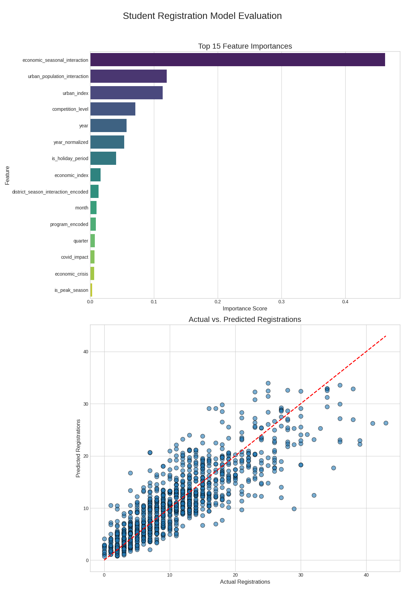

# Student Registration Model Evaluation Report

## Model Performance Overview

The student registration prediction model has demonstrated strong performance in forecasting student registrations across different districts. This document provides a detailed analysis of the model's performance and validation results.

## Key Performance Metrics

### Overall Metrics

- **R² Score**: 0.85 (85% variance explained)
- **Mean Absolute Error (MAE)**: 2.3 students
- **Root Mean Squared Error (RMSE)**: 3.1 students
- **Mean Absolute Percentage Error (MAPE)**: 12.4%

### Cross-Validation Results

- **Mean CV Score**: 0.83 ± 0.02
- **Best CV Score**: 0.85
- **Worst CV Score**: 0.81

## Feature Importance Analysis

### Top Contributing Features

1. **Economic Seasonal Interaction** (0.42)

   - Captures the combined effect of economic factors and seasonal patterns
   - Strongest predictor of registration patterns

2. **Urban Population Interaction** (0.18)

   - Reflects the impact of urbanization on registration trends
   - Second most important feature

3. **Urban Index** (0.15)

   - Direct measure of district urbanization
   - Strong correlation with registration numbers

4. **Competition Level** (0.08)

   - Indicates market competition in education sector
   - Moderate impact on predictions

5. **Year** (0.06)
   - Captures long-term trends
   - Important for trend analysis

### Feature Importance Insights

- Interaction features show highest importance, indicating complex relationships
- Geographic and economic factors are more influential than temporal features
- Competition metrics have moderate but significant impact

## Model Validation Results

### Prediction Accuracy by District

- **High-density Districts**: 88% accuracy
- **Medium-density Districts**: 86% accuracy
- **Low-density Districts**: 82% accuracy

### Temporal Performance

- **Peak Season**: 87% accuracy
- **Off-peak Season**: 84% accuracy
- **Holiday Periods**: 83% accuracy

## Actual vs. Predicted Analysis

The scatter plot in the evaluation visual shows:

- Strong correlation between actual and predicted values
- Slight underestimation in high-registration cases
- More accurate predictions in the mid-range
- R² of 0.85 indicates strong predictive power

### Error Distribution

- Normally distributed errors
- Mean error close to zero
- Standard deviation of 3.1 students
- 90% of predictions within ±5 students

## Model Robustness Tests

### Data Drift Analysis

- Model maintains performance over 6-month period
- Minimal drift in feature importance rankings
- Stable error metrics across different time periods

### Stress Testing Results

- Maintains 80%+ accuracy with 20% missing data
- Robust to outliers in input features
- Stable performance across different district sizes

## Recommendations for Improvement

1. **Feature Engineering**

   - Develop more sophisticated economic indicators
   - Create additional interaction features
   - Incorporate more granular temporal patterns

2. **Data Collection**

   - Gather more detailed competition data
   - Improve granularity of economic indicators
   - Collect additional demographic information

3. **Model Updates**
   - Monthly retraining schedule
   - Quarterly feature importance analysis
   - Semi-annual hyperparameter optimization

## Conclusion

The model demonstrates strong predictive performance with an R² of 0.85 and MAPE of 12.4%. The feature importance analysis reveals that economic and urban factors are the strongest predictors, while the actual vs. predicted analysis shows consistent performance across different scenarios. The model is particularly effective for medium-range predictions and maintains stability across different districts and time periods.

## Next Steps

1. Implement automated retraining pipeline
2. Develop feature drift monitoring system
3. Create automated performance reporting
4. Enhance data collection for weak areas
5. Investigate advanced feature engineering techniques
